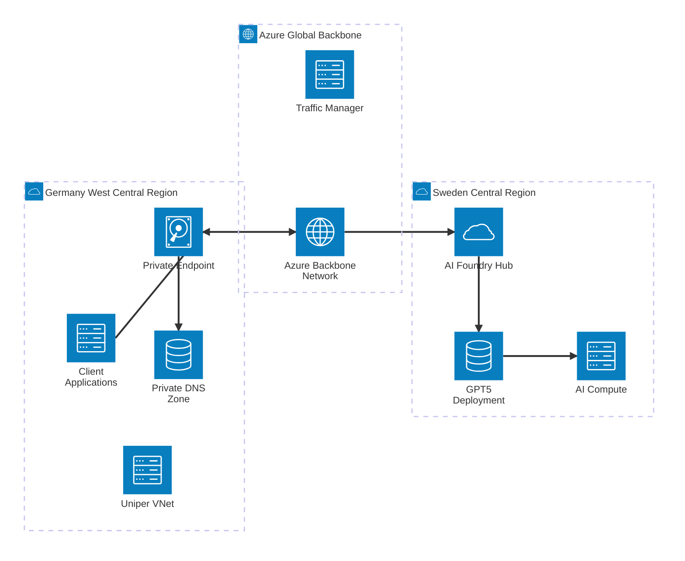
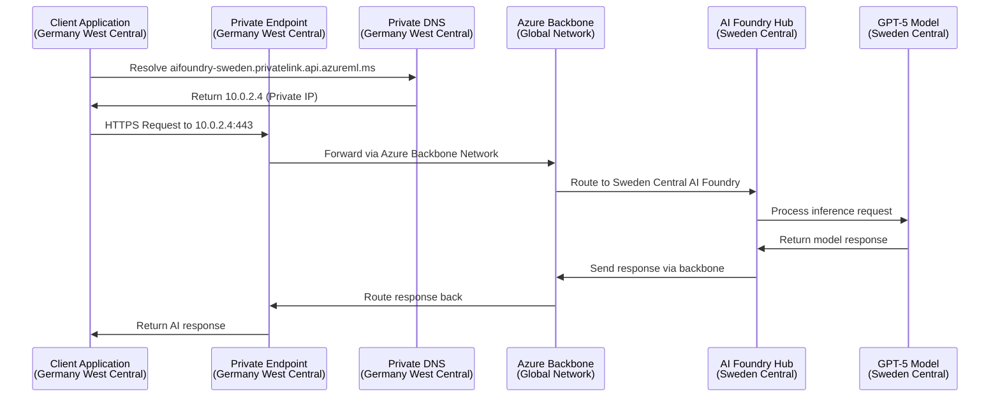

# Azure AI Foundry Cross-Region Private Endpoint Architecture

## Executive Summary

This document outlines the network architecture for accessing GPT-5 models deployed in Sweden Central from Germany West Central using private endpoints, ensuring secure, compliant, and performant connectivity for Uniper's AI workloads.

## Architecture Overview



## Detailed Network Components

### 1. Germany West Central Components

#### Uniper Virtual Network (VNet)
- **Address Space**: 10.0.0.0/16 (customer-defined)
- **Subnets**:
  - Application Subnet: 10.0.1.0/24
  - Private Endpoint Subnet: 10.0.2.0/24
  - Management Subnet: 10.0.3.0/24

#### Private Endpoint Configuration
```yaml
Private Endpoint:
  Name: pe-aifoundry-sweden-gwec
  Location: Germany West Central
  Subnet: 10.0.2.0/24
  Target Resource: AI Foundry Hub (Sweden Central)
  Target Sub-resource: amlworkspace
  Private IP: 10.0.2.4
  FQDN: aifoundry-sweden.privatelink.api.azureml.ms
```

#### Private DNS Zone
```yaml
Private DNS Zone:
  Zone Name: privatelink.api.azureml.ms
  Linked VNets: [Uniper-VNet-GWEC]
  A Records:
    - Name: aifoundry-sweden
      IP: 10.0.2.4
    - Name: aifoundry-sweden.westeurope
      IP: 10.0.2.4
```

### 2. Sweden Central Components

#### AI Foundry Hub
```yaml
AI Foundry Hub:
  Name: aifoundry-sweden-hub
  Location: Sweden Central
  Resource Group: rg-aifoundry-sweden-prod
  Public Network Access: Disabled
  Identity: System Assigned Managed Identity
```

#### GPT-5 Model Deployment
```yaml
GPT-5 Deployment:
  Model: gpt-5 (2025-08-07)
  Deployment Type: Standard (Regional)
  Location: Sweden Central
  Endpoint: https://aifoundry-sweden.openai.azure.com/
  API Version: 2024-10-01-preview
  Authentication: API Key + Azure AD
```

## Network Flow Architecture



## Security Architecture

### Network Security Groups (NSG)

#### Application Subnet NSG
```yaml
Inbound Rules:
  - Name: Allow-HTTPS-Internal
    Priority: 100
    Source: 10.0.0.0/16
    Destination: 10.0.1.0/24
    Port: 443
    Protocol: TCP
    Action: Allow

Outbound Rules:
  - Name: Allow-AI-Foundry
    Priority: 100
    Source: 10.0.1.0/24
    Destination: PrivateEndpoint
    Port: 443
    Protocol: TCP
    Action: Allow
```

#### Private Endpoint Subnet NSG
```yaml
Inbound Rules:
  - Name: Allow-Internal-HTTPS
    Priority: 100
    Source: 10.0.0.0/16
    Destination: 10.0.2.0/24
    Port: 443
    Protocol: TCP
    Action: Allow

Outbound Rules:
  - Name: Allow-Azure-Backbone
    Priority: 100
    Source: 10.0.2.0/24
    Destination: Internet
    Port: 443
    Protocol: TCP
    Action: Allow
```

### Authentication & Authorization

```yaml
Authentication Methods:
  1. Azure AD Service Principal:
     - Client ID: <service-principal-id>
     - Client Secret: <stored-in-key-vault>
     - Tenant ID: <tenant-id>
  
  2. Managed Identity:
     - Type: System Assigned
     - Scope: AI Foundry Hub Resource
  
  3. API Key (Backup):
     - Stored: Azure Key Vault
     - Rotation: 90 days

RBAC Assignments:
  - Role: Cognitive Services OpenAI User
  - Principal: Uniper Application Service Principal
  - Scope: AI Foundry Hub (Sweden Central)
```

## Data Residency & Compliance

### Data Processing Locations
```yaml
Data Flow:
  Request Origin: Germany West Central
  Network Transit: Azure Backbone (encrypted)
  Processing Location: Sweden Central (EU)
  Response Transit: Azure Backbone (encrypted)
  Response Destination: Germany West Central

Compliance Framework:
  - GDPR: ✅ EU-to-EU processing
  - Data Residency: ✅ Sweden (EU member state)
  - Encryption in Transit: ✅ TLS 1.3
  - Encryption at Rest: ✅ Azure Storage Encryption
  - Network Isolation: ✅ Private Endpoints
```

## Performance Optimization

### Latency Expectations
```yaml
Network Latency Components:
  GWEC to Sweden Central: ~25-35ms
  Private Endpoint Overhead: ~2-5ms
  AI Model Processing: ~500-2000ms
  Total Expected Latency: ~530-2040ms

Optimization Strategies:
  1. Connection Pooling: Reuse HTTPS connections
  2. Request Batching: Combine multiple prompts
  3. Async Processing: Non-blocking API calls
  4. Caching: Cache responses where appropriate
```

### Network Bandwidth
```yaml
Bandwidth Allocation:
  Expected Throughput: 1-10 Gbps
  Request Size: 1KB - 10MB (typical)
  Response Size: 1KB - 100KB (typical)
  Concurrent Connections: 100-1000
```

## Implementation Steps

### Phase 1: Infrastructure Setup (Week 1)

1. **Create AI Foundry Hub in Sweden Central**
```bash
# Create resource group
az group create --name rg-aifoundry-sweden-prod --location swedencentral

# Create AI Foundry Hub
az ml workspace create \
  --name aifoundry-sweden-hub \
  --resource-group rg-aifoundry-sweden-prod \
  --location swedencentral \
  --public-network-access Disabled
```

2. **Deploy GPT-5 Model**
```bash
# Deploy GPT-5 model
az ml online-deployment create \
  --name gpt5-deployment \
  --model gpt-5:1 \
  --workspace-name aifoundry-sweden-hub \
  --resource-group rg-aifoundry-sweden-prod
```

### Phase 2: Network Configuration (Week 2)

3. **Create Private Endpoint in GWEC**
```bash
# Create private endpoint
az network private-endpoint create \
  --name pe-aifoundry-sweden-gwec \
  --resource-group rg-uniper-gwec-prod \
  --vnet-name uniper-vnet-gwec \
  --subnet private-endpoint-subnet \
  --private-connection-resource-id "/subscriptions/<sub-id>/resourceGroups/rg-aifoundry-sweden-prod/providers/Microsoft.MachineLearningServices/workspaces/aifoundry-sweden-hub" \
  --group-id amlworkspace \
  --location germanywestcentral
```

4. **Configure Private DNS Zone**
```bash
# Create private DNS zone
az network private-dns zone create \
  --name privatelink.api.azureml.ms \
  --resource-group rg-uniper-gwec-prod

# Link to VNet
az network private-dns link vnet create \
  --name link-uniper-vnet \
  --zone-name privatelink.api.azureml.ms \
  --resource-group rg-uniper-gwec-prod \
  --virtual-network uniper-vnet-gwec \
  --registration-enabled false
```

### Phase 3: Security Configuration (Week 3)

5. **Configure Network Security Groups**
6. **Set up RBAC and Service Principal**
7. **Configure Azure Key Vault for secrets**

### Phase 4: Testing & Validation (Week 4)

8. **Network connectivity testing**
9. **Performance benchmarking**
10. **Security validation**

## Monitoring & Observability

### Network Monitoring
```yaml
Metrics to Monitor:
  - Private Endpoint Connection Status
  - Network Latency (GWEC ↔ Sweden)
  - Request/Response Throughput
  - Failed Connection Attempts
  - DNS Resolution Time

Alerting Thresholds:
  - Latency > 3 seconds: Warning
  - Connection Failures > 5%: Critical
  - Private Endpoint Down: Critical
```

### Application Monitoring
```yaml
AI Foundry Metrics:
  - Model Response Time
  - Token Usage (Input/Output)
  - Error Rates by HTTP Status
  - Quota Utilization
  - Model Availability

Logging Strategy:
  - Application Logs: Log Analytics Workspace
  - Network Logs: NSG Flow Logs
  - AI Foundry Logs: Diagnostic Settings
```

## Cost Optimization

### Estimated Monthly Costs (EUR)

```yaml
Network Components:
  Private Endpoint: €7.50/month
  DNS Zone: €0.50/month
  Data Transfer (intra-EU): €0.02/GB
  
AI Foundry Components:
  GPT-5 Usage: €0.03/1K tokens (input) + €0.06/1K tokens (output)
  Compute Resources: Variable based on usage
  
Total Estimated (10M tokens/month): ~€500-800/month
```

## Troubleshooting Guide

### Common Issues & Solutions

1. **DNS Resolution Failures**
   - Verify private DNS zone configuration
   - Check VNet link association
   - Validate A record entries

2. **Connection Timeouts**
   - Review NSG rules
   - Check private endpoint status
   - Verify Azure Backbone connectivity

3. **Authentication Errors**
   - Validate service principal permissions
   - Check RBAC assignments
   - Verify API key rotation

## Security Considerations

### Data Protection
- All traffic encrypted with TLS 1.3
- Private network isolation (no internet exposure)
- EU data processing compliance
- Regular security assessments

### Access Control
- Principle of least privilege
- Role-based access control (RBAC)
- Regular access reviews
- Multi-factor authentication for management

## Compliance & Governance

### GDPR Compliance
✅ **Data Processing Location**: Sweden (EU member state)
✅ **Data Controller**: Uniper (Germany)
✅ **Data Processor**: Microsoft Azure (EU operations)
✅ **Cross-border Transfer**: EU-to-EU (Article 28 compliant)

### Internal Governance
- Change management process
- Security review requirements
- Regular compliance audits
- Incident response procedures

---

This architecture provides a secure, compliant, and performant solution for accessing GPT-5 models in Sweden Central from Germany West Central while maintaining EU data residency requirements.