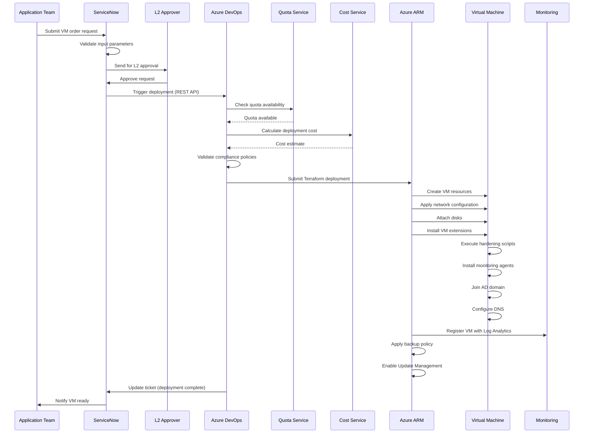
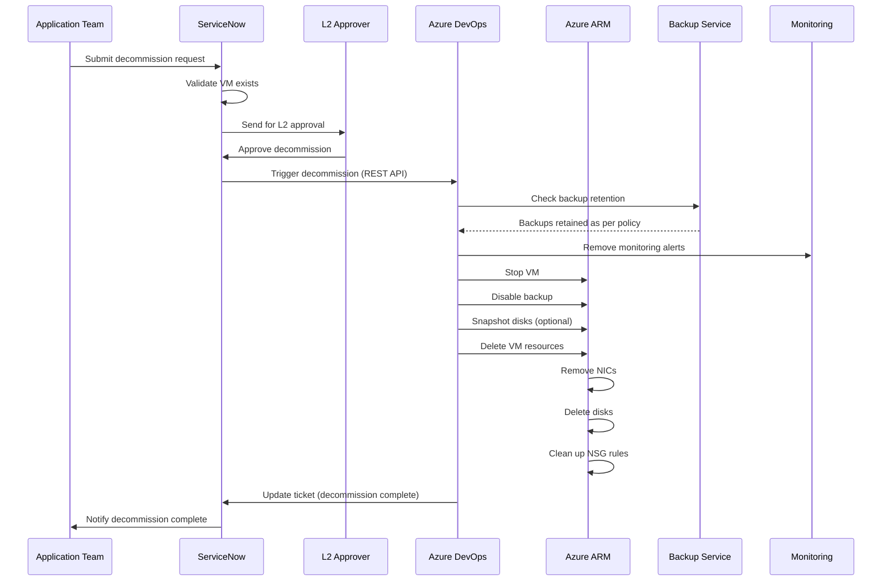

# Architecture Guide: Modern IaaS VM Automation Accelerator

## Table of Contents
1. [Solution Overview](#solution-overview)
2. [Architecture Principles](#architecture-principles)
3. [Component Architecture](#component-architecture)
4. [Integration Points](#integration-points)
5. [Security Architecture](#security-architecture)
6. [Data Flow](#data-flow)
7. [Deployment Models](#deployment-models)

---

## Solution Overview

This accelerator implements a **federated mesh model** for VM automation in Enterprise-Scale Landing Zones (ESLZ), balancing centralized governance with decentralized agility.

### Design Goals

1. **Automation First**: Eliminate manual VM provisioning
2. **Compliance by Default**: Built-in hardening, agents, and network controls
3. **Self-Service with Guardrails**: Empower application teams within governance boundaries
4. **Cost Transparency**: Pre-deployment cost forecasting and quota management
5. **Auditability**: Complete deployment tracking and lifecycle management

---

## Architecture Principles

### 1. Infrastructure as Code (IaC)
- All infrastructure defined in code (Terraform)
- Version-controlled templates
- Parameterized configurations
- Idempotent deployments

### 2. Centralized Control, Decentralized Execution
- **Core Capability Team**: Maintains IaC templates and pipelines
- **Onboarding Team**: Customizes for application-specific needs
- **Open Capability Team**: Governs security, networking, and compliance

### 3. API-First Integration
- ServiceNow REST API for catalog integration
- Azure Resource Manager APIs for deployments
- Webhook-based event notifications

### 4. Defense in Depth
- Azure Policy enforcement at management group level
- NSG rules for network segmentation
- VM-level hardening scripts
- Identity-based access control (Managed Identity + RBAC)

---

## Component Architecture

### High-Level Architecture Diagram

```
┌─────────────────────────────────────────────────────────────────────────────┐
│                         SERVICE DELIVERY LAYER                              │
├─────────────────────────────────────────────────────────────────────────────┤
│                                                                             │
│  ┌─────────────────────────────────────────────────────────────────────┐  │
│  │                    ServiceNow Catalog                                │  │
│  │  ┌──────────────┬──────────────┬──────────────┬──────────────────┐ │  │
│  │  │ VM Order     │ VM Decommission │ Disk Modify │ SKU Change    │ │  │
│  │  └──────────────┴──────────────┴──────────────┴──────────────────┘ │  │
│  └─────────────────────────────────────────────────────────────────────┘  │
│                                  │                                          │
│                                  ▼                                          │
│  ┌─────────────────────────────────────────────────────────────────────┐  │
│  │               L2 Approval Workflow Engine                            │  │
│  │  • Quota validation                                                  │  │
│  │  • Cost threshold checks                                             │  │
│  │  • Exception approvals                                               │  │
│  └─────────────────────────────────────────────────────────────────────┘  │
│                                                                             │
└─────────────────────────────────────────────────────────────────────────────┘
                                    │
                                    │ REST API Trigger
                                    ▼
┌─────────────────────────────────────────────────────────────────────────────┐
│                         ORCHESTRATION LAYER                                 │
├─────────────────────────────────────────────────────────────────────────────┤
│                                                                             │
│  ┌─────────────────────────────────────────────────────────────────────┐  │
│  │            Azure DevOps / GitHub Actions Pipeline                    │  │
│  │                                                                       │  │
│  │  Stage 1: Pre-Deployment Validation                                  │  │
│  │  ┌─────────────────────────────────────────────────────────────┐   │  │
│  │  │ • Quota availability check                                   │   │  │
│  │  │ • Cost forecast calculation                                  │   │  │
│  │  │ • Compliance policy validation                               │   │  │
│  │  │ • Naming convention enforcement                              │   │  │
│  │  └─────────────────────────────────────────────────────────────┘   │  │
│  │                                                                       │  │
│  │  Stage 2: Infrastructure Deployment                                  │  │
│  │  ┌─────────────────────────────────────────────────────────────┐   │  │
│  │  │ • IaC template execution (Terraform)                         │   │  │
│  │  │ • Network configuration (vNet, Subnet, NSG)                  │   │  │
│  │  │ • VM creation with OS disk                                   │   │  │
│  │  │ • Data disk attachment                                        │   │  │
│  │  │ • Managed Identity assignment                                │   │  │
│  │  └─────────────────────────────────────────────────────────────┘   │  │
│  │                                                                       │  │
│  │  Stage 3: Configuration & Hardening                                  │  │
│  │  ┌─────────────────────────────────────────────────────────────┐   │  │
│  │  │ • OS hardening script execution                              │   │  │
│  │  │ • Agent installation (Monitoring, Backup, Security)          │   │  │
│  │  │ • Domain join (AD integration)                               │   │  │
│  │  │ • DNS configuration                                           │   │  │
│  │  │ • Firewall rules (FCR for AD/DNS)                            │   │  │
│  │  └─────────────────────────────────────────────────────────────┘   │  │
│  │                                                                       │  │
│  │  Stage 4: Protection & Monitoring                                    │  │
│  │  ┌─────────────────────────────────────────────────────────────┐   │  │
│  │  │ • Backup policy assignment                                   │   │  │
│  │  │ • Update management enrollment                               │   │  │
│  │  │ • Log Analytics workspace connection                         │   │  │
│  │  │ • Baseline alerts configuration                              │   │  │
│  │  │ • Optional: Azure Site Recovery (Hot VMs)                    │   │  │
│  │  └─────────────────────────────────────────────────────────────┘   │  │
│  │                                                                       │  │
│  │  Stage 5: Post-Deployment Validation                                 │  │
│  │  ┌─────────────────────────────────────────────────────────────┐   │  │
│  │  │ • Deployment status verification                             │   │  │
│  │  │ • Connectivity tests (AD, DNS)                               │   │  │
│  │  │ • Compliance scan                                            │   │  │
│  │  │ • ServiceNow ticket update                                   │   │  │
│  │  └─────────────────────────────────────────────────────────────┘   │  │
│  └─────────────────────────────────────────────────────────────────────┘  │
│                                                                             │
└─────────────────────────────────────────────────────────────────────────────┘
                                    │
                                    │ Terraform Deployment
                                    ▼
┌─────────────────────────────────────────────────────────────────────────────┐
│                         INFRASTRUCTURE LAYER                                │
├─────────────────────────────────────────────────────────────────────────────┤
│                                                                             │
│  ┌──────────────────────────────────────────────────────────────────────┐ │
│  │              Enterprise-Scale Landing Zone (ESLZ)                     │ │
│  │                                                                        │ │
│  │  ┌────────────────────────────────────────────────────────────────┐ │ │
│  │  │ Management Group Hierarchy                                      │ │ │
│  │  │  ├─ Root                                                        │ │ │
│  │  │  ├─ Platform                                                    │ │ │
│  │  │  │   ├─ Management                                             │ │ │
│  │  │  │   ├─ Connectivity                                           │ │ │
│  │  │  │   └─ Identity                                               │ │ │
│  │  │  └─ Landing Zones (300+ existing)                              │ │ │
│  │  │      ├─ Corp                                                   │ │ │
│  │  │      ├─ Online                                                 │ │ │
│  │  │      └─ Application-specific LZs                               │ │ │
│  │  └────────────────────────────────────────────────────────────────┘ │ │
│  │                                                                        │ │
│  │  ┌────────────────────────────────────────────────────────────────┐ │ │
│  │  │ Deployed Resources per VM                                       │ │ │
│  │  │                                                                  │ │ │
│  │  │  ┌──────────────────────────────────────────────────────────┐ │ │ │
│  │  │  │ Compute                                                   │ │ │ │
│  │  │  │  • Virtual Machine (Windows/Linux)                        │ │ │ │
│  │  │  │  • OS Disk (Managed Disk)                                 │ │ │ │
│  │  │  │  • Data Disks (optional)                                  │ │ │ │
│  │  │  │  • VM Extensions (CSE, AADLogin, etc.)                    │ │ │ │
│  │  │  └──────────────────────────────────────────────────────────┘ │ │ │
│  │  │                                                                  │ │ │
│  │  │  ┌──────────────────────────────────────────────────────────┐ │ │ │
│  │  │  │ Networking                                                │ │ │ │
│  │  │  │  • Virtual Network (vNet)                                 │ │ │ │
│  │  │  │  • Subnet                                                 │ │ │ │
│  │  │  │  • Network Interface (NIC)                                │ │ │ │
│  │  │  │  • Network Security Group (NSG)                           │ │ │ │
│  │  │  │  • Firewall Rules (FCR for AD/DNS)                        │ │ │ │
│  │  │  │  • Private IP (Static/Dynamic)                            │ │ │ │
│  │  │  │  • Optional: Public IP (for jumpbox scenarios)            │ │ │ │
│  │  │  └──────────────────────────────────────────────────────────┘ │ │ │
│  │  │                                                                  │ │ │
│  │  │  ┌──────────────────────────────────────────────────────────┐ │ │ │
│  │  │  │ Protection                                                │ │ │ │
│  │  │  │  • Azure Backup (Recovery Services Vault)                 │ │ │ │
│  │  │  │  • Backup Policy (Daily/Weekly)                           │ │ │ │
│  │  │  │  • Optional: Azure Site Recovery (ASR)                    │ │ │ │
│  │  │  │  • Update Management (Azure Automation)                   │ │ │ │
│  │  │  └──────────────────────────────────────────────────────────┘ │ │ │
│  │  │                                                                  │ │ │
│  │  │  ┌──────────────────────────────────────────────────────────┐ │ │ │
│  │  │  │ Monitoring & Compliance                                   │ │ │ │
│  │  │  │  • Log Analytics Workspace                                │ │ │ │
│  │  │  │  • Azure Monitor (Metrics, Logs)                          │ │ │ │
│  │  │  │  • Baseline Alerts                                        │ │ │ │
│  │  │  │  • Diagnostic Settings                                    │ │ │ │
│  │  │  │  • Azure Policy Compliance                                │ │ │ │
│  │  │  └──────────────────────────────────────────────────────────┘ │ │ │
│  │  │                                                                  │ │ │
│  │  │  ┌──────────────────────────────────────────────────────────┐ │ │ │
│  │  │  │ Identity & Access                                         │ │ │ │
│  │  │  │  • Managed Identity (System/User-assigned)                │ │ │ │
│  │  │  │  • RBAC Assignments                                       │ │ │ │
│  │  │  │  • Azure AD Integration                                   │ │ │ │
│  │  │  │  • Safeguard/Sailpoint Onboarding                         │ │ │ │
│  │  │  └──────────────────────────────────────────────────────────┘ │ │ │
│  │  └────────────────────────────────────────────────────────────────┘ │ │
│  └──────────────────────────────────────────────────────────────────────┘ │
│                                                                             │
└─────────────────────────────────────────────────────────────────────────────┘
                                    │
                                    │ Telemetry & Logs
                                    ▼
┌─────────────────────────────────────────────────────────────────────────────┐
│                         GOVERNANCE LAYER                                    │
├─────────────────────────────────────────────────────────────────────────────┤
│                                                                             │
│  ┌────────────────────────────────────────────────────────────────────┐   │
│  │ Azure Policy Enforcement                                            │   │
│  │  • VM naming conventions                                            │   │
│  │  • Required tags (CostCenter, Environment, Owner)                   │   │
│  │  • Backup enforcement                                               │   │
│  │  • Allowed VM SKUs                                                  │   │
│  │  • Disk encryption requirements                                     │   │
│  │  • Network security rules                                           │   │
│  └────────────────────────────────────────────────────────────────────┘   │
│                                                                             │
│  ┌────────────────────────────────────────────────────────────────────┐   │
│  │ Cost Management                                                      │   │
│  │  • Quota tracking and alerts                                        │   │
│  │  • Budget monitoring                                                │   │
│  │  • Cost allocation by tags                                          │   │
│  │  • Chargeback reporting                                             │   │
│  └────────────────────────────────────────────────────────────────────┘   │
│                                                                             │
│  ┌────────────────────────────────────────────────────────────────────┐   │
│  │ Compliance Monitoring                                                │   │
│  │  • Deployment audit logs                                            │   │
│  │  • Exception tracking                                               │   │
│  │  • Security Center compliance                                       │   │
│  │  • Custom compliance dashboards                                     │   │
│  └────────────────────────────────────────────────────────────────────┘   │
│                                                                             │
└─────────────────────────────────────────────────────────────────────────────┘
```

---

## Integration Points

### 1. ServiceNow Integration

#### API Endpoints

```
POST /api/Your Organization/vm/order
POST /api/Your Organization/vm/decommission
POST /api/Your Organization/vm/disk-modify
POST /api/Your Organization/vm/sku-change
POST /api/Your Organization/vm/restore
GET  /api/Your Organization/vm/status/{deploymentId}
```

#### Authentication
- OAuth 2.0 with Service Principal
- API keys stored in Azure Key Vault

#### Data Exchange Format
```json
{
  "vmName": "vm-app-prod-001",
  "environment": "production",
  "vmSize": "Standard_D4s_v3",
  "osImage": "Windows Server 2022 Datacenter",
  "dataDisks": [
    {"sizeGB": 512, "lun": 0},
    {"sizeGB": 1024, "lun": 1}
  ],
  "networkConfig": {
    "vnetName": "vnet-prod-eastus",
    "subnetName": "snet-app-tier",
    "staticIP": "10.10.1.50"
  },
  "backupPolicy": "daily-7day-retention",
  "enableASR": true,
  "tags": {
    "CostCenter": "CC-12345",
    "Owner": "john.doe@Your Organization.com",
    "Application": "SAP ERP"
  },
  "requestedBy": "john.doe@Your Organization.com",
  "approvedBy": "manager@Your Organization.com",
  "ticketNumber": "RITM0012345"
}
```

### 2. Azure Integration

#### ARM/Bicep Deployment
```bash
az deployment group create \
  --resource-group rg-app-prod \
  --template-file main.bicep \
  --parameters @parameters.json \
  --what-if  # Pre-flight validation
```

#### Azure Policy Integration
- Policies assigned at Management Group level
- Inheritance to all child landing zones
- Exemption process for justified exceptions

### 3. Monitoring Integration

#### Log Analytics Workspace
- Centralized logging for all VMs
- Custom log queries for compliance reporting
- Alert rules for operational issues

#### Azure Monitor
- Performance metrics (CPU, Memory, Disk, Network)
- Availability monitoring
- Custom application insights

---

## Security Architecture

### Defense in Depth Model

```
Layer 1: Network Security
├─ NSG rules (Inbound/Outbound filtering)
├─ Azure Firewall (Centralized traffic inspection)
├─ Private networking (No public IPs by default)
└─ VPN/ExpressRoute for on-premises connectivity

Layer 2: Identity & Access Management
├─ Managed Identity (No credentials in code)
├─ Azure AD authentication
├─ RBAC (Least privilege access)
└─ Safeguard/Sailpoint integration

Layer 3: Host Security
├─ OS hardening (CIS benchmarks)
├─ Antivirus/Antimalware agents
├─ Security patches (Update Management)
└─ Disk encryption (Azure Disk Encryption)

Layer 4: Application Security
├─ App-level authentication
├─ TLS/SSL encryption
├─ Security scanning (DevSecOps)
└─ Vulnerability management

Layer 5: Data Security
├─ Encryption at rest (Storage Service Encryption)
├─ Encryption in transit (TLS 1.2+)
├─ Backup encryption
└─ Data classification

Layer 6: Monitoring & Response
├─ Security Center alerts
├─ Log Analytics threat detection
├─ Automated incident response
└─ Compliance auditing
```

### Hardening Standards

#### Windows VMs
- Disable unused services
- Enable Windows Firewall
- Configure audit policies
- Apply security baselines (STIG/CIS)
- Install security agents

#### Linux VMs
- SELinux/AppArmor enforcement
- SSH key-only authentication
- Fail2ban for brute-force protection
- Kernel hardening (sysctl)
- Security updates automation

---

## Data Flow

### VM Deployment Flow



### Decommissioning Flow



---

## Deployment Models

### Model 1: Centralized Deployment (Recommended)

```
Central Pipeline → Multiple Landing Zones
```

**Advantages:**
- Consistent deployment process
- Centralized governance
- Easier auditing and compliance
- Shared pipeline templates

**Use Cases:**
- Standard VM deployments
- Compliance-critical environments
- Multi-team organizations

### Model 2: Decentralized Deployment

```
Per-LZ Pipelines → Individual Landing Zones
```

**Advantages:**
- Team autonomy
- Faster iterations
- Custom configurations

**Use Cases:**
- Development/test environments
- Advanced users with special requirements

### Model 3: Hybrid Deployment (enterprise Approach)

```
Central Pipeline (Orchestrator) → Per-LZ Customization
```

**Advantages:**
- Centralized control with local flexibility
- Best of both worlds
- Federated mesh model

---

## Scalability & Performance

### Pipeline Optimization
- Parallel stage execution
- Template caching
- Reusable components
- Fast-fail validation

### Resource Optimization
- Right-sizing recommendations
- Auto-shutdown for dev/test
- Reserved instances for production
- Spot instances for non-critical workloads

---

## Disaster Recovery

### Backup Strategy
- **Dev**: 7-day retention
- **UAT**: 14-day retention
- **Prod**: 30-day retention + yearly archives

### Azure Site Recovery (Optional)
- Hot VMs: < 15 min RPO, < 1 hour RTO
- Automated failover testing
- DR drills scheduling

---

**Next Steps:**
- Review [Deployment Guide](./DEPLOYMENT.md)
- Explore [ServiceNow Integration](./docs/api-integration-guide.md)
- Understand [Governance Controls](./docs/governance-guide.md)
