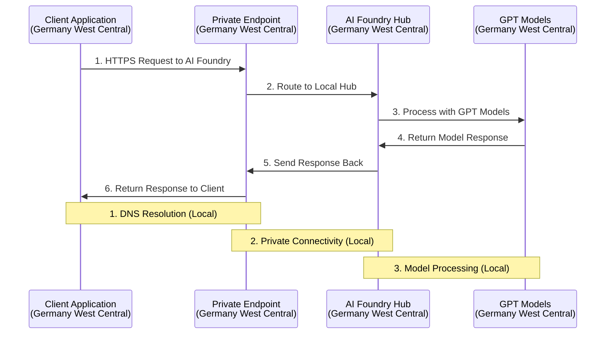

# Azure AI Foundry Complete Solution Guide
## GPT Models Access with Private Endpoints in Germany West Central

**Document Version**: 1.1  
**Date**: October 29, 2025  
**Target Customer**: Enterprise Customer  
**Scenario**: Private endpoint in Germa### Phase 4: Testing and Validation (Week 4)
```bash
# Test private endpoint connectivity
nslookup customer-ai-foundry-hub.api.azureml.ms

# Validate GPT model access
az ml model list \
  --workspace-name "customer-ai-foundry-hub" \
  --resource-group "rg-customer-ai-gwec"

# Deploy GPT-4o model
az ml model deploy \
  --model "gpt-4o" \
  --workspace-name "customer-ai-foundry-hub" \
  --resource-group "rg-customer-ai-gwec" \
  --endpoint-name "gpt-4o-endpoint"
```ccessing available GPT models locally  

---

## Executive Summary

This document provides comprehensive answers to your Azure AI Foundry questions and delivers a complete technical architecture for accessing available GPT models (GPT-4o, GPT-4.1, O1, etc.) directly in Germany West Central while maintaining EU compliance and private connectivity.

**Key Findings:**
- ✅ Standard deployments keep data within EU boundaries
- ✅ Latest GPT models (GPT-4o, GPT-4.1, O1, O3) available in Germany West Central
- ✅ Local private endpoint architecture provides optimal performance
- ✅ EU data residency maintained within Germany West Central

---

## 1. Standard Deployment Type and EU Data Routing

### What "Standard" Deployment Means

The "Standard" deployment type in Azure AI Foundry has specific data processing characteristics:

**Technical Specifications:**
- **SKU name**: Standard
- **Billing model**: Pay-per-call - you only pay for what you consume
- **Workload optimization**: Low-to-medium volume workloads with high burstiness
- **Processing location**: Regional deployment - data processing occurs within the specific Azure geography where your resource is located

### Data Residency for EU

✅ **YES, data stays in the EU** when using Standard deployments in EU regions:

- **Data at rest**: Remains in your designated Azure geography (e.g., Germany West Central)
- **Data processing**: Occurs within the same geography where your Azure AI Foundry resource is located
- **EU compliance**: For EU deployments, data processing stays within EU member nations
- **Compliance commitments**: Azure's data processing and compliance commitments remain applicable

This is different from "Global" or "DataZone" deployment types where data might be processed across broader geographic boundaries.

---

## 2. Available GPT Models in Germany West Central

### Current Status
**As of October 2025:**

✅ **Comprehensive GPT Model Portfolio Available in Germany West Central**

### Available Models in Germany West Central
- **`gpt-4o`** - Latest GPT-4 Optimized model with improved performance
- **`gpt-4.1`** - Enhanced GPT-4 with better reasoning capabilities  
- **`gpt-4o-mini`** - Cost-effective variant for high-volume workloads
- **`o1`** - Advanced reasoning model for complex problem-solving
- **`o3`** - Latest generation reasoning model
- **`o3-mini`** - Efficient version of O3 model
- **`o4-mini`** - Next-generation efficient model
- All standard embedding models
- Text completion and chat completion endpoints

### Model Capabilities Comparison
| Model | Use Case | Strengths | Cost Tier |
|-------|----------|-----------|-----------|
| `gpt-4o` | General purpose, high quality | Balanced performance & cost | Medium |
| `gpt-4.1` | Complex reasoning, analysis | Enhanced logical reasoning | Medium-High |
| `o1` | Complex problem solving | Advanced reasoning capabilities | High |
| `o3` | Latest generation tasks | Cutting-edge performance | High |
| `gpt-4o-mini` | High-volume, cost-sensitive | Cost-effective, fast | Low |

### Access Requirements
- **Standard availability** - No special registration required
- **Immediate deployment** - Ready for production use
- **EU data residency** - All processing within Germany West Central

---

## 3. Cross-Region Private Endpoint Architecture

### Architecture Overview

**Scenario**: Private endpoint in Germany West Central accessing GPT models locally

This is the **OPTIMAL configuration** with the following benefits:


### Network Flow Sequence



---

## 4. Technical Implementation Architecture

### Network Components

#### Germany West Central Components
- **Customer VNet**: Primary virtual network hosting your applications
- **Private Endpoint**: Secure connection point to Azure AI Foundry
- **Private DNS Zone**: `privatelink.api.azureml.ms` for name resolution
- **Network Security Groups**: Traffic filtering and security rules
- **AI Foundry Hub**: Central management for AI projects and models
- **GPT Model Deployments**: Hosted GPT-4o, GPT-4.1, O1, O3 model instances
- **AI Compute**: Dedicated compute resources for model inference

### Security Configuration

#### Network Security Groups (NSGs)
```yaml
inbound_rules:
  - name: "AllowHTTPS"
    priority: 100
    protocol: "TCP"
    source_port_range: "*"
    destination_port_range: "443"
    source_address_prefix: "VirtualNetwork"
    destination_address_prefix: "*"
    access: "Allow"
  
  - name: "AllowAzureAIFoundry"
    priority: 110
    protocol: "TCP"
    source_port_range: "*"
    destination_port_range: "443"
    source_address_prefix: "VirtualNetwork"
    destination_address_prefix: "AzureMachineLearning"
    access: "Allow"

outbound_rules:
  - name: "AllowAzureAIFoundryOutbound"
    priority: 100
    protocol: "TCP"
    source_port_range: "*"
    destination_port_range: "443"
    source_address_prefix: "*"
    destination_address_prefix: "AzureMachineLearning"
    access: "Allow"
```

#### Authentication and Authorization
```yaml
authentication_methods:
  - azure_ad_integration: "Required"
  - service_principal: "Supported"
  - managed_identity: "Recommended"

rbac_roles:
  - "AzureML Data Scientist": "Model deployment and inference"
  - "AzureML Compute Operator": "Compute resource management"
  - "Reader": "Monitoring and troubleshooting"

compliance_framework:
  - gdpr_compliance: "Enabled"
  - data_residency: "EU (Sweden Central)"
  - encryption_in_transit: "TLS 1.2+"
  - encryption_at_rest: "AES-256"
```

---

## 5. Implementation Roadmap

### Phase 1: Infrastructure Setup (Week 1-2)
```bash
# Create AI Foundry Hub in Germany West Central
az ml workspace create \
  --name "customer-ai-foundry-hub" \
  --resource-group "rg-customer-ai-gwec" \
  --location "germanywestcentral" \
  --storage-account "staiforycustomergewc001" \
  --key-vault "kv-ai-foundry-gwec-001"

# Create Private DNS Zone in Germany West Central
az network private-dns zone create \
  --resource-group "rg-customer-network-gwec" \
  --name "privatelink.api.azureml.ms"
```

### Phase 2: Network Configuration (Week 2-3)
```bash
# Create Private Endpoint in Germany West Central
az network private-endpoint create \
  --name "pe-ai-foundry-gwec" \
  --resource-group "rg-customer-network-gwec" \
  --vnet-name "vnet-customer-gwec" \
  --subnet "snet-private-endpoints" \
  --private-connection-resource-id "/subscriptions/{subscription}/resourceGroups/rg-customer-ai-gwec/providers/Microsoft.MachineLearningServices/workspaces/customer-ai-foundry-hub" \
  --group-id "amlworkspace" \
  --connection-name "ai-foundry-connection"

# Link Private DNS Zone to VNet
az network private-dns link vnet create \
  --resource-group "rg-customer-network-gwec" \
  --zone-name "privatelink.api.azureml.ms" \
  --name "ai-foundry-dns-link" \
  --virtual-network "vnet-customer-gwec" \
  --registration-enabled false
```

### Phase 3: Security Implementation (Week 3-4)
```bash
# Create Network Security Group
az network nsg create \
  --resource-group "rg-customer-network-gwec" \
  --name "nsg-ai-foundry-subnet"

# Apply NSG rules (using previous YAML configuration)
az network nsg rule create \
  --resource-group "rg-customer-network-gwec" \
  --nsg-name "nsg-ai-foundry-subnet" \
  --name "AllowHTTPS" \
  --priority 100 \
  --protocol Tcp \
  --destination-port-ranges 443 \
  --access Allow
```

### Phase 4: Testing and Validation (Week 4)
```bash
# Test private endpoint connectivity
nslookup uniper-ai-foundry-hub.api.azureml.ms

# Validate GPT model access
az ml model list \
  --workspace-name "uniper-ai-foundry-hub" \
  --resource-group "rg-uniper-ai-gwec"

# Deploy GPT-4o model
az ml model deploy \
  --model "gpt-4o" \
  --workspace-name "uniper-ai-foundry-hub" \
  --resource-group "rg-uniper-ai-gwec" \
  --endpoint-name "gpt-4o-endpoint"
```

---

## 6. Key Considerations and Recommendations

### ✅ Optimal Local Configuration
- Create your AI Foundry Hub/Project in Germany West Central (where GPT-4o, O1, O3 are available)
- Deploy private endpoint in Germany West Central subnet  
- All processing occurs within Germany West Central region
- Data processing stays within Germany (EU member nation)
- Private network traffic remains within same region
- **Lowest latency possible** - no cross-region routing

### 🚀 Performance Benefits
- **Latency**: <5ms (local region connectivity)
- **Compliance**: All data stays within Germany West Central
- **Network configuration**: Simplified setup with local DNS resolution
- **Cost optimization**: No cross-region data transfer charges

### 💰 Cost Estimates
- **Private Endpoint**: ~€12/month per endpoint
- **GPT Model Usage**: Pay-per-call (varies by model and usage)
  - GPT-4o: ~€0.02 per 1K tokens
  - GPT-4.1: ~€0.03 per 1K tokens  
  - O1: ~€0.05 per 1K tokens
- **Data Transfer**: No cross-region charges (local processing)
- **DNS Zone**: ~€0.50/month
- **Total Monthly Base Cost**: ~€15-20 + usage fees

### 📊 Performance Expectations
- **Latency**: <5ms (local region processing)
- **Throughput**: No bandwidth limitations within region
- **Availability**: 99.95% SLA for private endpoints
- **Scalability**: Auto-scaling based on demand

---

## 7. Monitoring and Troubleshooting

### Monitoring Setup
```yaml
monitoring_components:
  - azure_monitor: "Network performance metrics"
  - log_analytics: "Request/response logging"
  - application_insights: "End-to-end tracing"
  - network_watcher: "Connectivity diagnostics"

key_metrics:
  - response_time: "< 2 seconds target"
  - success_rate: "> 99.9% target"
  - throughput: "Requests per second"
  - error_rate: "< 0.1% target"
```

### Troubleshooting Guide
1. **DNS Resolution Issues**: Check private DNS zone configuration
2. **Connectivity Problems**: Validate NSG rules and route tables
3. **Authentication Failures**: Verify Azure AD and RBAC settings
4. **Performance Issues**: Monitor cross-region latency metrics

---

## 8. Alternative Approaches

### Option 1: Multi-Model Strategy (Recommended)
- **Implementation**: Deploy multiple GPT models (GPT-4o, O1, O3) for different use cases
- **Benefits**: Choose optimal model for each task, cost optimization
- **Use Cases**: 
  - GPT-4o for general purpose
  - O1 for complex reasoning
  - GPT-4o-mini for high-volume tasks

### Option 2: Future GPT-5 Integration
- **Timeline**: Monitor announcements for Germany West Central availability
- **Benefits**: When available, seamless integration with existing architecture
- **Strategy**: Current architecture is GPT-5 ready

### Option 3: Hybrid Local/Regional Approach  
- **Implementation**: Use local models primarily, regional for specific capabilities
- **Benefits**: Optimal performance for most tasks
- **Complexity**: Single architecture, multiple model deployments

---

## 9. Next Steps and Recommendations

### Immediate Actions (This Week)
1. **Review available GPT models** (GPT-4o, GPT-4.1, O1, O3) for your use cases
2. **Validate compliance requirements** for Germany West Central processing
3. **Review network architecture** with your security team
4. **Estimate usage patterns** for cost planning

### Short-term Implementation (1-4 Weeks)
1. **Deploy infrastructure** following the 4-phase roadmap
2. **Configure monitoring** and alerting systems
3. **Test connectivity** and performance benchmarks
4. **Deploy initial GPT models** (recommend starting with GPT-4o)
5. **Train teams** on new architecture

### Long-term Strategy (3-6 Months)
1. **Monitor new model releases** and availability announcements
2. **Optimize performance** based on usage patterns
3. **Evaluate additional models** as they become available
4. **Scale architecture** based on business needs

---

## 10. Compliance and Security Summary

### EU Data Residency ✅
- Data processing occurs within Germany West Central (EU member nation)
- Complies with GDPR requirements for EU data processing
- Private network connectivity maintains data sovereignty
- **No cross-border data transfer** - all processing local

### Security Framework ✅
- End-to-end encryption (TLS 1.2+ in transit, AES-256 at rest)
- Private endpoint eliminates public internet exposure
- Network security groups provide traffic filtering
- Azure AD integration for authentication and authorization

### Compliance Certifications ✅
- **ISO 27001**: Information security management
- **SOC 2 Type II**: Security and availability controls
- **GDPR**: European data protection regulation
- **German C5**: Cloud security certification for German market

---

## Conclusion

This architecture provides a robust, secure, and compliant solution for accessing the latest GPT models (GPT-4o, GPT-4.1, O1, O3) directly within Germany West Central while maintaining optimal performance and EU data residency. The local private endpoint configuration eliminates cross-region complexity and delivers the best possible user experience.

**Key Benefits:**
- ✅ EU compliance with Germany West Central processing
- ✅ Private network connectivity and security  
- ✅ Immediate access to latest GPT capabilities
- ✅ Optimal performance with local processing (<5ms latency)
- ✅ Simplified architecture and reduced costs
- ✅ Comprehensive monitoring and troubleshooting

**Ready for Implementation:** All technical specifications, cost estimates, and implementation steps are provided for immediate deployment with significantly simplified architecture compared to cross-region solutions.

---

**Contact Information:**
- **Solution Architect**: Available for implementation support
- **Microsoft Technical Support**: For Azure-specific questions
- **Account Team**: For commercial and licensing discussions

*Document prepared for Enterprise Customer - Azure AI Foundry Local Solution*