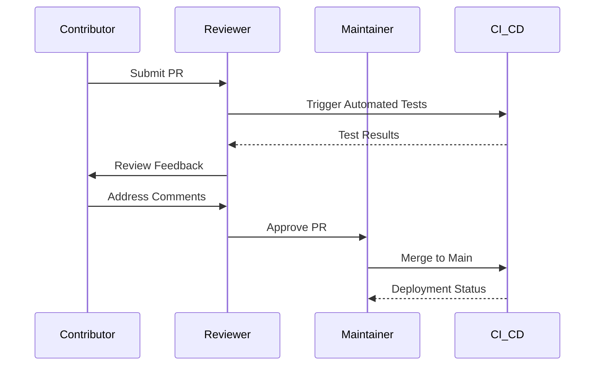
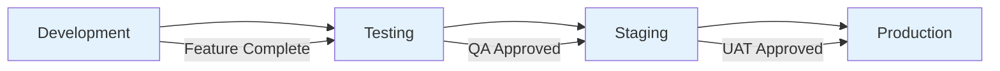

# Contributing Guide

Thank you for your interest in contributing to the Azure VM Automation Accelerator. This guide outlines the processes and standards for contributing to this enterprise infrastructure automation platform.

---

## Table of Contents

- [How to Contribute](#how-to-contribute)
- [Development Environment](#development-environment)
- [Code Standards](#code-standards)
- [Pull Request Process](#pull-request-process)
- [Issue Guidelines](#issue-guidelines)
- [Community Guidelines](#community-guidelines)

---

## How to Contribute

### Types of Contributions

We welcome several types of contributions:

| Contribution Type | Description | Requirements |
|------------------|-------------|--------------|
| **Bug Reports** | Report issues with existing functionality | Detailed reproduction steps, environment details |
| **Feature Requests** | Propose new capabilities or enhancements | Business justification, technical requirements |
| **Code Contributions** | Submit code improvements or new features | Code review, testing, documentation |
| **Documentation** | Improve existing documentation or add new content | Technical accuracy, clarity, consistency |
| **Infrastructure** | Enhance Terraform modules or deployment scripts | Testing in multiple environments, validation |

### Getting Started

1. **Fork the Repository**: Create a personal fork of the repository
2. **Create Feature Branch**: Use descriptive branch names (`feature/vm-encryption-enhancement`)
3. **Make Changes**: Implement your changes following our standards
4. **Test Thoroughly**: Validate changes in development environment
5. **Submit Pull Request**: Use our PR template and provide detailed description

---

## Development Environment

### Prerequisites

Ensure your development environment includes:

| Tool | Version | Purpose |
|------|---------|---------|
| [Git](https://git-scm.com/) | Latest | Version control |
| [Terraform](https://www.terraform.io/) | >= 1.5.0 | Infrastructure as Code |
| [Azure CLI](https://docs.microsoft.com/cli/azure/) | >= 2.50.0 | Azure management |
| [PowerShell](https://github.com/PowerShell/PowerShell) | >= 7.0 | Automation scripts |
| [Visual Studio Code](https://code.visualstudio.com/) | Latest | Development IDE |

### Environment Setup

```bash
# Clone the repository
git clone https://github.com/gitpavleenbali/vm-automation-accelerator.git
cd vm-automation-accelerator

# Install dependencies
az extension add --name azure-devops

# Configure development environment
cp boilerplate/bootstrap/control-plane/dev.tfvars.example terraform.tfvars
```

### Development Workflow

```mermaid
flowchart LR
    FORK[Fork Repository] --> CLONE[Clone Locally]
    CLONE --> BRANCH[Create Feature Branch]
    BRANCH --> DEVELOP[Implement Changes]
    DEVELOP --> TEST[Local Testing]
    TEST --> COMMIT[Commit Changes]
    COMMIT --> PUSH[Push to Fork]
    PUSH --> PR[Create Pull Request]
    PR --> REVIEW[Code Review]
    REVIEW --> MERGE[Merge to Main]
    
    classDef start fill:#4caf50
    classDef process fill:#2196f3
    classDef review fill:#ff9800
    classDef end fill:#9c27b0
    
    class FORK start
    class CLONE,BRANCH,DEVELOP,TEST,COMMIT,PUSH,PR process
    class REVIEW review
    class MERGE end
```

---

## Code Standards

### Terraform Standards

Follow these conventions for Terraform code:

#### File Organization
```
module/
├── main.tf          # Main resource definitions
├── variables.tf     # Input variables with descriptions
├── outputs.tf       # Output values
├── versions.tf      # Provider version constraints
├── README.md        # Module documentation
└── examples/        # Usage examples
    └── basic/
        ├── main.tf
        └── variables.tf
```

#### Naming Conventions
```hcl
# Resource naming pattern: <resource_type>_<purpose>_<environment>
resource "azurerm_resource_group" "vm_automation_dev" {
  name     = "rg-vm-automation-dev-eastus"
  location = "East US"
}

# Variable naming: descriptive, snake_case
variable "vm_size" {
  description = "The size of the virtual machine"
  type        = string
  default     = "Standard_D2s_v5"
}
```

#### Code Quality Requirements
- **Validation**: All variables must include validation rules where appropriate
- **Documentation**: Comprehensive descriptions for all variables and outputs
- **Examples**: Working examples for all modules
- **Testing**: Terraform validation and plan testing required

### PowerShell Standards

```powershell
# Function naming: Verb-Noun convention
function Deploy-VirtualMachine {
    [CmdletBinding()]
    param(
        [Parameter(Mandatory = $true)]
        [string]$ResourceGroupName,
        
        [Parameter(Mandatory = $true)]
        [string]$VirtualMachineName,
        
        [Parameter(Mandatory = $false)]
        [string]$Location = "East US"
    )
    
    # Implementation
}
```

### Documentation Standards

- **Clear Headings**: Use descriptive, hierarchical headings
- **Code Examples**: Include working code samples
- **Diagrams**: Use Mermaid for architecture and flow diagrams
- **Tables**: Organize information in structured tables
- **Links**: Reference related documentation and external resources

---

## Pull Request Process

### PR Requirements

Before submitting a pull request:

1. **Code Quality**
   - [ ] Code follows project standards
   - [ ] All tests pass locally
   - [ ] No linting errors
   - [ ] Documentation updated

2. **Testing**
   - [ ] Terraform validate passes
   - [ ] Terraform plan succeeds
   - [ ] Security scan (Checkov) passes
   - [ ] Integration tests completed

3. **Documentation**
   - [ ] README updated if applicable
   - [ ] Code comments added for complex logic
   - [ ] Example configurations provided

### PR Template

Use this template for pull requests:

```markdown
## Description
Brief description of changes and motivation.

## Type of Change
- [ ] Bug fix (non-breaking change)
- [ ] New feature (non-breaking change)
- [ ] Breaking change (fix or feature causing existing functionality to change)
- [ ] Documentation update

## Testing
- [ ] Local testing completed
- [ ] Integration tests passed
- [ ] Security validation performed

## Checklist
- [ ] Code follows project standards
- [ ] Self-review completed
- [ ] Documentation updated
- [ ] No conflicts with base branch
```

### Review Process



---

## Issue Guidelines

### Bug Reports

When reporting bugs, include:

**Environment Information**
- Azure region and subscription type
- Terraform version
- PowerShell version
- Operating system

**Reproduction Steps**
1. Detailed steps to reproduce the issue
2. Expected behavior
3. Actual behavior
4. Error messages or logs

**Additional Context**
- Configuration files (sanitized)
- Screenshots if applicable
- Related issues or PRs

### Feature Requests

For feature requests, provide:

**Business Justification**
- Problem statement
- Current workarounds
- Expected benefits

**Technical Requirements**
- Proposed solution approach
- Integration considerations
- Performance implications

**Acceptance Criteria**
- Detailed requirements
- Success metrics
- Testing requirements

---

## Community Guidelines

### Code of Conduct

We are committed to providing a welcoming and inclusive environment:

- **Be Respectful**: Treat all community members with respect and courtesy
- **Be Collaborative**: Work together to achieve common goals
- **Be Constructive**: Provide helpful feedback and suggestions
- **Be Professional**: Maintain professional communication standards

### Communication Channels

| Channel | Purpose | Response Time |
|---------|---------|---------------|
| **GitHub Issues** | Bug reports, feature requests | 2-3 business days |
| **GitHub Discussions** | Community questions, ideas | 1-2 business days |
| **Pull Request Reviews** | Code review and feedback | 1-2 business days |

### Recognition

We recognize valuable contributions through:

- **Contributor Recognition**: Monthly highlight of significant contributions
- **Maintainer Program**: Opportunity to become a project maintainer
- **Documentation Credits**: Attribution in project documentation

---

## Security Considerations

### Security Reporting

Report security vulnerabilities privately:

1. **Do not** create public issues for security vulnerabilities
2. **Contact** maintainers directly via email
3. **Provide** detailed vulnerability information
4. **Allow** reasonable time for investigation and fix

### Secure Development Practices

- **No Secrets**: Never commit credentials or sensitive information
- **Least Privilege**: Implement minimal required permissions
- **Code Scanning**: Use automated security scanning tools
- **Dependency Management**: Keep dependencies updated and secure

---

## Release Process

### Versioning Strategy

We follow semantic versioning (SemVer):

- **Major (X.0.0)**: Breaking changes
- **Minor (0.X.0)**: New features, backward compatible
- **Patch (0.0.X)**: Bug fixes, backward compatible

### Release Workflow



---

## Getting Help

### Resources

- **Documentation**: Comprehensive guides in the `/docs` directory
- **Examples**: Working examples in the `/boilerplate` directory
- **Architecture**: Detailed architecture documentation
- **Community**: GitHub Discussions for community support

### Contact Information

For specific questions or support:

- **Technical Issues**: Create GitHub Issues
- **General Questions**: Use GitHub Discussions
- **Security Issues**: Contact maintainers directly
- **Enterprise Support**: Contact your designated support channel

---

**Thank you for contributing to the Azure VM Automation Accelerator**
Any other relevant information.
```

### Suggesting Enhancements

Enhancement suggestions are tracked as GitHub issues. When creating an enhancement suggestion:

- **Use a clear and descriptive title**
- **Provide a detailed description** of the suggested enhancement
- **Explain why this enhancement would be useful** to most users
- **List any similar features** in other solutions
- **Provide examples** of how the enhancement would work

### Contributing Code

1. **Fork the repository** and create your branch from `main`
2. **Make your changes** following our style guidelines
3. **Test your changes** thoroughly
4. **Update documentation** if needed
5. **Submit a pull request**

## 🛠️ Development Setup

### Prerequisites

- **Azure Subscription** with Contributor access
- **Azure CLI** or **Azure PowerShell** installed
- **Terraform** (for infrastructure development)
- **PowerShell 7+** (for script development)
- **Python 3.8+** (for Python scripts)
- **Git** for version control

### Local Setup

```bash
# Clone your fork
git clone https://github.com/YOUR-USERNAME/vm-automation-accelerator.git
cd vm-automation-accelerator

# Add upstream remote
git remote add upstream https://github.com/yourorg/vm-automation-accelerator.git

# Create a branch for your feature
git checkout -b feature/your-feature-name
```

### Testing Your Changes

#### Terraform Validation

```bash
# Format Terraform files
terraform fmt -recursive

# Validate Terraform configuration
terraform validate

# Run Terraform plan (dry-run)
terraform plan -var-file="environments/dev.tfvars"
```

#### PowerShell Script Testing

```powershell
# Run PSScriptAnalyzer
Install-Module -Name PSScriptAnalyzer -Force
Invoke-ScriptAnalyzer -Path deploy/scripts/utilities/vm-operations/security/Your-Script.ps1

# Run Pester tests (if available)
Invoke-Pester
```

#### Python Script Testing

```bash
# Install dependencies
pip install -r requirements-dev.txt

# Run linting
pylint deploy/scripts/utilities/servicenow/your_script.py

# Run tests
pytest tests/
```

## 🔄 Pull Request Process

### Before Submitting

- [ ] Code follows the style guidelines
- [ ] Self-review of code completed
- [ ] Comments added for complex logic
- [ ] Documentation updated
- [ ] Tests added/updated
- [ ] All tests pass
- [ ] Terraform linting passes
- [ ] No breaking changes (or clearly documented)

### Pull Request Template

```markdown
## Description
Brief description of changes.

## Type of Change
- [ ] Bug fix (non-breaking change fixing an issue)
- [ ] New feature (non-breaking change adding functionality)
- [ ] Breaking change (fix or feature causing existing functionality to not work as expected)
- [ ] Documentation update

## Testing
Describe testing performed.

## Checklist
- [ ] Code follows style guidelines
- [ ] Self-review completed
- [ ] Documentation updated
- [ ] Tests added/updated
- [ ] All tests pass
- [ ] No breaking changes

## Related Issues
Closes #(issue number)
```

### Review Process

1. **Automated checks** will run (linting, validation)
2. **Maintainers will review** your code
3. **Address feedback** if requested
4. **Approval** required from at least one maintainer
5. **Merge** will be performed by maintainers

## 📝 Style Guidelines

### Terraform (HCL)

- Follow **Terraform Best Practices**
- Use **descriptive variable names**
- Include **descriptions** for all variables and outputs
- Use **consistent naming** conventions
- Add **comments** for complex logic

```hcl
# Good example
variable "vm_name" {
  description = "The name of the virtual machine"
  type        = string
}

variable "vm_size" {
  description = "The size of the virtual machine"
  type        = string
  default     = "Standard_D2s_v3"
}

resource "azurerm_virtual_machine" "vm" {
  name                = var.vm_name
  location            = var.location
  
  vm_size = var.vm_size
}
```

### PowerShell

- Follow **PowerShell Best Practices**
- Use **approved verbs** (Get, Set, New, Remove, etc.)
- Include **comment-based help**
- Use **CmdletBinding** for advanced functions
- **PascalCase** for function names, **camelCase** for variables

```powershell
<#
.SYNOPSIS
    Brief description.

.DESCRIPTION
    Detailed description.

.PARAMETER Name
    Parameter description.

.EXAMPLE
    Example-Command -Name "value"
#>
function Example-Command {
    [CmdletBinding()]
    param(
        [Parameter(Mandatory = $true)]
        [string]$Name
    )
    
    # Implementation
}
```

### Python

- Follow **PEP 8** style guide
- Use **type hints** for function signatures
- Include **docstrings** for all functions/classes
- Use **snake_case** for variables and functions

```python
def example_function(param: str) -> dict:
    """
    Brief description.
    
    Args:
        param: Parameter description.
        
    Returns:
        Description of return value.
        
    Raises:
        Exception: When something goes wrong.
    """
    return {"result": param}
```

### YAML (Pipelines)

- Use **2-space indentation**
- Include **comments** for stages and jobs
- Use **descriptive names** for steps
- Group **related variables**

```yaml
# Stage: Deployment
stages:
  - stage: Deploy
    displayName: 'Deploy Infrastructure'
    jobs:
      - job: DeployTerraform
        displayName: 'Deploy Terraform Templates'
        steps:
          - task: AzureCLI@2
            displayName: 'Deploy to Azure'
            inputs:
              azureSubscription: $(azureSubscription)
```

### Markdown (Documentation)

- Use **clear headings** and structure
- Include **code examples** where appropriate
- Add **links** to related documentation
- Use **tables** for structured data
- Include **emojis** for visual clarity (sparingly)

## 🏷️ Commit Message Guidelines

Follow the [Conventional Commits](https://www.conventionalcommits.org/) specification:

```
<type>(<scope>): <subject>

<body>

<footer>
```

### Types

- **feat**: A new feature
- **fix**: A bug fix
- **docs**: Documentation changes
- **style**: Code style changes (formatting, no logic change)
- **refactor**: Code refactoring
- **test**: Adding or updating tests
- **chore**: Maintenance tasks

### Examples

```
feat(terraform): add support for availability zones

Add availability zone configuration to VM deployment module.
Includes parameters for zone selection and load balancer setup.

Closes #123
```

```
fix(pipeline): correct approval gate timeout

The approval gate was timing out too quickly in production.
Increased timeout from 1 hour to 24 hours.

Fixes #456
```

## 🌍 Community

### Getting Help

- **GitHub Discussions**: For questions and discussions
- **GitHub Issues**: For bug reports and feature requests
- **Stack Overflow**: Tag with `azure-vm-automation-accelerator`

### Recognition

Contributors will be recognized in:
- README.md Contributors section
- Release notes for significant contributions
- GitHub contributors page

## 📚 Additional Resources

- [Terraform Documentation](https://www.terraform.io/docs)
- [Terraform Azure Provider](https://registry.terraform.io/providers/hashicorp/azurerm/latest/docs)
- [Azure DevOps Pipelines](https://docs.microsoft.com/azure/devops/pipelines/)

## 📄 License

By contributing, you agree that your contributions will be licensed under the [MIT License](LICENSE).

---

**Thank you for contributing to the VM Automation Accelerator!**

Your contributions help make Azure automation more accessible to everyone.
