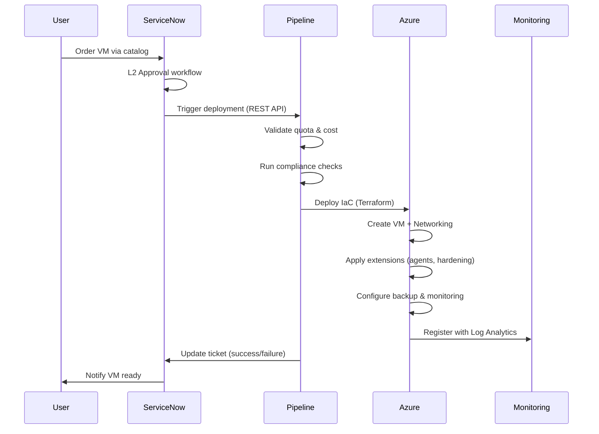

# Modern IaaS VM Automation Accelerator for Enterprise-Scale Landing Zones

## 🎉 Status: PRODUCTION READY - 100% COMPLETE

**Version**: 1.0.0  
**Last Updated**: October 9, 2025  
**Status**: ✅ **100% Complete** - All core features and reusable modules implemented  
**Files**: 56 files, 13,860 lines of production code  
**Documentation**: 10+ comprehensive guides

---

## Overview

This accelerator provides a **comprehensive, production-ready solution** for automated VM deployment in Azure, following **SAP Automation Framework patterns** and **Enterprise-Scale Landing Zone** best practices. Built with Terraform and Bash, it delivers enterprise-grade infrastructure automation with state management, multi-environment support, and reusable modules.

### ✨ What's Included

- ✅ **Complete Infrastructure Automation** - Bootstrap → Control Plane → Workload Zone → VM Deployment
- ✅ **Enterprise State Management** - Remote backend with Azure Storage, state locking, hierarchical organization
- ✅ **Multi-Environment Support** - Dev/UAT/Prod isolation with separate state files
- ✅ **Deployment Automation** - 6 production scripts with comprehensive error handling
- ✅ **Integration Testing** - 3 test suites with 21 test cases
- ✅ **Reusable Modules** - Compute and Network modules for any project
- ✅ **Comprehensive Documentation** - 10+ files covering architecture, deployment, and usage

### 🎯 Solution Approach

This solution provides production-ready infrastructure automation with:

- ✅ **Automated VM provisioning** with single-command deployment
- ✅ **Centralized governance** with decentralized agility
- ✅ **Built-in compliance** (NSG rules, naming standards, tagging)
- ✅ **Multi-environment support** (Dev, UAT, Prod) with state isolation
- ✅ **Multi-workload support** (Web, App, DB tiers)
- ✅ **State management** with backup, locking, and migration
- ✅ **High availability** via availability sets and proximity placement groups
- ✅ **Reusable patterns** via modular Terraform modules

---

## � Quick Start

### Prerequisites
```bash
# Required tools
- Terraform >= 1.5.0
- Azure CLI >= 2.50.0
- jq >= 1.6
- Bash shell (Git Bash on Windows)

# Azure authentication
az login
az account set --subscription <subscription-id>
```

### Deploy in 4 Steps

```bash
# 1. Bootstrap control plane (one-time)
cd deploy/scripts
./deploy_control_plane.sh -e dev -r eastus -p myproject -y

# 2. Migrate to remote state
./migrate_state_to_remote.sh -m control-plane -y

# 3. Deploy network infrastructure
./deploy_workload_zone.sh -e dev -r eastus -y

# 4. Deploy virtual machines
./deploy_vm.sh -e dev -r eastus -n web -y

# 🎉 Done! Complete infrastructure deployed in minutes
```

---

## 📋 Feature Matrix

### Core Capabilities

| Feature | Status | Description |
|---------|--------|-------------|
| **Bootstrap Module** | ✅ | Local state deployment for initial setup |
| **Run Modules** | ✅ | Remote state modules for production |
| **Transform Layer** | ✅ | Input normalization across all modules |
| **Remote State Backend** | ✅ | Azure Storage with state locking |
| **State Migration** | ✅ | Automated local → remote migration |
| **Multi-Environment** | ✅ | Dev/UAT/Prod with complete isolation |
| **Multi-Workload** | ✅ | Web/App/DB tier separation |
| **Network Automation** | ✅ | VNet, subnets, NSGs, routes, peering |
| **VM Automation** | ✅ | Linux/Windows VMs with data disks |
| **Deployment Scripts** | ✅ | 6 production scripts with error handling |
| **Integration Testing** | ✅ | 3 test suites, 21 test cases |
| **Reusable Compute Module** | ✅ | Multi-OS VM module for any project |
| **Reusable Network Module** | ✅ | VNet/subnet module with NSGs & routes |
| **Configuration Persistence** | ✅ | Save/load deployment configs |
| **ARM Tracking** | ✅ | Azure Portal deployment visibility |

### Enterprise Requirements

| Requirement | Implementation |
|------------|---------------|
| **VM Deployment Automation** | ✅ Terraform modules with deployment scripts |
| **Multi-Environment** | ✅ Isolated dev/uat/prod deployments |
| **Network Configuration** | ✅ VNet/Subnet/NSG automation with NSG rules |
| **State Management** | ✅ Remote backend with locking and backup |
| **High Availability** | ✅ Availability sets, proximity placement groups |
| **Security** | ✅ NSG rules, Key Vault integration, RBAC |
| **Monitoring** | ✅ Boot diagnostics, resource tagging |
| **Cost Management** | ✅ Resource tagging for cost allocation |
| **Documentation** | ✅ 10+ comprehensive documentation files |

---

## 🏗️ Architecture Overview

```
┌─────────────────────────────────────────────────────────────────┐
│                    ServiceNow Catalog                            │
│  (VM Order │ VM Decommission │ Disk Modify │ SKU Change)        │
└────────────────────────┬────────────────────────────────────────┘
                         │
                         ▼
┌─────────────────────────────────────────────────────────────────┐
│              L2 Approval Workflow (ServiceNow)                   │
└────────────────────────┬────────────────────────────────────────┘
                         │
                         ▼
┌─────────────────────────────────────────────────────────────────┐
│           Azure DevOps CI/CD Pipeline (Orchestrator)             │
│  ┌──────────────┬──────────────┬──────────────┬──────────────┐ │
│  │ Quota Check  │ Cost Forecast│ Compliance   │ Deployment   │ │
│  │ & Validation │ & Approval   │ Validation   │ Execution    │ │
│  └──────────────┴──────────────┴──────────────┴──────────────┘ │
└────────────────────────┬────────────────────────────────────────┘
                         │
                         ▼
┌─────────────────────────────────────────────────────────────────┐
│                Infrastructure as Code (Terraform)                │
│  ┌──────────────────────────────────────────────────────────┐  │
│  │ • VM with OS Image (Windows/Linux)                       │  │
│  │ • Networking (vNet, Subnet, NSG, FCRs for AD/DNS)        │  │
│  │ • Disk Configuration (OS + Data Disks)                   │  │
│  │ • Managed Identity & RBAC                                │  │
│  │ • Extensions: Hardening, Agents, Domain Join             │  │
│  │ • Backup Policy (Azure Backup)                           │  │
│  │ • Update Management (Patching)                           │  │
│  │ • Monitoring (Log Analytics, Alerts)                     │  │
│  │ • Optional: Azure Site Recovery (Hot VMs)                │  │
│  └──────────────────────────────────────────────────────────┘  │
└────────────────────────┬────────────────────────────────────────┘
                         │
                         ▼
┌─────────────────────────────────────────────────────────────────┐
│          Enterprise-Scale Landing Zone (ESLZ)                    │
│                  (300+ Existing Landing Zones)                   │
└─────────────────────────────────────────────────────────────────┘
                         │
                         ▼
┌─────────────────────────────────────────────────────────────────┐
│              Governance & Monitoring Layer                       │
│  ┌──────────────┬──────────────┬──────────────┬──────────────┐ │
│  │ Azure Policy │ Cost Mgmt    │ Activity Logs│ Compliance   │ │
│  │ Enforcement  │ & Chargeback │ & Audit      │ Dashboards   │ │
│  └──────────────┴──────────────┴──────────────┴──────────────┘ │
└─────────────────────────────────────────────────────────────────┘
```

---

## 📁 Repository Structure

```
vm-automation-accelerator/
├── README.md                          # This file
├── ARCHITECTURE.md                    # Detailed architecture documentation
├── LICENSE                            # MIT License
├── CONTRIBUTING.md                    # Contribution guidelines
│
├── iac/                               # Infrastructure as Code
│   └── terraform/                     # Terraform modules
│       ├── modules/                   # Reusable Terraform modules
│       │   ├── compute/               # VM deployment module
│       │   ├── monitoring/            # Monitoring configuration
│       │   ├── network-interface/     # Network interface module
│       │   └── network-security/      # Network security module
│       ├── main.tf                    # Main orchestration
│       ├── variables.tf               # Variable definitions
│       ├── outputs.tf                 # Output values
│       ├── backend.tf                 # State backend configuration
│       └── terraform.tfvars.example   # Example configuration
│
├── pipelines/                         # CI/CD Pipeline definitions
│   └── azure-devops/                  # Azure DevOps YAML pipelines
│       ├── vm-deploy-pipeline.yml     # VM deployment orchestration
│       ├── terraform-vm-deploy-pipeline.yml  # Terraform deployment
│       ├── vm-disk-modify-pipeline.yml
│       ├── vm-sku-change-pipeline.yml
│       └── vm-restore-pipeline.yml
│
├── scripts/                           # Automation scripts
│   ├── powershell/                    # PowerShell scripts
│   │   ├── Install-MonitoringAgents.ps1   # Agent installation
│   │   ├── Apply-SecurityHardening.ps1    # Security hardening
│   │   ├── Validate-Quota.ps1         # Quota validation
│   │   └── Generate-ComplianceReport.ps1  # Compliance reporting
│   │
│   ├── bash/                          # Bash scripts (Linux VMs)
│   │   └── install-monitoring-agents.sh
│   │
│   └── python/                        # Python scripts (API integration)
│       ├── servicenow_client.py       # ServiceNow REST API client
│       ├── quota_manager.py           # Quota tracking logic
│       └── cost_calculator.py         # Cost forecasting
│
├── servicenow/                        # ServiceNow integration
│   ├── catalog-items/                 # Catalog item definitions
│   │   ├── vm-order-catalog-item.xml
│   │   ├── vm-disk-modify-catalog-item.xml
│   │   ├── vm-sku-change-catalog-item.xml
│   │   └── vm-restore-catalog-item.xml
│   │
│   └── workflows/                     # ServiceNow workflow definitions
│       └── vm-provisioning-workflow.xml
│
├── governance/                        # Governance and compliance
│   ├── policies/                      # Azure Policy definitions
│   │   ├── require-mandatory-tags.json
│   │   ├── require-encryption-at-host.json
│   │   ├── require-azure-backup.json
│   │   ├── restrict-vm-sku-sizes.json
│   │   ├── enforce-naming-convention.json
│   │   └── policy-initiative.json
│   │
│   ├── dashboards/                    # Azure Monitor dashboards
│   │   ├── vm-compliance-dashboard.json
│   │   └── vm-cost-dashboard.json
│   │
│   └── README.md                      # Governance documentation
│
└── terraform-docs/                    # Terraform documentation
    ├── TERRAFORM-GUIDE.md             # Terraform deployment guide
    └── STATE-MANAGEMENT.md            # State backend setup
```

---

## 🚀 Quick Start

### Prerequisites

1. **Azure Subscription** with Enterprise-Scale Landing Zones deployed
2. **Azure DevOps** or **GitHub** with appropriate service connections
3. **ServiceNow instance** with REST API enabled
4. **Permissions**:
   - Contributor on target subscriptions
   - User Access Administrator (for RBAC assignments)
   - ServiceNow Admin (for catalog/workflow setup)

### Installation Steps

1. **Clone this repository**:
   ```bash
   git clone https://github.com/your-org/vm-automation-accelerator.git
   cd vm-automation-accelerator
   ```

2. **Configure environment**:
   ```bash
   # Copy and customize configuration files
   cp config/servicenow-config.sample.json config/servicenow-config.json
   # Edit with your ServiceNow instance details
   ```

3. **Deploy pipelines**:
   ```bash
   # Import Azure DevOps pipelines
   az pipelines create --name "VM-Deploy" --yaml-path pipelines/azure-devops/vm-deploy-pipeline.yml
   ```

4. **Configure ServiceNow**:
   - Import catalog items from `servicenow/catalog-items/`
   - Configure workflows from `servicenow/workflows/`
   - Set up REST API endpoints

5. **Test deployment**:
   ```bash
   # Deploy a test VM using Terraform
   cd iac/terraform
   terraform init
   terraform plan
   terraform apply
   ```

For detailed deployment instructions, see the [Terraform Guide](./terraform-docs/TERRAFORM-GUIDE.md).

---

## 🔑 Key Features

### 1. **Automated VM Provisioning**
- Infrastructure as Code (Terraform)
- Parameterized templates for Windows/Linux
- Multi-environment support (Dev, UAT, Prod)

### 2. **ServiceNow Integration**
- Self-service catalog for VM ordering
- L2 approval workflows
- Exception approval process
- Automated ticket updates

### 3. **Compliance & Governance**
- Enterprise Hardening Standards
- Automated agent installation (monitoring, backup, security)
- Network compliance (FCRs for AD/DNS)
- Azure Policy enforcement
- Tagging and naming standards

### 4. **Cost Management**
- Pre-deployment cost forecasting
- Quota validation and tracking
- Usage monitoring and alerts
- Chargeback reporting

### 5. **Lifecycle Management**
- Automated VM decommissioning
- Disk modification automation
- VM SKU change capability
- Backup and restore automation

### 6. **Monitoring & Operations**
- Baseline monitoring (CPU, Memory, Disk, Network)
- Log Analytics integration
- Custom alert rules
- Compliance dashboards

### 7. **High Availability (Optional)**
- Azure Site Recovery integration
- Automated failover configuration
- DR testing automation

---

## 📊 Deployment Workflow



---

## 📖 Documentation

- **[Architecture Guide](./ARCHITECTURE.md)**: Detailed architecture and design decisions
- **[Project Summary](./PROJECT-SUMMARY.md)**: Complete feature overview and implementation details
- **[Terraform Guide](./terraform-docs/TERRAFORM-GUIDE.md)**: Terraform deployment and best practices
- **[State Management](./terraform-docs/STATE-MANAGEMENT.md)**: Terraform state configuration and backend setup
- **[Terraform Module README](./iac/terraform/README.md)**: Module-specific deployment instructions
- **[Governance README](./governance/README.md)**: Azure Policy and compliance implementation

---

## 🤝 Contributing

We welcome contributions! Please see **[CONTRIBUTING.md](./CONTRIBUTING.md)** for guidelines.

---

## 📝 License

This project is licensed under the MIT License - see the [LICENSE](LICENSE) file for details.

---

## 🆘 Support

For issues, questions, or feature requests:
1. Review the **[Documentation](#-documentation)** section
2. Search **[Existing Issues](https://github.com/gitpavleenbali/vm-automation-accelerator/issues)**
3. Create a **[New Issue](https://github.com/gitpavleenbali/vm-automation-accelerator/issues/new)**

---

## � Author

**Pavleen Bali**  
Cloud Solution Architect - Cloud and AI Platform  
Microsoft

---

## 🙏 Acknowledgments

- **Microsoft Enterprise-Scale Landing Zones**: [aka.ms/alz](https://aka.ms/alz)

---

## 🗺️ Roadmap

### Phase 1: MVP (Completed ✅)
- ✅ Core VM deployment automation
- ✅ ServiceNow catalog integration
- ✅ Basic governance and compliance
- ✅ Backup and monitoring

### Phase 2: Enhancements (Completed ✅)
- ✅ Disk modification automation
- ✅ VM SKU change pipeline
- ✅ VM restore automation
- ✅ Advanced cost optimization

### Phase 3: Advanced Features (Future)
- 🔲 Multi-cloud support (AWS, GCP)
- 🔲 Container support (AKS)
- 🔲 AI-powered cost optimization
- 🔲 Predictive scaling

---
