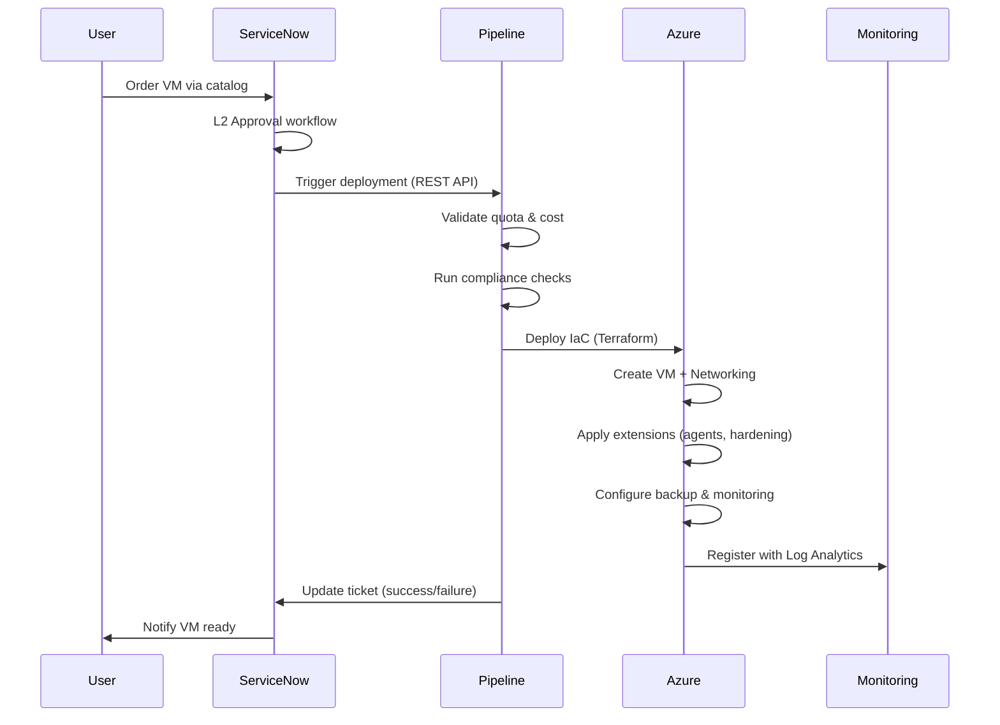

# Modern IaaS VM Automation Accelerator for Enterprise-Scale Landing Zones

## Overview

This accelerator provides a **comprehensive, production-ready solution** for automated VM deployment in Azure Enterprise-Scale Landing Zones (ESLZ), specifically designed for **enterprise Modern IaaS initiative**.

### 🎯 Solution Scope: Option Y (Semi Click-Ops with Full VM Automation)

This solution addresses the gap between fully manual VM provisioning and complete self-service automation, providing:

- ✅ **Automated VM provisioning** via ServiceNow catalog
- ✅ **Centralized governance** with decentralized agility
- ✅ **Built-in compliance** (hardening, agents, networking)
- ✅ **L2 approval workflows** with safeguard controls
- ✅ **Multi-environment support** (Dev, UAT, Prod)
- ✅ **Cost optimization** with quota management

---

## 📋 Requirements Summary

Based on enterprise MVP platform requirements:

### Core Requirements

| Requirement | Implementation |
|------------|---------------|
| **VM Deployment Automation** | Terraform IaC templates with centralized pipelines |
| **Enterprise Hardening Standards** | Custom script extensions, Azure Policy enforcement |
| **Agent Installation** | Automated deployment of monitoring, backup, security agents |
| **Safeguard/Sailpoint Integration** | Identity onboarding automation |
| **Network Configuration** | FCRs for AD/DNS, vNet/Subnet/NSG automation |
| **ServiceNow Catalog** | REST API integration with approval workflows |
| **Exception Approval Process** | Multi-level approval gates (L2, Management) |
| **Central Governance Monitoring** | Azure Policy, Activity Logs, cost tracking |
| **OS Patching (Decentral)** | Azure Update Management integration |
| **Backup & Restore (Decentral)** | Azure Backup automation with policy templates |
| **Baseline Monitoring** | Azure Monitor, Log Analytics, alerts |
| **ILM Process** | VM lifecycle management via ServiceNow |
| **VM Decommissioning** | Automated cleanup via SNOW catalog |
| **ASR for Hot VMs** | Optional Azure Site Recovery configuration |

### Enhancement Requirements

| Enhancement | Status |
|------------|--------|
| **Disk Modification via SNOW** | Optional Module |
| **VM SKU Change Pipeline** | Optional Module |
| **VM Restore Automation** | Optional Module |

---

## 🏗️ Architecture Overview

```
┌─────────────────────────────────────────────────────────────────┐
│                    ServiceNow Catalog                            │
│  (VM Order │ VM Decommission │ Disk Modify │ SKU Change)        │
└────────────────────────┬────────────────────────────────────────┘
                         │
                         ▼
┌─────────────────────────────────────────────────────────────────┐
│              L2 Approval Workflow (ServiceNow)                   │
└────────────────────────┬────────────────────────────────────────┘
                         │
                         ▼
┌─────────────────────────────────────────────────────────────────┐
│           Azure DevOps CI/CD Pipeline (Orchestrator)             │
│  ┌──────────────┬──────────────┬──────────────┬──────────────┐ │
│  │ Quota Check  │ Cost Forecast│ Compliance   │ Deployment   │ │
│  │ & Validation │ & Approval   │ Validation   │ Execution    │ │
│  └──────────────┴──────────────┴──────────────┴──────────────┘ │
└────────────────────────┬────────────────────────────────────────┘
                         │
                         ▼
┌─────────────────────────────────────────────────────────────────┐
│                Infrastructure as Code (Terraform)                │
│  ┌──────────────────────────────────────────────────────────┐  │
│  │ • VM with OS Image (Windows/Linux)                       │  │
│  │ • Networking (vNet, Subnet, NSG, FCRs for AD/DNS)        │  │
│  │ • Disk Configuration (OS + Data Disks)                   │  │
│  │ • Managed Identity & RBAC                                │  │
│  │ • Extensions: Hardening, Agents, Domain Join             │  │
│  │ • Backup Policy (Azure Backup)                           │  │
│  │ • Update Management (Patching)                           │  │
│  │ • Monitoring (Log Analytics, Alerts)                     │  │
│  │ • Optional: Azure Site Recovery (Hot VMs)                │  │
│  └──────────────────────────────────────────────────────────┘  │
└────────────────────────┬────────────────────────────────────────┘
                         │
                         ▼
┌─────────────────────────────────────────────────────────────────┐
│          Enterprise-Scale Landing Zone (ESLZ)                    │
│                  (300+ Existing Landing Zones)                   │
└─────────────────────────────────────────────────────────────────┘
                         │
                         ▼
┌─────────────────────────────────────────────────────────────────┐
│              Governance & Monitoring Layer                       │
│  ┌──────────────┬──────────────┬──────────────┬──────────────┐ │
│  │ Azure Policy │ Cost Mgmt    │ Activity Logs│ Compliance   │ │
│  │ Enforcement  │ & Chargeback │ & Audit      │ Dashboards   │ │
│  └──────────────┴──────────────┴──────────────┴──────────────┘ │
└─────────────────────────────────────────────────────────────────┘
```

---

## 📁 Repository Structure

```
vm-automation-accelerator/
├── README.md                          # This file
├── ARCHITECTURE.md                    # Detailed architecture documentation
├── DEPLOYMENT.md                      # Step-by-step deployment guide
├── CONTRIBUTING.md                    # Contribution guidelines
│
├── docs/                              # Documentation
│   ├── architecture-diagrams/         # Architecture visuals
│   ├── api-integration-guide.md       # ServiceNow API integration
│   ├── governance-guide.md            # Governance and compliance
│   ├── troubleshooting.md             # Common issues and solutions
│   └── faq.md                         # Frequently asked questions
│
├── iac/                               # Infrastructure as Code
│   ├── bicep/                         # Bicep modules
│   │   ├── modules/                   # Reusable Bicep modules
│   │   │   ├── vm-windows/            # Windows VM deployment
│   │   │   ├── vm-linux/              # Linux VM deployment
│   │   │   ├── networking/            # vNet, Subnet, NSG, FCR
│   │   │   ├── backup/                # Azure Backup configuration
│   │   │   ├── monitoring/            # Log Analytics, Alerts
│   │   │   ├── asr/                   # Azure Site Recovery (optional)
│   │   │   └── extensions/            # VM extensions (agents, hardening)
│   │   ├── main.bicep                 # Main orchestration template
│   │   └── parameters/                # Environment-specific parameters
│   │       ├── dev.parameters.json
│   │       ├── uat.parameters.json
│   │       └── prod.parameters.json
│   │
│   └── terraform/                     # Terraform modules (alternative)
│       ├── modules/                   # Reusable Terraform modules
│       ├── main.tf
│       └── environments/
│
├── pipelines/                         # CI/CD Pipeline definitions
│   ├── azure-devops/                  # Azure DevOps YAML pipelines
│   │   ├── vm-deploy-pipeline.yml     # VM deployment orchestration
│   │   ├── vm-decommission-pipeline.yml
│   │   ├── vm-disk-modify-pipeline.yml
│   │   ├── vm-sku-change-pipeline.yml
│   │   ├── vm-restore-pipeline.yml
│   │   └── templates/                 # Reusable pipeline templates
│   │       ├── quota-validation.yml
│   │       ├── cost-forecast.yml
│   │       ├── compliance-check.yml
│   │       └── servicenow-approval.yml
│   │
│   └── github-actions/                # GitHub Actions (alternative)
│       └── workflows/
│
├── scripts/                           # Automation scripts
│   ├── powershell/                    # PowerShell scripts
│   │   ├── Install-Your OrganizationAgents.ps1   # Agent installation
│   │   ├── Apply-Your OrganizationHardening.ps1  # Security hardening
│   │   ├── Configure-ADDNSConnectivity.ps1
│   │   ├── Validate-Quota.ps1         # Quota validation
│   │   ├── Get-CostForecast.ps1       # Cost estimation
│   │   └── Remove-VMResources.ps1     # Decommissioning cleanup
│   │
│   ├── bash/                          # Bash scripts (Linux VMs)
│   │   ├── install-Your Organization-agents.sh
│   │   ├── apply-Your Organization-hardening.sh
│   │   └── configure-ad-dns.sh
│   │
│   └── python/                        # Python scripts (API integration)
│       ├── servicenow_client.py       # ServiceNow REST API client
│       ├── quota_manager.py           # Quota tracking logic
│       └── cost_calculator.py         # Cost forecasting
│
├── config/                            # Configuration files
│   ├── vm-sizes.json                  # Allowed VM SKUs by environment
│   ├── os-images.json                 # Approved OS images
│   ├── backup-policies.json           # Backup policy templates
│   ├── monitoring-alerts.json         # Alert rule definitions
│   ├── compliance-policies.json       # Azure Policy definitions
│   └── servicenow-config.json         # ServiceNow integration settings
│
├── servicenow/                        # ServiceNow integration
│   ├── catalog-items/                 # Catalog item definitions
│   │   ├── vm-order-catalog.xml
│   │   ├── vm-decommission-catalog.xml
│   │   ├── vm-disk-modify-catalog.xml
│   │   ├── vm-sku-change-catalog.xml
│   │   └── vm-restore-catalog.xml
│   │
│   ├── workflows/                     # ServiceNow workflow definitions
│   │   ├── vm-approval-workflow.xml
│   │   └── exception-approval-workflow.xml
│   │
│   └── business-rules/                # ServiceNow business rules
│       └── vm-validation-rules.js
│
├── governance/                        # Governance and compliance
│   ├── azure-policies/                # Azure Policy definitions
│   │   ├── vm-naming-policy.json
│   │   ├── vm-tagging-policy.json
│   │   ├── vm-backup-enforcement.json
│   │   └── vm-network-compliance.json
│   │
│   ├── rbac/                          # RBAC role definitions
│   │   ├── vm-deployer-role.json
│   │   └── vm-operator-role.json
│   │
│   └── monitoring-dashboards/         # Azure Monitor dashboards
│       ├── vm-compliance-dashboard.json
│       └── cost-tracking-dashboard.json
│
├── tests/                             # Testing scripts
│   ├── unit/                          # Unit tests for scripts
│   ├── integration/                   # Integration tests
│   └── e2e/                           # End-to-end deployment tests
│
└── examples/                          # Example configurations
    ├── simple-windows-vm/             # Basic Windows VM example
    ├── simple-linux-vm/               # Basic Linux VM example
    ├── ha-vm-with-asr/                # High-availability VM with ASR
    └── multi-disk-vm/                 # VM with multiple data disks
```

---

## 🚀 Quick Start

### Prerequisites

1. **Azure Subscription** with Enterprise-Scale Landing Zones deployed
2. **Azure DevOps** or **GitHub** with appropriate service connections
3. **ServiceNow instance** with REST API enabled
4. **Permissions**:
   - Contributor on target subscriptions
   - User Access Administrator (for RBAC assignments)
   - ServiceNow Admin (for catalog/workflow setup)

### Installation Steps

1. **Clone this repository**:
   ```bash
   git clone https://github.com/your-org/vm-automation-accelerator.git
   cd vm-automation-accelerator
   ```

2. **Configure environment**:
   ```bash
   # Copy and customize configuration files
   cp config/servicenow-config.sample.json config/servicenow-config.json
   # Edit with your ServiceNow instance details
   ```

3. **Deploy pipelines**:
   ```bash
   # Import Azure DevOps pipelines
   az pipelines create --name "VM-Deploy" --yaml-path pipelines/azure-devops/vm-deploy-pipeline.yml
   ```

4. **Configure ServiceNow**:
   - Import catalog items from `servicenow/catalog-items/`
   - Configure workflows from `servicenow/workflows/`
   - Set up REST API endpoints

5. **Test deployment**:
   ```bash
   # Deploy a test VM
   az deployment group create \
     --resource-group rg-test \
     --template-file iac/bicep/main.bicep \
     --parameters @iac/bicep/parameters/dev.parameters.json
   ```

For detailed deployment instructions, see **[DEPLOYMENT.md](./DEPLOYMENT.md)**.

---

## 🔑 Key Features

### 1. **Automated VM Provisioning**
- Infrastructure as Code (Terraform)
- Parameterized templates for Windows/Linux
- Multi-environment support (Dev, UAT, Prod)

### 2. **ServiceNow Integration**
- Self-service catalog for VM ordering
- L2 approval workflows
- Exception approval process
- Automated ticket updates

### 3. **Compliance & Governance**
- Enterprise Hardening Standards
- Automated agent installation (monitoring, backup, security)
- Network compliance (FCRs for AD/DNS)
- Azure Policy enforcement
- Tagging and naming standards

### 4. **Cost Management**
- Pre-deployment cost forecasting
- Quota validation and tracking
- Usage monitoring and alerts
- Chargeback reporting

### 5. **Lifecycle Management**
- Automated VM decommissioning
- Disk modification automation
- VM SKU change capability
- Backup and restore automation

### 6. **Monitoring & Operations**
- Baseline monitoring (CPU, Memory, Disk, Network)
- Log Analytics integration
- Custom alert rules
- Compliance dashboards

### 7. **High Availability (Optional)**
- Azure Site Recovery integration
- Automated failover configuration
- DR testing automation

---

## 📊 Deployment Workflow



---

## 📖 Documentation

- **[Architecture Guide](./ARCHITECTURE.md)**: Detailed architecture and design decisions
- **[Deployment Guide](./DEPLOYMENT.md)**: Step-by-step deployment instructions
- **[ServiceNow Integration](./docs/api-integration-guide.md)**: REST API setup and configuration
- **[Governance Guide](./docs/governance-guide.md)**: Compliance and policy enforcement
- **[Troubleshooting](./docs/troubleshooting.md)**: Common issues and resolutions
- **[FAQ](./docs/faq.md)**: Frequently asked questions

---

## 🤝 Contributing

We welcome contributions! Please see **[CONTRIBUTING.md](./CONTRIBUTING.md)** for guidelines.

---

## 📝 License

This project is licensed under the MIT License - see the [LICENSE](LICENSE) file for details.

---

## 🆘 Support

For issues, questions, or feature requests:
1. Check **[Troubleshooting Guide](./docs/troubleshooting.md)**
2. Search **[Existing Issues](https://github.com/your-org/vm-automation-accelerator/issues)**
3. Create a **[New Issue](https://github.com/your-org/vm-automation-accelerator/issues/new)**

---

## � Author

**Pavleen Bali**  
Cloud Solution Architect - Cloud and AI Platform  
Microsoft

---

## 🙏 Acknowledgments

- **Microsoft Enterprise-Scale Landing Zones**: [aka.ms/alz](https://aka.ms/alz)

---

## 🗺️ Roadmap

### Phase 1: MVP (Current)
- ✅ Core VM deployment automation
- ✅ ServiceNow catalog integration
- ✅ Basic governance and compliance
- ✅ Backup and monitoring

### Phase 2: Enhancements (Planned)
- 🔲 Disk modification automation
- 🔲 VM SKU change pipeline
- 🔲 VM restore automation
- 🔲 Advanced cost optimization

### Phase 3: Advanced Features (Future)
- 🔲 Multi-cloud support (AWS, GCP)
- 🔲 Container support (AKS)
- 🔲 AI-powered cost optimization
- 🔲 Predictive scaling

---
