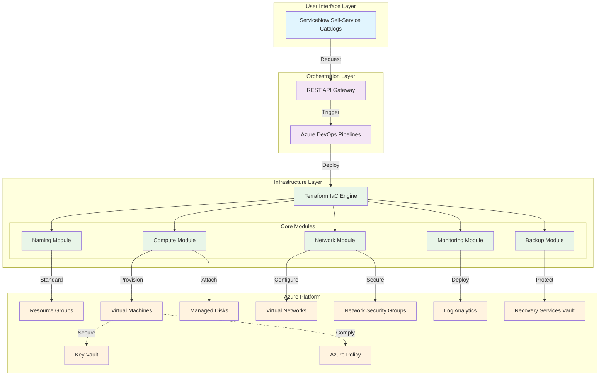
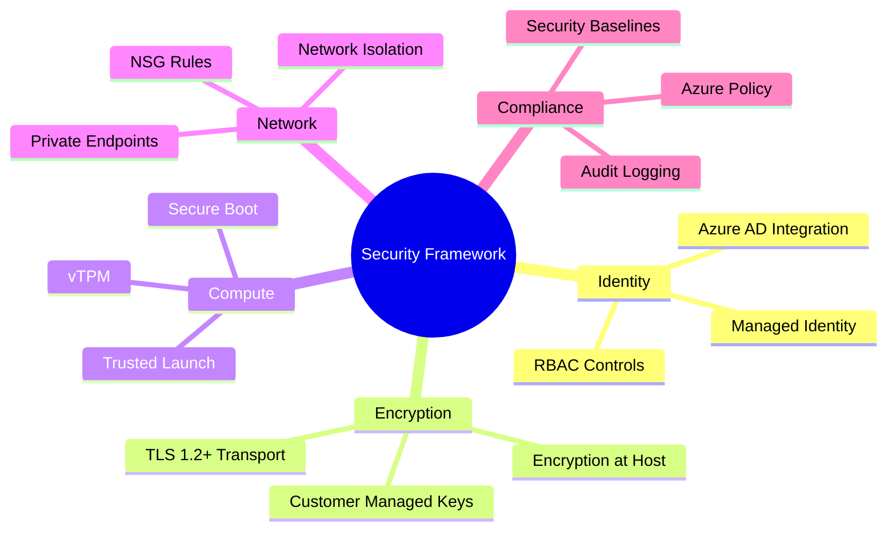

# Azure VM Automation Accelerator

[](./LICENSE)
[](https://www.terraform.io/)
[](https://azure.github.io/Azure-Verified-Modules/)
[](https://github.com/PowerShell/PowerShell)

**Enterprise-grade Azure virtual machine automation platform** with security-first design, ServiceNow integration, and comprehensive lifecycle management capabilities.

---

## Overview

The Azure VM Automation Accelerator is a production-ready infrastructure automation platform designed for enterprise environments that require centralized governance with decentralized execution. Built on Azure Verified Module patterns and enterprise-grade security controls, this solution enables self-service VM provisioning while maintaining strict compliance and operational excellence.

### Core Capabilities

| Capability | Implementation |
|------------|---------------|
| **Enterprise Security** | Managed identities, encryption at host, Trusted Launch, customer-managed keys |
| **Self-Service Portal** | ServiceNow catalog integration with approval workflows |
| **Pipeline Automation** | Azure DevOps CI/CD with validation, compliance checks, and deployment |
| **Monitoring & Insights** | Azure Monitor Agent, VM Insights, Data Collection Rules |
| **Lifecycle Management** | VM provisioning, disk operations, SKU changes, backup and restore |
| **Governance & Compliance** | Azure Policy enforcement, tagging standards, cost controls |
| **Infrastructure as Code** | Terraform modules following Azure Verified Module patterns |

---

## Architecture



**Detailed Architecture**: [View Complete Architecture Guide](./ARCHITECTURE.md)

---

## Quick Start

### Prerequisites

| Tool | Version | Purpose |
|------|---------|---------|
| [Terraform](https://www.terraform.io/) | >= 1.5.0 | Infrastructure as Code |
| [Azure CLI](https://docs.microsoft.com/cli/azure/) | >= 2.50.0 | Azure management |
| [PowerShell](https://github.com/PowerShell/PowerShell) | >= 7.0 | Automation scripts |
| [jq](https://stedolan.github.io/jq/) | >= 1.6 | JSON processing |

### Azure Requirements

- **Subscription** with Contributor access
- **User Access Administrator** role for role assignments
- **Key Vault Administrator** role for secrets management

### Deployment Process

```mermaid
flowchart LR
    START([Start]) --> AUTH[Azure Authentication]
    AUTH --> BOOTSTRAP[Bootstrap Control Plane]
    BOOTSTRAP --> NETWORK[Deploy Network Infrastructure]
    NETWORK --> VM[Deploy Virtual Machines]
    VM --> GOVERNANCE[Apply Governance Policies]
    GOVERNANCE --> VALIDATE[Validate Deployment]
    VALIDATE --> COMPLETE([Complete])
    
    classDef startEnd fill:#4caf50,color:#fff
    classDef process fill:#2196f3,color:#fff
    
    class START,COMPLETE startEnd
    class AUTH,BOOTSTRAP,NETWORK,VM,GOVERNANCE,VALIDATE process
```



### Basic Deployment

```bash
# Authentication
az login
az account set --subscription "<subscription-id>"

# Deploy infrastructure
cd deploy/scripts
./deploy_control_plane.sh -e dev -r eastus -p myproject
./deploy_workload_zone.sh -e dev -r eastus
./deploy_vm.sh -e dev -r eastus -n webserver
```

**Complete Guide**: [View Deployment Documentation](./deploy/README.md)

---

## Repository Structure

```
vm-automation-accelerator/
├── README.md                          # This file
├── ARCHITECTURE.md                    # Architecture documentation
├── CONTRIBUTING.md                    # Contribution guidelines
│
├── boilerplate/                       # Configuration templates
│   ├── README.md                      # Template usage guide
│   ├── bootstrap/                     # Control plane templates
│   └── run/                           # Deployment templates
│
├── deploy/                            # Deployment assets
│   ├── README.md                      # Deployment guide
│   ├── pipelines/                     # Azure DevOps YAML pipelines
│   ├── scripts/                       # Automation scripts
│   ├── servicenow/                    # ServiceNow integration
│   └── terraform/                     # Infrastructure as Code
│       ├── bootstrap/                 # Control plane setup
│       ├── run/                       # Deployment configurations
│       └── terraform-units/modules/   # Reusable modules
│
└── terraform-docs/                   # Terraform documentation
    ├── TERRAFORM-GUIDE.md             # Terraform usage guide
    └── STATE-MANAGEMENT.md            # State management guide
```

---

## Security Framework

The solution implements enterprise-grade security controls:



### Security Implementation

| Security Control | Status | Implementation |
|------------------|--------|----------------|
| **Identity & Access** | Enabled | Managed identities, RBAC, Azure AD integration |
| **Data Encryption** | Enabled | Encryption at host, customer-managed keys |
| **Compute Security** | Enabled | Trusted Launch, Secure Boot, vTPM |
| **Network Security** | Enabled | Private endpoints, NSG rules, network isolation |
| **Compliance** | Active | Azure Policy enforcement, security baselines |

---

## Operations

### Lifecycle Management

| Operation | Description | Automation |
|-----------|-------------|------------|
| **VM Provisioning** | Create new virtual machines with security controls | Azure DevOps Pipeline |
| **Disk Management** | Add, resize, or modify VM disks | ServiceNow Catalog |
| **SKU Changes** | Modify VM sizes and configurations | API Wrapper |
| **Backup & Restore** | Data protection and recovery operations | Recovery Services Vault |
| **Decommissioning** | Secure VM removal with data cleanup | Automated Pipeline |

### Performance Metrics

| Operation | Average Duration | Description |
|-----------|-----------------|-------------|
| **Control Plane Bootstrap** | 5 minutes | One-time setup of state storage and Key Vault |
| **Network Infrastructure** | 8 minutes | VNet, subnets, and NSGs deployment |
| **VM Deployment** | 15 minutes | Complete VM with monitoring and backup |
| **End-to-End Pipeline** | 18 minutes | Full infrastructure deployment |

---

## Configuration

### Environment Variables

```bash
export ARM_SUBSCRIPTION_ID="<subscription-id>"
export ARM_TENANT_ID="<tenant-id>"
export ARM_CLIENT_ID="<client-id>"
export ARM_CLIENT_SECRET="<client-secret>"
```

### Terraform Configuration Example

```hcl
# Environment configuration
environment = "production"
location    = "eastus"
project     = "webapp"

# VM configuration
vm_name         = "vm-web-prod-001"
vm_size         = "Standard_D4s_v5"
os_type         = "Linux"
os_disk_size_gb = 128

# Security settings
enable_encryption_at_host = true
enable_trusted_launch     = true
enable_secure_boot        = true

# Networking
vnet_address_space    = ["10.0.0.0/16"]
subnet_address_prefix = "10.0.1.0/24"

# Monitoring
enable_monitoring = true
enable_backup     = true

# Tags
tags = {
  Environment = "production"
  Project     = "webapp"
  ManagedBy   = "terraform"
  Owner       = "platform-team"
}
```

---

## Documentation

| Document | Description |
|----------|-------------|
| [Architecture Guide](./ARCHITECTURE.md) | Comprehensive architecture documentation |
| [Deployment Guide](./deploy/README.md) | Step-by-step deployment instructions |
| [Configuration Templates](./boilerplate/README.md) | Ready-to-use configuration examples |
| [Terraform Guide](./terraform-docs/TERRAFORM-GUIDE.md) | Terraform usage and best practices |
| [State Management](./terraform-docs/STATE-MANAGEMENT.md) | Remote state configuration guide |
| [Contributing Guidelines](./CONTRIBUTING.md) | Development and contribution process |

---

## Support

- **Issues**: Report bugs and request features via [GitHub Issues](../../issues)
- **Discussions**: Join community discussions via [GitHub Discussions](../../discussions)
- **Documentation**: Comprehensive guides available in the `/docs` directory

---

## License

This project is licensed under the MIT License. See the [LICENSE](./LICENSE) file for details.

---

**Built for enterprise Azure infrastructure automation**