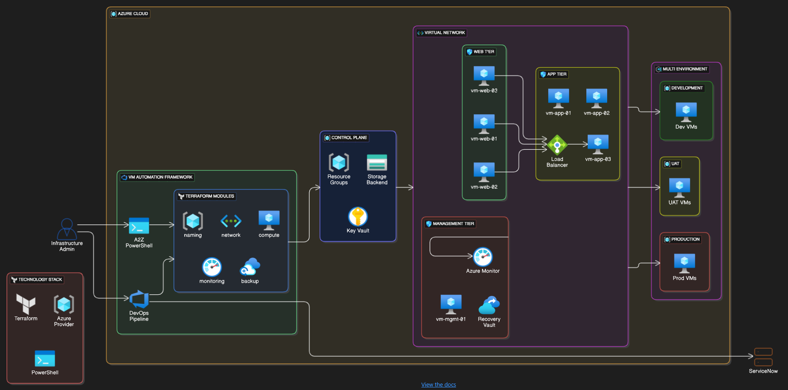
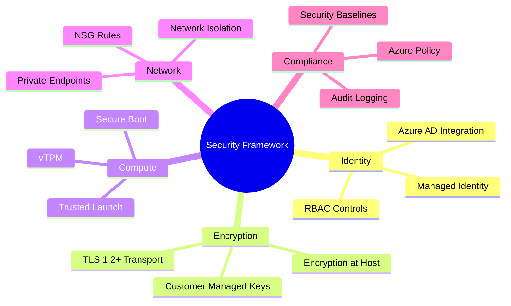

# Azure VM Automation Accelerator v2.0

[](./LICENSE)
[](https://www.terraform.io/)
[](https://azure.github.io/Azure-Verified-Modules/)
[](https://github.com/PowerShell/PowerShell)

**Enterprise-grade Azure virtual machine automation platform** with security-first design, ServiceNow integration, and comprehensive lifecycle management capabilities.

---

## Overview

The Azure VM Automation Accelerator is a production-ready infrastructure automation platform designed for enterprise environments that require centralized governance with decentralized execution. Built on Azure Verified Module patterns and enterprise-grade security controls, this solution enables self-service VM provisioning while maintaining strict compliance and operational excellence.

### 🏗️ Enterprise Architecture



*Complete enterprise platform architecture showing Infrastructure Admin, VM Automation Framework, Control Plane, Virtual Network Infrastructure, Multi-Environment Support, and Technology Stack integration*

**Key Architectural Components:**

- **🧑‍💼 Infrastructure Admin**: Central management and automation control
- **🔄 VM Automation Framework**: A-Z PowerShell scripts and DevOps pipelines with modular Terraform components  
- **🏗️ Control Plane**: Resource groups, storage backend, and Key Vault for secure state management
- **🌐 Virtual Network Infrastructure**: Multi-tier architecture (Web, App, Management) with load balancing
- **🚀 Multi-Environment Support**: Development, UAT, and Production environments
- **⚙️ Technology Stack**: Terraform with Azure Provider and PowerShell automation
- **🔒 Security & Governance**: Azure Policy, RBAC controls, and managed identity integration
- **📊 Monitoring & Operations**: Complete observability with Azure Monitor and backup services

### Core Capabilities

| Capability | Implementation |
|------------|---------------|
| **Enterprise Security** | Managed identities, encryption at host, Trusted Launch, customer-managed keys |
| **Self-Service Portal** | ServiceNow catalog integration with approval workflows |
| **Pipeline Automation** | Azure DevOps CI/CD with validation, compliance checks, and deployment |
| **Monitoring & Insights** | Azure Monitor Agent, VM Insights, Data Collection Rules |
| **Lifecycle Management** | VM provisioning, disk operations, SKU changes, backup and restore |
| **Governance & Compliance** | Azure Policy enforcement, tagging standards, cost controls |
| **Infrastructure as Code** | Terraform modules following Azure Verified Module patterns |

### ✨ What's New in Version 2.0

| Feature Category | v1.0 (Previous) | v2.0 (Current) | Enhancement |
|------------------|-----------------|----------------|-------------|
| **🏗️ Architecture** | Basic ServiceNow integration | Enterprise-scale layered architecture | Multi-tier orchestration with comprehensive automation |
| **🚀 Deployment** | Manual terraform execution | A-to-Z automated deployment scripts | Complete end-to-end automation with validation |
| **🔒 Security** | Basic RBAC | Advanced security framework | Managed identities, encryption at host, Trusted Launch |
| **📊 Monitoring** | Basic logging | Comprehensive observability | Azure Monitor, VM Insights, Data Collection Rules |
| **🔄 Pipeline Integration** | Single environment | Multi-environment CI/CD | Dev, UAT, Prod with automated promotion |
| **📋 Configuration** | Static configuration | Dynamic configuration management | Environment-specific configs with validation |
| **🛡️ Compliance** | Manual policy enforcement | Automated governance | Azure Policy automation, compliance reporting |
| **📖 Documentation** | Basic README | Comprehensive documentation suite | Architecture guides, troubleshooting, best practices |
| **🔧 Operations** | Manual VM operations | Automated lifecycle management | VM provisioning, scaling, backup, restore automation |
| **🌐 Networking** | Basic networking | Advanced network security | NSG automation, subnet management, firewall rules |
| **💾 Storage** | Standard disks | Enterprise storage management | Managed disks, encryption, backup policies |
| **🎯 Targeting** | Single subscription | Multi-subscription enterprise | Cross-tenant, cross-region deployment support |
| **⚡ Performance** | Basic deployment | Optimized deployment engine | Parallel execution, dependency management |
| **🔍 Diagnostics** | Limited troubleshooting | Advanced diagnostics | Comprehensive logging, error resolution guides |
| **📦 Modularity** | Monolithic approach | Modular architecture | Reusable Terraform modules, component-based design |

> **💡 Key Improvements**: Version 2.0 represents a complete architectural evolution from a basic VM provisioning tool to an enterprise-grade automation platform with comprehensive security, monitoring, and governance capabilities.

---

## Quick Start

### Prerequisites

| Tool | Version | Purpose |
|------|---------|---------|
| [Terraform](https://www.terraform.io/) | >= 1.5.0 | Infrastructure as Code |
| [Azure CLI](https://docs.microsoft.com/cli/azure/) | >= 2.50.0 | Azure management |
| [PowerShell](https://github.com/PowerShell/PowerShell) | >= 7.0 | Automation scripts |
| [jq](https://stedolan.github.io/jq/) | >= 1.6 | JSON processing |

### Azure Requirements

- **Subscription** with Contributor access
- **User Access Administrator** role for role assignments
- **Key Vault Administrator** role for secrets management

### Deployment Process


```mermaid
flowchart LR
    START([Start]) --> AUTH[Azure Authentication]
    AUTH --> BOOTSTRAP[Bootstrap Control Plane]
    BOOTSTRAP --> NETWORK[Deploy Network Infrastructure]
    NETWORK --> VM[Deploy Virtual Machines]
    VM --> GOVERNANCE[Apply Governance Policies]
    GOVERNANCE --> VALIDATE[Validate Deployment]
    VALIDATE --> COMPLETE([Complete])
    
    classDef startEnd fill:#4caf50,color:#fff
    classDef process fill:#2196f3,color:#fff
    
    class START,COMPLETE startEnd
    class AUTH,BOOTSTRAP,NETWORK,VM,GOVERNANCE,VALIDATE process
```

### Basic Deployment

```powershell
# Authentication
az login
az account set --subscription "<subscription-id>"

# 🚀 One-Command Deployment (A-to-Z)
./scripts/Deploy-VMAutomationAccelerator.ps1 -Environment "dev" -Location "eastus"
```

### PowerShell Script Reference

The **Deploy-VMAutomationAccelerator.ps1** script provides comprehensive automation for the entire infrastructure lifecycle. Here's the complete usage guide:

#### Script Parameters

| Parameter | Type | Required | Description | Values |
|-----------|------|----------|-------------|---------|
| `-Environment` | String | ✅ **Yes** | Target deployment environment | `dev`, `uat`, `prod` |
| `-SubscriptionId` | String | ❌ No | Azure subscription ID | Any valid subscription GUID |
| `-Location` | String | ❌ No | Azure region for deployment | Default: `eastus` |
| `-ValidateOnly` | Switch | ❌ No | Validate configuration without deploying | |
| `-DestroyAfterValidation` | Switch | ❌ No | Clean up resources after validation | |
| `-SkipControlPlane` | Switch | ❌ No | Skip control plane deployment | |
| `-SkipWorkloadZone` | Switch | ❌ No | Skip workload zone deployment | |
| `-AutoResolveDependencies` | Switch | ❌ No | Automatically resolve infrastructure conflicts | |

#### Usage Examples

```powershell
# 🚀 Full Production Deployment
./scripts/Deploy-VMAutomationAccelerator.ps1 -Environment "prod" -Location "westus2" -SubscriptionId "12345678-1234-1234-1234-123456789012"

# 🧪 Development Environment with Validation Only
./scripts/Deploy-VMAutomationAccelerator.ps1 -Environment "dev" -ValidateOnly

# 🔧 Partial Deployment (Skip Control Plane)
./scripts/Deploy-VMAutomationAccelerator.ps1 -Environment "uat" -SkipControlPlane

# 🔄 Infrastructure Update with Auto-Resolution
./scripts/Deploy-VMAutomationAccelerator.ps1 -Environment "dev" -AutoResolveDependencies

# 🧹 Test Deployment with Cleanup
./scripts/Deploy-VMAutomationAccelerator.ps1 -Environment "dev" -ValidateOnly -DestroyAfterValidation

# ⚡ Quick Component-Specific Testing
./scripts/Test-QuickPipeline.ps1 -Environment "dev"
```

#### Advanced Deployment Scenarios

```powershell
# 🏗️ Workload Zone Only (Existing Control Plane)
./scripts/Deploy-VMAutomationAccelerator.ps1 -Environment "prod" -SkipControlPlane

# 🖥️ VM Deployment Only (Existing Infrastructure)
./scripts/Deploy-VMAutomationAccelerator.ps1 -Environment "prod" -SkipControlPlane -SkipWorkloadZone

# 🔍 Configuration Validation
./scripts/Deploy-VMAutomationAccelerator.ps1 -Environment "dev" -ValidateOnly

# 🚨 Troubleshooting Deployment Issues
./scripts/Validate-PipelineEcosystem.ps1
./scripts/Fix-PipelineCompatibility.ps1
```

> **💡 Pro Tip**: The script automatically handles Terraform state management, dependency resolution, and provides comprehensive error handling with auto-recovery capabilities.

**Complete Guide**: [View Deployment Documentation](./deploy/README.md)

---

## Azure DevOps CI/CD Pipeline Setup

For enterprise-scale deployments, set up automated CI/CD pipelines using Azure DevOps. This approach provides governance, approval workflows, and automated deployments across environments.

### Prerequisites for CI/CD Setup

| Requirement | Description |
|-------------|-------------|
| **Azure DevOps Organization** | Active Azure DevOps organization with project |
| **Service Principal** | Azure AD app registration with Contributor access |
| **Variable Groups** | Azure DevOps library for environment secrets |
| **Repository Access** | This repository imported into Azure DevOps |

### Step-by-Step Pipeline Setup

#### 1️⃣ **Create Service Principal**

```bash
# Create service principal for pipeline authentication
az ad sp create-for-rbac --name "vm-automation-sp-prod" \
  --role "Contributor" \
  --scopes "/subscriptions/<SUBSCRIPTION-ID>" \
  --sdk-auth

# Note the output - you'll need clientId, clientSecret, tenantId
```

#### 2️⃣ **Configure Azure DevOps Service Connection**

1. Navigate to **Project Settings** → **Service Connections**
2. Create **New Service Connection** → **Azure Resource Manager**
3. Select **Service principal (manual)**
4. Configure:
   - **Service Connection Name**: `Azure-VM-Automation-Production`
   - **Subscription ID**: Your Azure subscription
   - **Service Principal ID**: `clientId` from step 1
   - **Service Principal Key**: `clientSecret` from step 1
   - **Tenant ID**: `tenantId` from step 1

#### 3️⃣ **Setup Variable Groups**

Create variable groups for each environment:

```yaml
# Variable Group: "vm-automation-dev"
ARM_CLIENT_ID: "<service-principal-client-id>"
ARM_CLIENT_SECRET: "<service-principal-secret>"  # Mark as secret
ARM_SUBSCRIPTION_ID: "<azure-subscription-id>"
ARM_TENANT_ID: "<azure-tenant-id>"
ENVIRONMENT: "dev"
LOCATION: "eastus"
```

#### 4️⃣ **Create Pipeline YAML**

```yaml
# azure-pipelines.yml
trigger:
  branches:
    include:
    - main
    - feature/*
  paths:
    exclude:
    - README.md
    - _docs/*

variables:
- group: vm-automation-dev  # Link your variable group

stages:
- stage: Validate
  displayName: 'Validate Infrastructure'
  jobs:
  - job: ValidateDeployment
    displayName: 'Validate Terraform Configuration'
    pool:
      vmImage: 'ubuntu-latest'
    steps:
    - task: AzureCLI@2
      displayName: 'Validate Infrastructure'
      inputs:
        azureSubscription: 'Azure-VM-Automation-Production'
        scriptType: 'pscore'
        scriptPath: 'scripts/Deploy-VMAutomationAccelerator.ps1'
        arguments: '-Environment $(ENVIRONMENT) -ValidateOnly'

- stage: Deploy
  displayName: 'Deploy Infrastructure'
  dependsOn: Validate
  condition: and(succeeded(), eq(variables['Build.SourceBranch'], 'refs/heads/main'))
  jobs:
  - deployment: DeployInfrastructure
    displayName: 'Deploy VM Automation Infrastructure'
    environment: 'vm-automation-$(ENVIRONMENT)'
    pool:
      vmImage: 'ubuntu-latest'
    strategy:
      runOnce:
        deploy:
          steps:
          - task: AzureCLI@2
            displayName: 'Deploy Complete Infrastructure'
            inputs:
              azureSubscription: 'Azure-VM-Automation-Production'
              scriptType: 'pscore'
              scriptPath: 'scripts/Deploy-VMAutomationAccelerator.ps1'
              arguments: '-Environment $(ENVIRONMENT) -Location $(LOCATION) -AutoResolveDependencies'
```

#### 5️⃣ **Configure Pipeline Permissions**

1. **Pipeline Permissions**:
   - Navigate to **Pipelines** → **Environments**
   - Create environment: `vm-automation-dev`
   - Configure **Approvals and checks** for production

2. **Security Settings**:
   - **Approvals**: Require approval for production deployments
   - **Branch Control**: Restrict to `main` branch for production
   - **Resource Authorization**: Auto-authorize resources

#### 6️⃣ **Advanced Pipeline Features**

```yaml
# Multi-environment pipeline with approvals
- stage: DeployProduction
  displayName: 'Deploy to Production'
  dependsOn: DeployUAT
  variables:
  - group: vm-automation-prod
  jobs:
  - deployment: ProductionDeployment
    displayName: 'Production Infrastructure Deployment'
    environment: 'vm-automation-production'  # Requires manual approval
    strategy:
      runOnce:
        deploy:
          steps:
          - task: AzureCLI@2
            displayName: 'Production Deployment with Monitoring'
            inputs:
              azureSubscription: 'Azure-VM-Automation-Production'
              scriptType: 'pscore'
              scriptPath: 'scripts/Deploy-VMAutomationAccelerator.ps1'
              arguments: '-Environment prod -Location westus2 -AutoResolveDependencies'
          
          - task: PowerShell@2
            displayName: 'Post-Deployment Validation'
            inputs:
              targetType: 'filePath'
              filePath: 'scripts/Validate-PipelineEcosystem.ps1'
```

### 🚀 **Benefits of CI/CD Approach**

| Feature | Benefit |
|---------|---------|
| **🔒 Automated Security** | Service principal authentication, no manual credentials |
| **📋 Approval Workflows** | Manual approval gates for production deployments |
| **🔄 Infrastructure Validation** | Automatic validation before deployment |
| **📊 Deployment Tracking** | Complete audit trail and deployment history |
| **🚨 Error Handling** | Automatic rollback and notification on failures |
| **🌍 Multi-Environment** | Consistent deployments across dev/uat/prod |

### 🛠️ **Pipeline vs Direct Script Execution**

| Approach | Use Case | Benefits |
|----------|----------|----------|
| **Direct Script** | Development, testing, quick deployments | Fast iteration, full control, immediate feedback |
| **Azure DevOps Pipeline** | Production, enterprise governance | Approval gates, audit trails, automated validation |

> **🎯 Recommendation**: Use direct script execution for development and Azure DevOps pipelines for production deployments with governance requirements.

---

## Repository Structure

```
vm-automation-accelerator/
├── README.md                          # Main project documentation
├── CONTRIBUTING.md                    # Contribution guidelines  
├── LICENSE                            # MIT License
├── .gitignore                         # Git ignore configuration
│
├── scripts/                           # 🚀 Automation Scripts
│   ├── Deploy-VMAutomationAccelerator.ps1  # Main A-to-Z deployment
│   ├── Fix-PipelineCompatibility.ps1       # Pipeline compatibility fixes
│   ├── Manage-InfrastructureConfig.ps1     # Configuration management
│   ├── Test-QuickPipeline.ps1              # Quick pipeline testing
│   ├── Validate-PipelineEcosystem.ps1      # Ecosystem validation
│   └── utilities/                           # Helper scripts
│
├── .azuredevops/                      # 🔄 Azure DevOps Configuration
│   └── pipelines/                     # Pipeline definitions
│
├── boilerplate/                       # 📋 Configuration Templates
│   ├── README.md                      # Template usage guide
│   ├── bootstrap/                     # Control plane templates
│   └── run/                           # Deployment templates
│
├── config/                            # ⚙️ Infrastructure Configuration
│   └── infrastructure-config.yaml     # Environment definitions
│
├── deploy/                            # 🏗️ Deployment Assets
│   ├── README.md                      # Comprehensive deployment guide
│   ├── pipelines/                     # Azure DevOps YAML pipelines
│   ├── scripts/                       # Deployment automation scripts
│   ├── servicenow/                    # ServiceNow integration
│   └── terraform/                     # Infrastructure as Code
│       ├── bootstrap/                 # Control plane setup
│       ├── run/                       # Environment configurations
│       └── terraform-units/modules/   # Reusable Terraform modules
│
└── terraform-docs/                   # 📖 Terraform Documentation
    ├── TERRAFORM-GUIDE.md             # Terraform usage guide
    └── STATE-MANAGEMENT.md            # State management guide
```

> **📁 Repository Organization**: Version 2.0 features a clean, production-ready structure optimized for enterprise deployments. The repository contains comprehensive documentation and production-ready automation scripts.

---

## Security Framework

The solution implements enterprise-grade security controls:


```mermaid
mindmap
  root((Security Framework))
    Identity
      Managed Identity
      Azure AD Integration
      RBAC Controls
    Encryption
      Encryption at Host
      Customer Managed Keys
      TLS 1.2+ Transport
    Compute
      Trusted Launch
      Secure Boot
      vTPM
    Network
      Private Endpoints
      NSG Rules
      Network Isolation
    Compliance
      Azure Policy
      Security Baselines
      Audit Logging
```

### Security Implementation

| Security Control | Status | Implementation |
|------------------|--------|----------------|
| **Identity & Access** | Enabled | Managed identities, RBAC, Azure AD integration |
| **Data Encryption** | Enabled | Encryption at host, customer-managed keys |
| **Compute Security** | Enabled | Trusted Launch, Secure Boot, vTPM |
| **Network Security** | Enabled | Private endpoints, NSG rules, network isolation |
| **Compliance** | Active | Azure Policy enforcement, security baselines |

---

## Operations

### Lifecycle Management

| Operation | Description | Automation |
|-----------|-------------|------------|
| **VM Provisioning** | Create new virtual machines with security controls | Azure DevOps Pipeline |
| **Disk Management** | Add, resize, or modify VM disks | ServiceNow Catalog |
| **SKU Changes** | Modify VM sizes and configurations | API Wrapper |
| **Backup & Restore** | Data protection and recovery operations | Recovery Services Vault |
| **Decommissioning** | Secure VM removal with data cleanup | Automated Pipeline |

### Performance Metrics

| Operation | Average Duration | Description |
|-----------|-----------------|-------------|
| **Control Plane Bootstrap** | 5 minutes | One-time setup of state storage and Key Vault |
| **Network Infrastructure** | 8 minutes | VNet, subnets, and NSGs deployment |
| **VM Deployment** | 15 minutes | Complete VM with monitoring and backup |
| **End-to-End Pipeline** | 18 minutes | Full infrastructure deployment |

---

## Configuration

### Environment Variables

```bash
export ARM_SUBSCRIPTION_ID="<subscription-id>"
export ARM_TENANT_ID="<tenant-id>"
export ARM_CLIENT_ID="<client-id>"
export ARM_CLIENT_SECRET="<client-secret>"
```

### Terraform Configuration Example

```hcl
# Environment configuration
environment = "production"
location    = "eastus"
project     = "webapp"

# VM configuration
vm_name         = "vm-web-prod-001"
vm_size         = "Standard_D4s_v5"
os_type         = "Linux"
os_disk_size_gb = 128

# Security settings
enable_encryption_at_host = true
enable_trusted_launch     = true
enable_secure_boot        = true

# Networking
vnet_address_space    = ["10.0.0.0/16"]
subnet_address_prefix = "10.0.1.0/24"

# Monitoring
enable_monitoring = true
enable_backup     = true

# Tags
tags = {
  Environment = "production"
  Project     = "webapp"
  ManagedBy   = "terraform"
  Owner       = "platform-team"
}
```

---

## Documentation

| Document | Description |
|----------|-------------|
| [Deployment Guide](./deploy/README.md) | Step-by-step deployment instructions |
| [Configuration Templates](./boilerplate/README.md) | Ready-to-use configuration examples |
| [Terraform Guide](./terraform-docs/TERRAFORM-GUIDE.md) | Terraform usage and best practices |
| [State Management](./terraform-docs/STATE-MANAGEMENT.md) | Remote state configuration guide |
| [Contributing Guidelines](./CONTRIBUTING.md) | Development and contribution process |

---

## Support

- **Issues**: Report bugs and request features via [GitHub Issues](https://github.com/gitpavleenbali/vm-automation-accelerator/issues)
- **Community**: Star ⭐ this repository and share your experience
- **Documentation**: Comprehensive guides available in this repository

---

## License

This project is licensed under the MIT License. See the [LICENSE](./LICENSE) file for details.

---

**Built for enterprise Azure infrastructure automation**