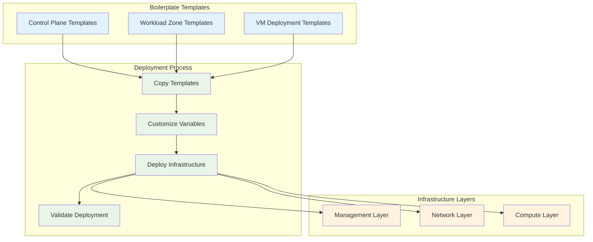
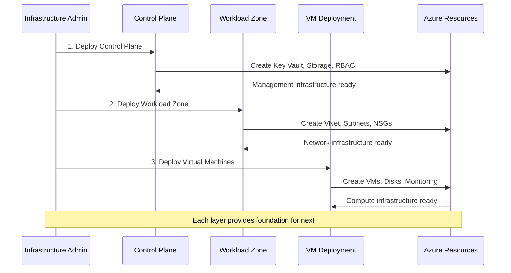
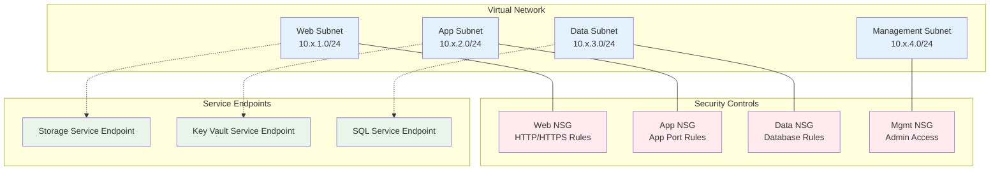
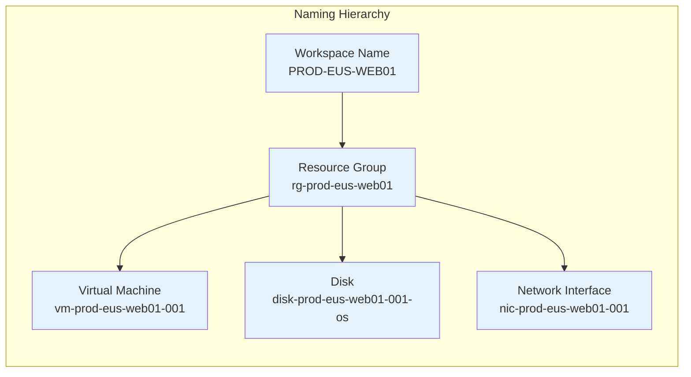

# Boilerplate Workspace Templates

Enterprise-ready configuration templates for deploying Azure infrastructure with the VM Automation Accelerator.

---

## Overview

These boilerplate templates are **production-ready starter configurations** that provide pre-configured examples for common deployment scenarios. Instead of writing Terraform `.tfvars` files from scratch, you can copy these templates, customize them with your specific values, and deploy immediately.

### Template Benefits

| Feature | Benefit | Implementation |
|---------|---------|----------------|
| **Rapid Deployment** | Deploy infrastructure in minutes | Pre-configured Terraform variables |
| **Best Practices** | Security and compliance standards | Built-in Azure Well-Architected patterns |
| **Consistency** | Standardized naming and tagging | Enterprise naming conventions |
| **Multi-Environment** | Dev, UAT, and Production templates | Environment-specific configurations |
| **Risk Mitigation** | Working examples minimize errors | Tested and validated configurations |

---

## Template Architecture

### Deployment Structure



### Directory Structure

```
boilerplate/WORKSPACES/
├── CONTROL-PLANE/                    # Management infrastructure
│   └── MGMT-EUS-CP01/
│       └── control-plane.tfvars
├── WORKLOAD-ZONE/                    # Network infrastructure
│   ├── DEV-EUS-NET01/
│   │   └── workload-zone.tfvars
│   ├── UAT-EUS-NET01/
│   │   └── workload-zone.tfvars
│   └── PROD-EUS-NET01/
│       └── workload-zone.tfvars
└── VM-DEPLOYMENT/                    # Virtual machine deployments
    ├── DEV-EUS-WEB01/
    │   └── vm-deployment.tfvars
    └── PROD-EUS-DB01/
        └── vm-deployment.tfvars
```

---

## Deployment Workflow

### Three-Tier Deployment Model



### Deployment Sequence

| Order | Component | Purpose | Key Resources | Dependencies |
|-------|-----------|---------|---------------|--------------|
| **1** | Control Plane | Management infrastructure | Key Vault, Storage Account, RBAC | None (bootstrap) |
| **2** | Workload Zone | Network infrastructure | VNet, Subnets, NSGs, Service Endpoints | Control Plane |
| **3** | VM Deployment | Compute infrastructure | VMs, Disks, Monitoring, Backups | Workload Zone |

---

## Template Categories

### Control Plane Templates

**Purpose**: Bootstrap foundational management infrastructure required for all subsequent deployments.

**Location**: `CONTROL-PLANE/MGMT-EUS-CP01/`

**Deployed Resources**:
- **Azure Key Vault**: Secure storage for secrets, keys, and certificates
- **Storage Account**: Backend for Terraform state files with versioning
- **Resource Group**: Logical container for management resources
- **RBAC Policies**: Role-based access control for secure operations

**Configuration Example**:
```hcl
# Core Configuration
environment = "mgmt"
location    = "eastus"

# Key Vault Configuration
create_key_vault        = true
key_vault_sku          = "standard"
enable_purge_protection = true

# State Storage Configuration
tfstate_storage_account_tier = "Standard"
tfstate_container_name      = "tfstate"
enable_versioning          = true

# Security Configuration
allowed_ip_ranges = ["203.0.113.0/24"]  # Restrict access
soft_delete_retention_days = 90

# Tagging Strategy
tags = {
  Environment   = "Management"
  Purpose      = "Infrastructure Bootstrap"
  ManagedBy    = "Terraform"
  Owner        = "Platform Team"
  CostCenter   = "IT Infrastructure"
}
```

**Deployment Prerequisites**:
- Azure subscription with appropriate permissions
- Terraform 1.5+ installed
- Azure CLI authentication configured

**Deployment Commands**:
```bash
# Copy and customize template
cp boilerplate/WORKSPACES/CONTROL-PLANE/MGMT-EUS-CP01/control-plane.tfvars \
   my-deployments/control-plane.tfvars

# Edit configuration with your specific values
# Deploy control plane
cd deploy/terraform/control-plane
terraform init
terraform apply -var-file="../../../my-deployments/control-plane.tfvars"
```

### Workload Zone Templates

**Purpose**: Create network infrastructure that isolates and secures different environments and workload tiers.

**Available Templates**:

| Template | Environment | CIDR Range | Use Case |
|----------|-------------|------------|----------|
| `DEV-EUS-NET01` | Development | 10.1.0.0/16 | Development and testing |
| `UAT-EUS-NET01` | User Acceptance Testing | 10.2.0.0/16 | Pre-production validation |
| `PROD-EUS-NET01` | Production | 10.0.0.0/16 | Production workloads |

**Deployed Resources**:
- **Virtual Network (VNet)**: Isolated network address space
- **Subnets**: Segmented network tiers with specific purposes
- **Network Security Groups (NSGs)**: Firewall rules per subnet
- **Service Endpoints**: Private connectivity to Azure PaaS services
- **DNS Configuration**: Custom or Azure-provided DNS resolution
- **VNet Peering**: Hub-spoke topology support (optional)

**Network Segmentation Strategy**:



**Configuration Example - Development Environment**:
```hcl
# Environment Configuration
environment         = "dev"
location           = "eastus"
vnet_address_space = ["10.1.0.0/16"]

# Subnet Configuration
subnets = {
  web = {
    name             = "snet-web"
    address_prefix   = "10.1.1.0/24"
    service_endpoints = ["Microsoft.Storage", "Microsoft.KeyVault"]
    
    nsg_rules = {
      allow_https = {
        name                       = "Allow-HTTPS-Inbound"
        priority                   = 100
        direction                  = "Inbound"
        access                     = "Allow"
        protocol                   = "Tcp"
        source_port_range          = "*"
        destination_port_range     = "443"
        source_address_prefix      = "Internet"
        destination_address_prefix = "*"
      }
    }
  }
  
  app = {
    name             = "snet-app"
    address_prefix   = "10.1.2.0/24"
    service_endpoints = ["Microsoft.Storage", "Microsoft.KeyVault", "Microsoft.Sql"]
    
    nsg_rules = {
      allow_app_traffic = {
        name                       = "Allow-App-Traffic"
        priority                   = 100
        direction                  = "Inbound"
        access                     = "Allow"
        protocol                   = "Tcp"
        source_port_range          = "*"
        destination_port_range     = "8080"
        source_address_prefix      = "10.1.1.0/24"
        destination_address_prefix = "*"
      }
    }
  }
  
  data = {
    name             = "snet-data"
    address_prefix   = "10.1.3.0/24"
    service_endpoints = ["Microsoft.Sql"]
    
    nsg_rules = {
      allow_db_traffic = {
        name                       = "Allow-Database-Traffic"
        priority                   = 100
        direction                  = "Inbound"
        access                     = "Allow"
        protocol                   = "Tcp"
        source_port_range          = "*"
        destination_port_range     = "1433"
        source_address_prefix      = "10.1.2.0/24"
        destination_address_prefix = "*"
      }
    }
  }
}

# DNS Configuration
dns_servers = ["168.63.129.16"]  # Azure-provided DNS

# Tagging Strategy
tags = {
  Environment   = "Development"
  Purpose      = "Network Infrastructure"
  Tier         = "Foundational"
  ManagedBy    = "Terraform"
}
```

### VM Deployment Templates

**Purpose**: Deploy production-ready virtual machines into workload zone networks with comprehensive security and monitoring.

**Available Templates**:

| Template | Workload Type | VM Specifications | Use Case |
|----------|---------------|------------------|----------|
| `DEV-EUS-WEB01` | Web Servers | Standard_D2s_v3, Ubuntu 22.04 | Development web applications |
| `PROD-EUS-DB01` | Database Servers | Standard_E8s_v5, Enterprise features | Production database workloads |

**Deployed Resources**:
- **Azure Virtual Machines**: Linux or Windows with optimized configurations
- **Managed Disks**: OS disk with optional data disks and encryption
- **Network Interfaces**: Connected to appropriate workload zone subnets
- **Availability Configuration**: Availability zones or availability sets
- **Security Features**: SSH keys, NSG rules, private networking
- **Monitoring Integration**: Azure Monitor agents and data collection
- **Backup Configuration**: Azure Backup integration for production
- **Encryption**: Disk encryption and host-based encryption

**Configuration Example - Development Web Servers**:
```hcl
# Core Configuration
environment   = "dev"
workload_name = "web"
location      = "eastus"
vm_count      = 2

# VM Specifications
vm_size = "Standard_D2s_v3"
os_type = "Linux"

# Operating System Configuration
os_image = {
  publisher = "Canonical"
  offer     = "0001-com-ubuntu-server-jammy"
  sku       = "22_04-lts-gen2"
  version   = "latest"
}

# Storage Configuration
os_disk = {
  caching              = "ReadWrite"
  storage_account_type = "Premium_LRS"
  disk_size_gb         = 128
  encryption_settings = {
    enabled = true
  }
}

data_disks = [
  {
    name                 = "data-disk-01"
    storage_account_type = "Premium_LRS"
    disk_size_gb         = 256
    lun                  = 0
    caching             = "ReadWrite"
  }
]

# High Availability Configuration
availability_zone = ["1", "2"]  # Cross-zone deployment

# Network Configuration
subnet_id                = "/subscriptions/{subscription-id}/resourceGroups/{rg-name}/providers/Microsoft.Network/virtualNetworks/{vnet-name}/subnets/snet-web"
enable_public_ip         = false  # Private networking only
enable_accelerated_networking = true

# Security Configuration
admin_username                     = "azureuser"
disable_password_authentication    = true
ssh_public_key                    = "ssh-rsa AAAAB3..."
enable_encryption_at_host         = true

# Monitoring and Operations
enable_boot_diagnostics           = true
enable_monitoring                 = true
log_analytics_workspace_id        = "/subscriptions/{subscription-id}/resourceGroups/{rg-name}/providers/Microsoft.OperationalInsights/workspaces/{workspace-name}"

# Backup Configuration (Development)
enable_backup                     = false  # Enable for production
```

**Configuration Example - Production Database Servers**:
```hcl
# Core Configuration
environment   = "prod"
workload_name = "database"
location      = "eastus"
vm_count      = 2

# VM Specifications (Memory-optimized)
vm_size = "Standard_E16s_v5"
os_type = "Linux"

# High Availability and Resilience
availability_zone                  = ["1", "2", "3"]  # Multi-zone redundancy
enable_accelerated_networking      = true
enable_proximity_placement_group   = true

# Enhanced Storage Configuration
os_disk = {
  caching              = "ReadWrite"
  storage_account_type = "Premium_LRS"
  disk_size_gb         = 256
}

data_disks = [
  {
    name                 = "data-disk-01"
    storage_account_type = "Ultra_SSD_LRS"
    disk_size_gb         = 2048
    lun                  = 0
    disk_iops_read_write = 3000
    disk_mbps_read_write = 125
  },
  {
    name                 = "logs-disk-01"
    storage_account_type = "Premium_LRS"
    disk_size_gb         = 512
    lun                  = 1
    caching             = "ReadWrite"
  }
]

# Production Security Features
enable_encryption_at_host         = true
enable_secure_boot                = true
enable_vtpm                       = true

# Production Monitoring
enable_monitoring                 = true
enable_dependency_agent          = true
enable_performance_diagnostics   = true

# Production Backup Configuration
enable_backup                     = true
backup_policy_id                 = "/subscriptions/{subscription-id}/resourceGroups/{rg-name}/providers/Microsoft.RecoveryServices/vaults/{vault-name}/backupPolicies/daily-backup-policy"
backup_frequency                 = "Daily"
backup_retention_daily           = 30
backup_retention_weekly          = 12
backup_retention_monthly         = 12
backup_retention_yearly          = 7

# Enterprise Tagging
tags = {
  Environment        = "Production"
  Workload          = "Database"
  BusinessUnit      = "IT Infrastructure"
  DataClassification = "Confidential"
  BackupRequired    = "Yes"
  MonitoringLevel   = "Enhanced"
  MaintenanceWindow = "Sunday 02:00-04:00 UTC"
}
```

---

## Naming Convention Standards

### Enterprise Naming Pattern

All templates implement a consistent **enterprise naming convention**:

```
{ENVIRONMENT}-{REGION}-{WORKLOAD}-{INSTANCE}
```

### Component Definitions

| Component | Description | Values | Examples |
|-----------|-------------|--------|----------|
| **ENVIRONMENT** | Deployment environment | DEV, UAT, PROD, MGMT, DR | Development, Production |
| **REGION** | Azure region abbreviation | EUS, WUS, NEU, WEU, SEA | East US, West Europe |
| **WORKLOAD** | Workload or service type | WEB, APP, DB, NET, CP, LB | Web tier, Database |
| **INSTANCE** | Sequential instance number | 01, 02, 03, 04, 05 | First deployment, Second |

### Naming Examples

| Workspace Name | Full Meaning | Resource Type | Use Case |
|---------------|--------------|---------------|----------|
| `MGMT-EUS-CP01` | Management, East US, Control Plane, Instance 01 | Infrastructure bootstrap | Centralized management |
| `DEV-EUS-NET01` | Development, East US, Network, Instance 01 | Development networking | Dev environment isolation |
| `DEV-EUS-WEB01` | Development, East US, Web tier, Instance 01 | Web servers | Development web applications |
| `PROD-WEU-DB02` | Production, West Europe, Database, Instance 02 | Database servers | DR database deployment |
| `UAT-CUS-APP01` | UAT, Central US, Application tier, Instance 01 | Application servers | Pre-production testing |

### Resource Naming Consistency



---

## Environment Comparison Matrix

### Resource Specifications by Environment

| Specification | Development | UAT/Staging | Production | Disaster Recovery |
|---------------|-------------|-------------|------------|-------------------|
| **VM Size** | Standard_D2s_v3 | Standard_D4s_v3 | Standard_E8s_v5 | Standard_E8s_v5 |
| **Memory** | 8 GB | 16 GB | 64 GB | 64 GB |
| **vCPUs** | 2 | 4 | 8 | 8 |
| **Availability Zones** | Single zone | 2 zones | 3 zones | 3 zones |
| **Data Disks** | 1 (256 GB) | 2 (512 GB each) | 3 (1 TB each) | 3 (1 TB each) |
| **Disk Type** | Premium SSD | Premium SSD | Ultra SSD | Premium SSD |
| **Backup Policy** | Disabled | Weekly | Daily | Daily |
| **Monitoring Level** | Basic | Standard | Enhanced | Enhanced |
| **Network Security** | Standard NSG | Enhanced NSG | Advanced + WAF | Advanced + WAF |
| **Encryption** | Standard | Standard | Host + Disk | Host + Disk |
| **Cost (Monthly)** | $200-400 | $600-1000 | $2000-4000 | $1500-3000 |
| **SLA Target** | None | 99.9% | 99.99% | 99.99% |

### Security Features by Environment

| Security Feature | Development | UAT/Staging | Production |
|------------------|-------------|-------------|------------|
| **Public IP** | Allowed (restricted) | No | No |
| **SSH Access** | From corporate network | Bastion host only | Bastion host only |
| **Disk Encryption** | Standard | Standard | Customer-managed keys |
| **Network Isolation** | Basic VNet | VNet + NSG | VNet + NSG + Firewall |
| **Key Management** | Azure-managed | Azure-managed | Customer-managed HSM |
| **Compliance Scanning** | Monthly | Weekly | Daily |
| **Vulnerability Assessment** | Quarterly | Monthly | Weekly |
| **Security Monitoring** | Basic | Standard | 24/7 SOC |

---

## Customization Guidelines

### Required Configuration Updates

Before deploying any template, the following values **must** be customized:

#### Control Plane Customization
```hcl
# Geographic Configuration
location = "eastus"  # Update to your preferred Azure region

# Network Security
allowed_ip_ranges = [
  "203.0.113.0/24",    # Corporate network CIDR
  "198.51.100.0/24"    # VPN gateway CIDR
]

# Organizational Tagging
tags = {
  Owner          = "Platform Engineering Team"
  CostCenter     = "CC-IT-001"
  BusinessUnit   = "Information Technology"
  Environment    = "Management"
  DataRetention  = "7years"
  ComplianceReq  = "SOX,GDPR"
}

# Retention Policies
key_vault_retention_days    = 90
storage_retention_days      = 2555  # 7 years
soft_delete_retention_days  = 30
```

#### Workload Zone Customization
```hcl
# Network Planning
vnet_address_space = ["10.1.0.0/16"]  # Ensure no CIDR conflicts

# Subnet Sizing (based on expected VM count)
subnets = {
  web = {
    address_prefix = "10.1.1.0/24"  # 251 usable IPs
    expected_vms   = 50              # Plan for growth
  }
  app = {
    address_prefix = "10.1.2.0/24"  # 251 usable IPs
    expected_vms   = 30              # Application tier
  }
  data = {
    address_prefix = "10.1.3.0/24"  # 251 usable IPs
    expected_vms   = 10              # Database tier
  }
}

# Hub-Spoke Topology (if applicable)
enable_vnet_peering = true
hub_vnet_id        = "/subscriptions/{sub-id}/resourceGroups/rg-hub/providers/Microsoft.Network/virtualNetworks/vnet-hub"
use_remote_gateway = true

# DNS Configuration
dns_servers = [
  "10.0.0.4",        # Primary domain controller
  "10.0.0.5",        # Secondary domain controller
  "168.63.129.16"    # Azure-provided DNS (fallback)
]
```

#### VM Deployment Customization
```hcl
# Network Integration
subnet_id = "/subscriptions/{subscription-id}/resourceGroups/rg-{env}-{region}-net01/providers/Microsoft.Network/virtualNetworks/vnet-{env}-{region}/subnets/snet-web"

# Authentication Configuration
admin_username = "azureuser"
ssh_public_key = "ssh-rsa AAAAB3NzaC1yc2EAAAADAQABAAACAQC..."  # Your public key

# Key Vault Integration (Production)
key_vault_id = "/subscriptions/{subscription-id}/resourceGroups/rg-mgmt-eus-cp01/providers/Microsoft.KeyVault/vaults/kv-mgmt-eus-cp01"

# Monitoring Integration
log_analytics_workspace_id = "/subscriptions/{subscription-id}/resourceGroups/rg-monitoring/providers/Microsoft.OperationalInsights/workspaces/law-prod-monitoring"

# Backup Integration (Production)
recovery_vault_id = "/subscriptions/{subscription-id}/resourceGroups/rg-backup/providers/Microsoft.RecoveryServices/vaults/rsv-prod-backup"

# Organizational Tagging
tags = {
  Owner             = "Application Team Alpha"
  Application       = "E-Commerce Platform"
  BusinessUnit      = "Digital Commerce"
  CostCenter        = "CC-DC-001"
  Environment       = "Production"
  DataClassification = "Internal"
  BackupRequired    = "Yes"
  MaintenanceWindow = "Sunday 02:00-06:00 UTC"
  SupportContact    = "alpha-team@company.com"
}
```

### Optional Advanced Configurations

#### High Availability Configuration
```hcl
# Multi-region deployment
enable_cross_region_replication = true
secondary_region               = "westus2"

# Load balancing
enable_load_balancer          = true
load_balancer_sku            = "Standard"
enable_zone_redundancy       = true

# Auto-scaling
enable_vmss                  = true
vmss_min_instances          = 2
vmss_max_instances          = 10
auto_scale_rules = {
  cpu_scale_out = {
    metric_trigger = "Percentage CPU"
    threshold      = 75
    direction      = "Increase"
    scale_action   = 2
  }
}
```

#### Security Hardening
```hcl
# Advanced Threat Protection
enable_atp                   = true
enable_vulnerability_assessment = true

# Network Security
enable_ddos_protection       = true
enable_firewall_integration  = true
firewall_policy_id          = "/subscriptions/{sub-id}/resourceGroups/rg-security/providers/Microsoft.Network/firewallPolicies/fw-policy-prod"

# Identity and Access
enable_managed_identity      = true
assign_rbac_roles           = ["Virtual Machine Contributor"]
```

---

## Quick Start Examples

### Complete Development Environment Deployment

```bash
# Prerequisites: Azure CLI installed and authenticated
az login
az account set --subscription "your-subscription-id"

# Step 1: Bootstrap Control Plane (one-time per subscription)
cp boilerplate/WORKSPACES/CONTROL-PLANE/MGMT-EUS-CP01/control-plane.tfvars \
   deployments/control-plane.tfvars

# Edit control-plane.tfvars with your values
# - Update location
# - Set allowed_ip_ranges
# - Configure organizational tags

cd deploy/terraform/control-plane
terraform init
terraform plan -var-file="../../../deployments/control-plane.tfvars"
terraform apply -var-file="../../../deployments/control-plane.tfvars"

# Capture outputs for next steps
terraform output -json > ../../../deployments/control-plane-outputs.json

# Step 2: Deploy Development Network
cp boilerplate/WORKSPACES/WORKLOAD-ZONE/DEV-EUS-NET01/workload-zone.tfvars \
   deployments/dev-network.tfvars

# Edit dev-network.tfvars with your values
# - Verify CIDR ranges don't conflict
# - Adjust subnet sizes based on needs
# - Configure service endpoints

cd ../workload-zone
STORAGE_ACCOUNT=$(cat ../../../deployments/control-plane-outputs.json | jq -r '.tfstate_storage_account_name.value')

terraform init \
  -backend-config="storage_account_name=${STORAGE_ACCOUNT}" \
  -backend-config="container_name=tfstate" \
  -backend-config="key=workload-zone-dev.tfstate" \
  -backend-config="use_azuread_auth=true"

terraform plan -var-file="../../../deployments/dev-network.tfvars"
terraform apply -var-file="../../../deployments/dev-network.tfvars"

# Capture subnet outputs
terraform output -json > ../../../deployments/dev-network-outputs.json

# Step 3: Deploy Development Web Servers
cp boilerplate/WORKSPACES/VM-DEPLOYMENT/DEV-EUS-WEB01/vm-deployment.tfvars \
   deployments/dev-web.tfvars

# Edit dev-web.tfvars with your values
# - Set subnet_id from network outputs
# - Configure SSH public key
# - Set monitoring workspace ID

# Extract subnet ID from network outputs
WEB_SUBNET_ID=$(cat ../../../deployments/dev-network-outputs.json | jq -r '.subnet_ids.value.web')

# Update vm-deployment.tfvars with subnet ID
sed -i "s|subnet_id = \".*\"|subnet_id = \"${WEB_SUBNET_ID}\"|" ../../../deployments/dev-web.tfvars

cd ../vm-deployment
terraform init \
  -backend-config="storage_account_name=${STORAGE_ACCOUNT}" \
  -backend-config="container_name=tfstate" \
  -backend-config="key=vm-deployment-dev-web.tfstate" \
  -backend-config="use_azuread_auth=true"

terraform plan -var-file="../../../deployments/dev-web.tfvars"
terraform apply -var-file="../../../deployments/dev-web.tfvars"

# Verify deployment
terraform output
```

### Multi-Environment Production Deployment

```bash
# Deploy production-ready infrastructure across multiple environments

# Step 1: Deploy Control Plane (shared across environments)
# [Same as development example above]

# Step 2: Deploy Multiple Workload Zones
for env in dev uat prod; do
  echo "Deploying ${env} environment network..."
  
  cp boilerplate/WORKSPACES/WORKLOAD-ZONE/${env^^}-EUS-NET01/workload-zone.tfvars \
     deployments/${env}-network.tfvars
  
  # Customize each environment's configuration
  # - Update CIDR ranges (10.1.0.0/16 for dev, 10.2.0.0/16 for uat, 10.0.0.0/16 for prod)
  # - Adjust security rules per environment
  # - Set appropriate tagging
  
  cd deploy/terraform/workload-zone
  
  terraform init \
    -backend-config="storage_account_name=${STORAGE_ACCOUNT}" \
    -backend-config="container_name=tfstate" \
    -backend-config="key=workload-zone-${env}.tfstate" \
    -backend-config="use_azuread_auth=true"
  
  terraform apply -var-file="../../../deployments/${env}-network.tfvars" -auto-approve
  
  # Save outputs for VM deployment
  terraform output -json > ../../../deployments/${env}-network-outputs.json
  
  cd ../../..
done

# Step 3: Deploy VMs per environment with appropriate sizing
environments=(
  "dev:DEV-EUS-WEB01:2:Standard_D2s_v3"
  "uat:DEV-EUS-WEB01:3:Standard_D4s_v3"     # Reuse dev template but modify
  "prod:PROD-EUS-DB01:5:Standard_E8s_v5"
)

for env_config in "${environments[@]}"; do
  IFS=':' read -r env template vm_count vm_size <<< "$env_config"
  
  echo "Deploying ${env} VMs: ${vm_count}x ${vm_size}"
  
  cp boilerplate/WORKSPACES/VM-DEPLOYMENT/${template}/vm-deployment.tfvars \
     deployments/${env}-vms.tfvars
  
  # Update configuration for environment
  sed -i "s/vm_count = .*/vm_count = ${vm_count}/" deployments/${env}-vms.tfvars
  sed -i "s/vm_size = .*/vm_size = \"${vm_size}\"/" deployments/${env}-vms.tfvars
  
  # Extract and set subnet ID
  WEB_SUBNET_ID=$(cat deployments/${env}-network-outputs.json | jq -r '.subnet_ids.value.web')
  sed -i "s|subnet_id = \".*\"|subnet_id = \"${WEB_SUBNET_ID}\"|" deployments/${env}-vms.tfvars
  
  # Deploy VMs
  cd deploy/terraform/vm-deployment
  
  terraform init \
    -backend-config="storage_account_name=${STORAGE_ACCOUNT}" \
    -backend-config="container_name=tfstate" \
    -backend-config="key=vm-deployment-${env}.tfstate" \
    -backend-config="use_azuread_auth=true"
  
  terraform apply -var-file="../../../deployments/${env}-vms.tfvars" -auto-approve
  
  cd ../../..
done

echo "Multi-environment deployment completed successfully!"
```

---

## Best Practices Implementation

### Template Management

**Recommended Practices**:
- **Version Control**: Store customized `.tfvars` files in a separate, secure repository
- **Template Versioning**: Tag boilerplate template releases for consistency
- **Environment Separation**: Use different Azure subscriptions or separate state files
- **Security**: Never commit sensitive data; use Key Vault references
- **Testing**: Always test in development before promoting to production

**Directory Structure for Customizations**:
```
my-infrastructure-configs/
├── environments/
│   ├── dev/
│   │   ├── control-plane.tfvars
│   │   ├── network.tfvars
│   │   └── vms.tfvars
│   ├── uat/
│   │   ├── network.tfvars
│   │   └── vms.tfvars
│   └── prod/
│       ├── network.tfvars
│       └── vms.tfvars
├── shared/
│   └── control-plane.tfvars
└── scripts/
    ├── deploy-environment.sh
    └── validate-configs.sh
```

### Security Best Practices

**Authentication and Authorization**:
```hcl
# Use Azure Key Vault for secrets
admin_password_key_vault_secret_id = "/subscriptions/{sub}/resourceGroups/{rg}/providers/Microsoft.KeyVault/vaults/{kv}/secrets/vm-admin-password"

# Implement least privilege access
rbac_assignments = {
  vm_operators = {
    principal_id = "group-vm-operators-object-id"
    role_definition_name = "Virtual Machine Contributor"
    scope = "resource_group"
  }
}

# Enable audit logging
enable_diagnostic_settings = true
diagnostic_storage_account_id = "/subscriptions/{sub}/resourceGroups/{rg}/providers/Microsoft.Storage/storageAccounts/{sa}"
```

**Network Security**:
```hcl
# Implement network segmentation
network_security_rules = {
  deny_all_inbound = {
    name                       = "DenyAll-Inbound"
    priority                   = 4096
    direction                  = "Inbound"
    access                     = "Deny"
    protocol                   = "*"
    source_port_range          = "*"
    destination_port_range     = "*"
    source_address_prefix      = "*"
    destination_address_prefix = "*"
  }
}

# Use private endpoints
enable_private_endpoints = true
private_dns_zone_ids = [
  "/subscriptions/{sub}/resourceGroups/{rg}/providers/Microsoft.Network/privateDnsZones/privatelink.vault.azure.net"
]
```

### Operational Excellence

**Monitoring Configuration**:
```hcl
# Comprehensive monitoring setup
monitoring_config = {
  enable_vm_insights          = true
  enable_dependency_agent     = true
  enable_performance_counters = true
  
  # Custom metrics
  performance_counters = [
    "\\Processor(_Total)\\% Processor Time",
    "\\Memory\\Available MBytes",
    "\\PhysicalDisk(_Total)\\Disk Reads/sec",
    "\\PhysicalDisk(_Total)\\Disk Writes/sec"
  ]
  
  # Alert rules
  alert_rules = {
    high_cpu = {
      metric_name = "Percentage CPU"
      operator    = "GreaterThan"
      threshold   = 80
      severity    = 2
    }
    low_memory = {
      metric_name = "Available Memory Bytes"
      operator    = "LessThan"
      threshold   = 1073741824  # 1GB in bytes
      severity    = 1
    }
  }
}
```

**Backup and Disaster Recovery**:
```hcl
# Production backup configuration
backup_config = {
  policy_name = "production-daily-backup"
  
  # Backup schedule
  backup = {
    frequency = "Daily"
    time      = "02:00"
    timezone  = "UTC"
  }
  
  # Retention policy
  retention_daily = {
    count = 30
  }
  retention_weekly = {
    count = 12
    weekdays = ["Sunday"]
  }
  retention_monthly = {
    count = 12
    weekdays = ["Sunday"]
    weeks = ["First"]
  }
  retention_yearly = {
    count = 7
    weekdays = ["Sunday"]
    weeks = ["First"]
    months = ["January"]
  }
}

# Cross-region replication
enable_cross_region_backup = true
cross_region_restore_enabled = true
```

---

## Troubleshooting Guide

### Common Deployment Issues

#### Issue: Subnet ID Not Found
**Symptoms**: `Error: Invalid subnet ID` during VM deployment

**Root Cause**: VM deployment template references non-existent subnet

**Resolution**:
```bash
# Verify workload zone deployment completed
cd deploy/terraform/workload-zone
terraform state list | grep azurerm_subnet

# Get correct subnet ID
terraform output subnet_ids

# Update VM deployment configuration
subnet_id = "/subscriptions/{subscription-id}/resourceGroups/{resource-group}/providers/Microsoft.Network/virtualNetworks/{vnet-name}/subnets/{subnet-name}"
```

#### Issue: CIDR Range Conflicts
**Symptoms**: `Error: address space overlaps` during network deployment

**Root Cause**: VNet CIDR conflicts with existing networks

**Resolution**:
```bash
# Check existing VNet address spaces
az network vnet list --query "[].{Name:name, AddressSpace:addressSpace.addressPrefixes}" -o table

# Update workload zone configuration with non-conflicting CIDR
vnet_address_space = ["10.5.0.0/16"]  # Use available range

# Update all subnet addresses accordingly
subnets = {
  web = {
    address_prefix = "10.5.1.0/24"
  }
  # ... update all subnets
}
```

#### Issue: Storage Account Name Already Exists
**Symptoms**: `Error: storage account name already taken` during control plane deployment

**Root Cause**: Storage account names must be globally unique

**Resolution**:
```hcl
# Control plane template uses random suffix
# If redeploying, either:

# Option 1: Import existing storage account
terraform import azurerm_storage_account.tfstate /subscriptions/{sub-id}/resourceGroups/{rg}/providers/Microsoft.Storage/storageAccounts/{existing-name}

# Option 2: Use different random seed
locals {
  random_suffix = "001"  # Change this value
}
```

#### Issue: Quota Exceeded
**Symptoms**: `Error: quota exceeded for VM family` during VM deployment

**Root Cause**: Insufficient Azure quota for requested VM size

**Resolution**:
```bash
# Check current quota
az vm list-usage --location eastus --query "[?name.value=='standardDSv3Family']"

# Request quota increase via Azure portal or CLI
az support tickets create \
  --ticket-name "VM Quota Increase" \
  --description "Request increase for Standard DSv3 family" \
  --severity minimal \
  --problem-classification-id "{classification-id}"

# Alternative: Use smaller VM size temporarily
vm_size = "Standard_D2s_v3"  # Instead of Standard_D4s_v3
```

### Performance Optimization

#### VM Sizing Recommendations

**Memory-Optimized Workloads** (Databases, Analytics):
```hcl
# Use E-series VMs
vm_size = "Standard_E16s_v5"

# Configure appropriate storage
data_disks = [
  {
    storage_account_type = "Ultra_SSD_LRS"
    disk_size_gb        = 4096
    disk_iops_read_write = 10000
    disk_mbps_read_write = 400
  }
]
```

**Compute-Optimized Workloads** (Web Servers, Applications):
```hcl
# Use D-series VMs
vm_size = "Standard_D8s_v5"

# Enable accelerated networking
enable_accelerated_networking = true

# Use Premium SSD for balanced performance
data_disks = [
  {
    storage_account_type = "Premium_LRS"
    disk_size_gb        = 512
    caching             = "ReadWrite"
  }
]
```

#### Network Performance Tuning

```hcl
# Enable advanced networking features
enable_accelerated_networking = true
enable_ip_forwarding         = false
enable_proximity_placement_group = true  # For latency-sensitive workloads

# Configure NSG rules for optimal performance
nsg_rules = {
  allow_app_traffic = {
    priority                   = 100
    protocol                   = "Tcp"
    destination_port_ranges    = ["80", "443", "8080-8090"]  # Use ranges vs individual rules
  }
}
```

---

## Related Documentation

### Core Documentation
- **[Architecture Guide](../ARCHITECTURE.md)**: Comprehensive solution architecture and design patterns
- **[Terraform Implementation Guide](../terraform-docs/TERRAFORM-GUIDE.md)**: Detailed Terraform usage and best practices
- **[State Management Guide](../terraform-docs/STATE-MANAGEMENT.md)**: Terraform state management and backend configuration
- **[Contributing Guidelines](../CONTRIBUTING.md)**: Development workflow and contribution standards

### Operational Guides
- **[Cost Management](../deploy/scripts/utilities/cost-management/README.md)**: Cost optimization strategies and monitoring
- **[VM Operations](../deploy/scripts/utilities/vm-operations/README.md)**: Virtual machine management and maintenance
- **[Monitoring Setup](../deploy/scripts/utilities/vm-operations/monitoring/README.md)**: Comprehensive monitoring configuration
- **[Security Hardening](../deploy/scripts/utilities/vm-operations/security/README.md)**: Security configuration and compliance

### Integration Guides
- **[ServiceNow Integration](../deploy/scripts/utilities/servicenow/README.md)**: ITSM platform integration
- **[Azure DevOps Integration](../deploy/README.md)**: CI/CD pipeline configuration
- **[Backup and Recovery](../deploy/scripts/utilities/vm-operations/backup/README.md)**: Data protection strategies

---

## Support and Assistance

### Getting Help

**Documentation Resources**:
- Review template-specific README files in each workspace directory
- Consult Terraform module documentation in `terraform-units/modules/`
- Check Azure provider documentation for resource-specific configurations

**Issue Resolution**:
- **GitHub Issues**: Submit bug reports and feature requests via repository issues
- **Template Questions**: Review existing issues with `template` label
- **Deployment Support**: Check troubleshooting sections in related documentation

**Community Support**:
- Follow contribution guidelines for improvements and bug fixes
- Share custom configurations and enhancements with the community
- Participate in architectural discussions and feature planning

---

**Enterprise Infrastructure Foundation with Azure VM Automation Accelerator**

### Deployment Order

| Step | Template Type | Purpose | Key Resources |
|------|--------------|---------|---------------|
| **1** | Control Plane | Management infrastructure | Key Vault, Storage Account, RBAC |
| **2** | Workload Zone | Network setup | VNet, Subnets, NSGs, Service Endpoints |
| **3** | VM Deployment | Actual virtual machines | VMs, Disks, Monitoring, Backups |

---

## 📘 Template Types

### 1️⃣ Control Plane

**Purpose:** Bootstrap the foundational management infrastructure needed for all subsequent deployments.

**Location:** `CONTROL-PLANE/MGMT-EUS-CP01/`

**What it deploys:**
- **Azure Key Vault** - Secure storage for secrets, keys, and certificates
- **Storage Account** - Backend for Terraform state files
- **Resource Group** - Logical container for management resources
- **RBAC Policies** - Role-based access control

**Configuration highlights:**
```terraform
environment  = "mgmt"
location     = "eastus"
create_key_vault               = true
key_vault_sku                  = "standard"
enable_purge_protection        = true
tfstate_storage_account_tier   = "Standard"
tfstate_container_name         = "tfstate"
```

**When to use:** Deploy this **FIRST** before any other infrastructure. All subsequent deployments will use this control plane for state management and secrets.

**Deployment example:**
```bash
# Copy and customize the template
cp boilerplate/WORKSPACES/CONTROL-PLANE/MGMT-EUS-CP01/control-plane.tfvars \
   my-deployments/control-plane.tfvars

# Edit my-deployments/control-plane.tfvars with your values
# - Update tags
# - Configure IP restrictions if needed
# - Adjust retention policies

# Deploy
cd deploy/terraform/control-plane
terraform init
terraform apply -var-file="../../../my-deployments/control-plane.tfvars"
```

---

### 2️⃣ Workload Zone

**Purpose:** Create network infrastructure that isolates and secures different environments and workload tiers.

**Location:** `WORKLOAD-ZONE/`

**Templates available:**
- `DEV-EUS-NET01/` - Development environment network (10.1.0.0/16)
- `UAT-EUS-NET01/` - UAT/Staging environment network (10.2.0.0/16)
- `PROD-EUS-NET01/` - Production environment network (10.0.0.0/16)

**What it deploys:**
- **Virtual Network (VNet)** - Isolated network address space
- **Subnets** - Segmented network tiers:
  - Web tier (public-facing applications)
  - App tier (application servers)
  - Data tier (databases, data stores)
  - Management tier (admin access, jump boxes)
- **Network Security Groups (NSGs)** - Firewall rules per subnet
- **Service Endpoints** - Private connectivity to Azure PaaS services
- **DNS Configuration** - Custom or Azure-provided DNS
- **VNet Peering** (optional) - Hub-spoke topology support

**Configuration highlights - DEV:**
```terraform
environment  = "dev"
vnet_address_space = ["10.1.0.0/16"]

subnets = {
  web = {
    name                 = "snet-web"
    address_prefix       = "10.1.1.0/24"
    service_endpoints    = ["Microsoft.Storage", "Microsoft.KeyVault"]
  }
  app = {
    name                 = "snet-app"
    address_prefix       = "10.1.2.0/24"
    service_endpoints    = ["Microsoft.Storage", "Microsoft.KeyVault", "Microsoft.Sql"]
  }
  data = {
    name                 = "snet-data"
    address_prefix       = "10.1.3.0/24"
    service_endpoints    = ["Microsoft.Storage", "Microsoft.Sql"]
  }
}
```

**When to use:** Deploy this **SECOND** after control plane exists. Create separate workload zones for each environment (Dev, UAT, Prod).

**Deployment example:**
```bash
# Copy and customize for your environment
cp boilerplate/WORKSPACES/WORKLOAD-ZONE/DEV-EUS-NET01/workload-zone.tfvars \
   my-deployments/dev-network.tfvars

# Edit my-deployments/dev-network.tfvars:
# - Adjust CIDR ranges to avoid conflicts
# - Add/remove subnets based on your architecture
# - Configure service endpoints for your PaaS services
# - Set up VNet peering if using hub-spoke topology

# Deploy with remote state backend
cd deploy/terraform/workload-zone
terraform init \
  -backend-config="storage_account_name=<from_control_plane>" \
  -backend-config="container_name=tfstate" \
  -backend-config="key=workload-zone-dev.tfstate"
  
terraform apply -var-file="../../../my-deployments/dev-network.tfvars"
```

**Network Isolation Strategy:**

| Environment | VNet CIDR | Web Subnet | App Subnet | Data Subnet | Isolation Level |
|------------|-----------|------------|------------|-------------|----------------|
| **Dev** | 10.1.0.0/16 | 10.1.1.0/24 | 10.1.2.0/24 | 10.1.3.0/24 | Low (internal testing) |
| **UAT** | 10.2.0.0/16 | 10.2.1.0/24 | 10.2.2.0/24 | 10.2.3.0/24 | Medium (pre-production) |
| **Prod** | 10.0.0.0/16 | 10.0.1.0/24 | 10.0.2.0/24 | 10.0.3.0/24 | High (production workloads) |

---

### 3️⃣ VM Deployment

**Purpose:** Deploy actual virtual machines into your workload zone networks.

**Location:** `VM-DEPLOYMENT/`

**Templates available:**
- `DEV-EUS-WEB01/` - Development web servers (Linux, Ubuntu 22.04)
- `PROD-EUS-DB01/` - Production database servers (high-performance, HA)

**What it deploys:**
- **Azure Virtual Machines** - Linux or Windows
- **Managed Disks** - OS disk + optional data disks
- **Network Interfaces** - Connected to workload zone subnets
- **Availability Configuration** - Zones or availability sets
- **Security** - SSH keys, NSG rules, private networking
- **Monitoring** - Azure Monitor agents
- **Backup** - Azure Backup integration (optional)
- **Encryption** - Disk encryption enabled

**Configuration highlights - DEV Web Servers:**
```terraform
environment   = "dev"
workload_name = "web"
vm_count      = 2
vm_size       = "Standard_D2s_v3"
os_type       = "Linux"

os_image = {
  publisher = "Canonical"
  offer     = "0001-com-ubuntu-server-jammy"
  sku       = "22_04-lts-gen2"
  version   = "latest"
}

# Disk Configuration
os_disk = {
  caching              = "ReadWrite"
  storage_account_type = "Premium_LRS"
  disk_size_gb         = 128
}

data_disks = [
  {
    name                 = "data-disk-01"
    storage_account_type = "Premium_LRS"
    disk_size_gb         = 256
    lun                  = 0
  }
]

# High Availability
availability_zone = ["1", "2"]  # Spread across zones

# Security
enable_public_ip = false  # Private networking only
disable_password_authentication = true

# Monitoring & Operations
enable_boot_diagnostics = true
enable_monitoring       = true
enable_backup          = false  # Enable for production
```

**Configuration highlights - PROD Database Servers:**
```terraform
environment   = "prod"
workload_name = "database"
vm_count      = 2
vm_size       = "Standard_E8s_v5"  # Memory-optimized
os_type       = "Linux"

# Production features
availability_zone = ["1", "2"]  # Zone redundancy
enable_backup = true            # Daily backups
backup_policy_id = "<policy>"   # Production backup policy
enable_accelerated_networking = true
enable_monitoring = true

# Security hardening
disable_password_authentication = true
enable_encryption_at_host = true

# Enhanced storage
data_disks = [
  {
    name                 = "data-disk-01"
    storage_account_type = "Premium_LRS"
    disk_size_gb         = 1024
    lun                  = 0
  },
  {
    name                 = "logs-disk-01"
    storage_account_type = "Premium_LRS"
    disk_size_gb         = 512
    lun                  = 1
  }
]
```

**When to use:** Deploy this **THIRD** after workload zone exists. The VMs will be connected to the subnets you created in step 2.

**Deployment example:**
```bash
# Copy and customize
cp boilerplate/WORKSPACES/VM-DEPLOYMENT/DEV-EUS-WEB01/vm-deployment.tfvars \
   my-deployments/web-servers.tfvars

# Edit my-deployments/web-servers.tfvars:
# - Set subnet_id from workload zone output
# - Adjust VM size based on workload requirements
# - Configure disk sizes
# - Set admin username and SSH key
# - Enable backup for production

# Get subnet ID from workload zone
cd deploy/terraform/workload-zone
terraform output subnet_ids

# Deploy VMs
cd ../vm-deployment
terraform init \
  -backend-config="storage_account_name=<from_control_plane>" \
  -backend-config="container_name=tfstate" \
  -backend-config="key=vm-deployment-dev-web.tfstate"
  
terraform apply -var-file="../../../my-deployments/web-servers.tfvars"
```

---

## 🎨 Naming Convention

All templates follow a consistent **naming pattern** for easy identification:

```
{ENVIRONMENT}-{REGION}-{WORKLOAD}-{INSTANCE}
```

### Components

| Component | Description | Examples |
|-----------|-------------|----------|
| **ENVIRONMENT** | Deployment environment | DEV, UAT, PROD, MGMT |
| **REGION** | Azure region code | EUS (East US), WEU (West Europe), CUS (Central US) |
| **WORKLOAD** | Workload type | WEB, APP, DB, NET, CP (Control Plane) |
| **INSTANCE** | Instance number | 01, 02, 03 |

### Examples

| Workspace Name | Meaning | Use Case |
|---------------|---------|----------|
| `MGMT-EUS-CP01` | Management, East US, Control Plane, Instance 01 | Bootstrap infrastructure |
| `DEV-EUS-NET01` | Development, East US, Network, Instance 01 | Dev environment networking |
| `DEV-EUS-WEB01` | Development, East US, Web, Instance 01 | Dev web servers |
| `PROD-WEU-DB02` | Production, West Europe, Database, Instance 02 | Prod database servers (2nd deployment) |
| `UAT-CUS-APP01` | UAT, Central US, Application, Instance 01 | UAT application servers |

---

## Customization Guide

### Required Customizations

Before deploying any template, you **MUST** customize these values:

#### Control Plane
```terraform
# Update location if needed
location = "eastus"  # Change to your preferred region

# Uncomment and set your IP for Key Vault firewall
# allowed_ip_ranges = ["YOUR_IP/32"]

# Update tags with your organizational info
tags = {
  Owner           = "Your Team Name"
  CostCenter      = "Your Cost Center"
  # ... other required tags
}
```

#### Workload Zone
```terraform
# Ensure CIDR ranges don't conflict with existing networks
vnet_address_space = ["10.1.0.0/16"]  # Check for conflicts

# Adjust subnet sizing based on expected VM count
subnets = {
  web = {
    address_prefix = "10.1.1.0/24"  # 251 usable IPs
  }
}

# Configure VNet peering if using hub-spoke
# hub_vnet_id = "/subscriptions/.../virtualNetworks/hub-vnet"
```

#### VM Deployment
```terraform
# Set the subnet from workload zone output
subnet_id = "/subscriptions/<sub-id>/resourceGroups/<rg>/providers/Microsoft.Network/virtualNetworks/<vnet>/subnets/snet-web"

# Set admin credentials (use Key Vault reference in production)
admin_username = "azureuser"

# Update tags
tags = {
  Owner       = "Your Team"
  Application = "Your App Name"
}
```

### Optional Customizations

#### Scaling
```terraform
# Adjust VM count
vm_count = 5  # Scale from 2 to 5

# Change VM size for performance
vm_size = "Standard_D4s_v3"  # Upgrade from D2s to D4s
```

#### High Availability
```terraform
# Enable zone redundancy
availability_zone = ["1", "2", "3"]

# Enable accelerated networking
enable_accelerated_networking = true
```

#### Backup & DR
```terraform
# Enable backup for production
enable_backup = true
backup_policy_id = "/subscriptions/.../vaults/.../backupPolicies/daily-backup"
```

#### Monitoring
```terraform
# Configure monitoring
enable_monitoring = true
log_analytics_workspace_id = "/subscriptions/.../workspaces/..."
```

---

## Environment Comparison

| Feature | Development | UAT/Staging | Production |
|---------|------------|-------------|------------|
| **VM Size** | Small (D2s_v3) | Medium (D4s_v3) | Large (E8s_v5) |
| **Availability Zones** | Single zone | 2 zones | 3 zones |
| **Backup** | Disabled | Weekly | Daily |
| **Public IP** | Allowed (dev/test) | No | No |
| **Disk Type** | Standard SSD | Premium SSD | Premium SSD |
| **Monitoring** | Basic | Standard | Advanced |
| **Cost** | Low | Medium | High |
| **SLA** | None | 99.9% | 99.99% |

---

## Quick Start Examples

### Example 1: Deploy Complete Dev Environment

```bash
# Step 1: Control Plane (one-time setup)
cp boilerplate/WORKSPACES/CONTROL-PLANE/MGMT-EUS-CP01/control-plane.tfvars \
   deployments/control-plane.tfvars
# Edit deployments/control-plane.tfvars
cd deploy/terraform/control-plane
terraform init
terraform apply -var-file="../../../deployments/control-plane.tfvars"

# Step 2: Dev Network
cp boilerplate/WORKSPACES/WORKLOAD-ZONE/DEV-EUS-NET01/workload-zone.tfvars \
   deployments/dev-network.tfvars
# Edit deployments/dev-network.tfvars
cd ../workload-zone
terraform init -backend-config="storage_account_name=..." -backend-config="key=dev-network.tfstate"
terraform apply -var-file="../../../deployments/dev-network.tfvars"

# Step 3: Web Servers
cp boilerplate/WORKSPACES/VM-DEPLOYMENT/DEV-EUS-WEB01/vm-deployment.tfvars \
   deployments/dev-web.tfvars
# Edit deployments/dev-web.tfvars (add subnet_id from step 2 output)
cd ../vm-deployment
terraform init -backend-config="storage_account_name=..." -backend-config="key=dev-web.tfstate"
terraform apply -var-file="../../../deployments/dev-web.tfvars"
```

### Example 2: Multi-Environment Setup

```bash
# Deploy Dev, UAT, and Prod networks in parallel
for env in dev uat prod; do
  cp boilerplate/WORKSPACES/WORKLOAD-ZONE/${env^^}-EUS-NET01/workload-zone.tfvars \
     deployments/${env}-network.tfvars
  # Edit each file
done

# Deploy each environment
cd deploy/terraform/workload-zone
for env in dev uat prod; do
  terraform workspace new ${env} || terraform workspace select ${env}
  terraform apply -var-file="../../../deployments/${env}-network.tfvars"
done
```

---

## Best Practices

### DO

- **Copy templates** to a separate directory (e.g., `my-deployments/`) before editing
- **Version control** your customized `.tfvars` files (separate repo for security)
- **Use remote state** from control plane for all deployments
- **Follow naming conventions** for consistency
- **Tag all resources** with Owner, CostCenter, Environment
- **Test in Dev** before deploying to UAT/Prod
- **Use Key Vault references** for secrets instead of plaintext
- **Enable backups** for production workloads
- **Review terraform plan** before applying

### DON'T

- **Don't edit** boilerplate templates directly (they're reference templates)
- **Don't commit** `.tfvars` files with secrets to public repos
- **Don't skip** the control plane deployment
- **Don't use** the same CIDR ranges across environments
- **Don't deploy** production without testing in Dev/UAT first
- **Don't hardcode** credentials in `.tfvars` files
- **Don't ignore** terraform state - always use remote backend

---

## 🔍 Troubleshooting

### Common Issues

#### Issue: "subnet_id is required"
**Solution:** Get the subnet ID from workload zone output:
```bash
cd deploy/terraform/workload-zone
terraform output subnet_ids
# Copy the appropriate subnet ID to your vm-deployment.tfvars
```

#### Issue: "CIDR range conflicts"
**Solution:** Check existing VNets and adjust address spaces:
```bash
az network vnet list --query "[].{Name:name, CIDR:addressSpace.addressPrefixes}" -o table
```

#### Issue: "Storage account name already exists"
**Solution:** Control plane creates unique names with random suffix. If redeploying, either:
- Use the existing storage account
- Change the `random_id` in control-plane.tfvars

#### Issue: "Quota exceeded"
**Solution:** Validate quota before deployment:
```powershell
pwsh deploy/scripts/utilities/cost-management/Validate-Quota.ps1 `
  -SubscriptionId "<sub-id>" `
  -Location "eastus" `
  -VMSize "Standard_D2s_v3" `
  -VMCount 2
```

---

## Related Documentation

- **[Terraform Deployment Guide](../terraform-docs/TERRAFORM-GUIDE.md)** - Detailed Terraform usage
- **[Azure Architecture](../ARCHITECTURE.md)** - Solution architecture overview
- **[Cost Management](../deploy/scripts/utilities/cost-management/README.md)** - Cost optimization
- **[Monitoring Setup](../deploy/scripts/utilities/vm-operations/monitoring/README.md)** - VM monitoring
- **[Security Hardening](../deploy/scripts/utilities/vm-operations/security/README.md)** - Security configuration
- **[ServiceNow Integration](../deploy/scripts/utilities/servicenow/README.md)** - ITSM integration

---

## Contributing

Found an issue or want to improve the templates? Please see [CONTRIBUTING.md](../CONTRIBUTING.md) for guidelines.

---

## License

This project is licensed under the MIT License - see the [LICENSE](../LICENSE) file for details.

---

## 💬 Support

For questions or issues:
- **GitHub Issues:** [vm-automation-accelerator/issues](https://github.com/gitpavleenbali/vm-automation-accelerator/issues)
- **Documentation:** See `terraform-docs/` directory
- **Examples:** Check completed deployments in `deploy/` directory
