# Boilerplate Workspace Templates

Ready-to-use configuration templates for deploying Azure infrastructure with the VM Automation Accelerator.

## 📋 Overview

These boilerplate templates are **production-ready starter files** that provide pre-configured examples for common deployment scenarios. Instead of writing Terraform `.tfvars` files from scratch, you can copy these templates, customize them with your specific values, and deploy immediately.

## 🎯 Benefits

✅ **Quick Start** - Deploy infrastructure in minutes, not hours  
✅ **Best Practices** - Pre-configured with security and compliance standards  
✅ **Consistency** - Standardized naming conventions and tagging  
✅ **Multi-Environment** - Templates for Dev, UAT, and Production  
✅ **Reduced Errors** - Working examples minimize misconfiguration risks  

---

## 📂 Template Structure

```
boilerplate/WORKSPACES/
├── CONTROL-PLANE/          # Management infrastructure
│   └── MGMT-EUS-CP01/
│       └── control-plane.tfvars
├── WORKLOAD-ZONE/          # Network infrastructure
│   ├── DEV-EUS-NET01/
│   │   └── workload-zone.tfvars
│   ├── UAT-EUS-NET01/
│   │   └── workload-zone.tfvars
│   └── PROD-EUS-NET01/
│       └── workload-zone.tfvars
└── VM-DEPLOYMENT/          # Virtual machine deployments
    ├── DEV-EUS-WEB01/
    │   └── vm-deployment.tfvars
    └── PROD-EUS-DB01/
        └── vm-deployment.tfvars
```

---

## 🚀 Deployment Workflow

The templates follow a **three-tier deployment model**:

```mermaid
graph TD
    A[1️⃣ Control Plane] -->|Provides state storage & secrets| B[2️⃣ Workload Zone]
    B -->|Provides network infrastructure| C[3️⃣ VM Deployment]
    C -->|Deploys workload VMs| D[✅ Running Infrastructure]
    
    style A fill:#e1f5ff
    style B fill:#fff3e0
    style C fill:#e8f5e9
    style D fill:#f3e5f5
```



### Deployment Order

| Step | Template Type | Purpose | Key Resources |
|------|--------------|---------|---------------|
| **1** | Control Plane | Management infrastructure | Key Vault, Storage Account, RBAC |
| **2** | Workload Zone | Network setup | VNet, Subnets, NSGs, Service Endpoints |
| **3** | VM Deployment | Actual virtual machines | VMs, Disks, Monitoring, Backups |

---

## 📘 Template Types

### 1️⃣ Control Plane

**Purpose:** Bootstrap the foundational management infrastructure needed for all subsequent deployments.

**Location:** `CONTROL-PLANE/MGMT-EUS-CP01/`

**What it deploys:**
- 🔑 **Azure Key Vault** - Secure storage for secrets, keys, and certificates
- 💾 **Storage Account** - Backend for Terraform state files
- 🏷️ **Resource Group** - Logical container for management resources
- 🔐 **RBAC Policies** - Role-based access control

**Configuration highlights:**
```terraform
environment  = "mgmt"
location     = "eastus"
create_key_vault               = true
key_vault_sku                  = "standard"
enable_purge_protection        = true
tfstate_storage_account_tier   = "Standard"
tfstate_container_name         = "tfstate"
```

**When to use:** Deploy this **FIRST** before any other infrastructure. All subsequent deployments will use this control plane for state management and secrets.

**Deployment example:**
```bash
# Copy and customize the template
cp boilerplate/WORKSPACES/CONTROL-PLANE/MGMT-EUS-CP01/control-plane.tfvars \
   my-deployments/control-plane.tfvars

# Edit my-deployments/control-plane.tfvars with your values
# - Update tags
# - Configure IP restrictions if needed
# - Adjust retention policies

# Deploy
cd deploy/terraform/control-plane
terraform init
terraform apply -var-file="../../../my-deployments/control-plane.tfvars"
```

---

### 2️⃣ Workload Zone

**Purpose:** Create network infrastructure that isolates and secures different environments and workload tiers.

**Location:** `WORKLOAD-ZONE/`

**Templates available:**
- `DEV-EUS-NET01/` - Development environment network (10.1.0.0/16)
- `UAT-EUS-NET01/` - UAT/Staging environment network (10.2.0.0/16)
- `PROD-EUS-NET01/` - Production environment network (10.0.0.0/16)

**What it deploys:**
- 🌐 **Virtual Network (VNet)** - Isolated network address space
- 🔌 **Subnets** - Segmented network tiers:
  - Web tier (public-facing applications)
  - App tier (application servers)
  - Data tier (databases, data stores)
  - Management tier (admin access, jump boxes)
- 🛡️ **Network Security Groups (NSGs)** - Firewall rules per subnet
- 🔗 **Service Endpoints** - Private connectivity to Azure PaaS services
- 📡 **DNS Configuration** - Custom or Azure-provided DNS
- 🔄 **VNet Peering** (optional) - Hub-spoke topology support

**Configuration highlights - DEV:**
```terraform
environment  = "dev"
vnet_address_space = ["10.1.0.0/16"]

subnets = {
  web = {
    name                 = "snet-web"
    address_prefix       = "10.1.1.0/24"
    service_endpoints    = ["Microsoft.Storage", "Microsoft.KeyVault"]
  }
  app = {
    name                 = "snet-app"
    address_prefix       = "10.1.2.0/24"
    service_endpoints    = ["Microsoft.Storage", "Microsoft.KeyVault", "Microsoft.Sql"]
  }
  data = {
    name                 = "snet-data"
    address_prefix       = "10.1.3.0/24"
    service_endpoints    = ["Microsoft.Storage", "Microsoft.Sql"]
  }
}
```

**When to use:** Deploy this **SECOND** after control plane exists. Create separate workload zones for each environment (Dev, UAT, Prod).

**Deployment example:**
```bash
# Copy and customize for your environment
cp boilerplate/WORKSPACES/WORKLOAD-ZONE/DEV-EUS-NET01/workload-zone.tfvars \
   my-deployments/dev-network.tfvars

# Edit my-deployments/dev-network.tfvars:
# - Adjust CIDR ranges to avoid conflicts
# - Add/remove subnets based on your architecture
# - Configure service endpoints for your PaaS services
# - Set up VNet peering if using hub-spoke topology

# Deploy with remote state backend
cd deploy/terraform/workload-zone
terraform init \
  -backend-config="storage_account_name=<from_control_plane>" \
  -backend-config="container_name=tfstate" \
  -backend-config="key=workload-zone-dev.tfstate"
  
terraform apply -var-file="../../../my-deployments/dev-network.tfvars"
```

**Network Isolation Strategy:**

| Environment | VNet CIDR | Web Subnet | App Subnet | Data Subnet | Isolation Level |
|------------|-----------|------------|------------|-------------|----------------|
| **Dev** | 10.1.0.0/16 | 10.1.1.0/24 | 10.1.2.0/24 | 10.1.3.0/24 | Low (internal testing) |
| **UAT** | 10.2.0.0/16 | 10.2.1.0/24 | 10.2.2.0/24 | 10.2.3.0/24 | Medium (pre-production) |
| **Prod** | 10.0.0.0/16 | 10.0.1.0/24 | 10.0.2.0/24 | 10.0.3.0/24 | High (production workloads) |

---

### 3️⃣ VM Deployment

**Purpose:** Deploy actual virtual machines into your workload zone networks.

**Location:** `VM-DEPLOYMENT/`

**Templates available:**
- `DEV-EUS-WEB01/` - Development web servers (Linux, Ubuntu 22.04)
- `PROD-EUS-DB01/` - Production database servers (high-performance, HA)

**What it deploys:**
- 🖥️ **Azure Virtual Machines** - Linux or Windows
- 💿 **Managed Disks** - OS disk + optional data disks
- 🔌 **Network Interfaces** - Connected to workload zone subnets
- ⚖️ **Availability Configuration** - Zones or availability sets
- 🔐 **Security** - SSH keys, NSG rules, private networking
- 📊 **Monitoring** - Azure Monitor agents
- 💾 **Backup** - Azure Backup integration (optional)
- 🔒 **Encryption** - Disk encryption enabled

**Configuration highlights - DEV Web Servers:**
```terraform
environment   = "dev"
workload_name = "web"
vm_count      = 2
vm_size       = "Standard_D2s_v3"
os_type       = "Linux"

os_image = {
  publisher = "Canonical"
  offer     = "0001-com-ubuntu-server-jammy"
  sku       = "22_04-lts-gen2"
  version   = "latest"
}

# Disk Configuration
os_disk = {
  caching              = "ReadWrite"
  storage_account_type = "Premium_LRS"
  disk_size_gb         = 128
}

data_disks = [
  {
    name                 = "data-disk-01"
    storage_account_type = "Premium_LRS"
    disk_size_gb         = 256
    lun                  = 0
  }
]

# High Availability
availability_zone = ["1", "2"]  # Spread across zones

# Security
enable_public_ip = false  # Private networking only
disable_password_authentication = true

# Monitoring & Operations
enable_boot_diagnostics = true
enable_monitoring       = true
enable_backup          = false  # Enable for production
```

**Configuration highlights - PROD Database Servers:**
```terraform
environment   = "prod"
workload_name = "database"
vm_count      = 2
vm_size       = "Standard_E8s_v5"  # Memory-optimized
os_type       = "Linux"

# Production features
availability_zone = ["1", "2"]  # Zone redundancy
enable_backup = true            # Daily backups
backup_policy_id = "<policy>"   # Production backup policy
enable_accelerated_networking = true
enable_monitoring = true

# Security hardening
disable_password_authentication = true
enable_encryption_at_host = true

# Enhanced storage
data_disks = [
  {
    name                 = "data-disk-01"
    storage_account_type = "Premium_LRS"
    disk_size_gb         = 1024
    lun                  = 0
  },
  {
    name                 = "logs-disk-01"
    storage_account_type = "Premium_LRS"
    disk_size_gb         = 512
    lun                  = 1
  }
]
```

**When to use:** Deploy this **THIRD** after workload zone exists. The VMs will be connected to the subnets you created in step 2.

**Deployment example:**
```bash
# Copy and customize
cp boilerplate/WORKSPACES/VM-DEPLOYMENT/DEV-EUS-WEB01/vm-deployment.tfvars \
   my-deployments/web-servers.tfvars

# Edit my-deployments/web-servers.tfvars:
# - Set subnet_id from workload zone output
# - Adjust VM size based on workload requirements
# - Configure disk sizes
# - Set admin username and SSH key
# - Enable backup for production

# Get subnet ID from workload zone
cd deploy/terraform/workload-zone
terraform output subnet_ids

# Deploy VMs
cd ../vm-deployment
terraform init \
  -backend-config="storage_account_name=<from_control_plane>" \
  -backend-config="container_name=tfstate" \
  -backend-config="key=vm-deployment-dev-web.tfstate"
  
terraform apply -var-file="../../../my-deployments/web-servers.tfvars"
```

---

## 🎨 Naming Convention

All templates follow a consistent **naming pattern** for easy identification:

```
{ENVIRONMENT}-{REGION}-{WORKLOAD}-{INSTANCE}
```

### Components

| Component | Description | Examples |
|-----------|-------------|----------|
| **ENVIRONMENT** | Deployment environment | DEV, UAT, PROD, MGMT |
| **REGION** | Azure region code | EUS (East US), WEU (West Europe), CUS (Central US) |
| **WORKLOAD** | Workload type | WEB, APP, DB, NET, CP (Control Plane) |
| **INSTANCE** | Instance number | 01, 02, 03 |

### Examples

| Workspace Name | Meaning | Use Case |
|---------------|---------|----------|
| `MGMT-EUS-CP01` | Management, East US, Control Plane, Instance 01 | Bootstrap infrastructure |
| `DEV-EUS-NET01` | Development, East US, Network, Instance 01 | Dev environment networking |
| `DEV-EUS-WEB01` | Development, East US, Web, Instance 01 | Dev web servers |
| `PROD-WEU-DB02` | Production, West Europe, Database, Instance 02 | Prod database servers (2nd deployment) |
| `UAT-CUS-APP01` | UAT, Central US, Application, Instance 01 | UAT application servers |

---

## 🔧 Customization Guide

### Required Customizations

Before deploying any template, you **MUST** customize these values:

#### Control Plane
```terraform
# Update location if needed
location = "eastus"  # Change to your preferred region

# Uncomment and set your IP for Key Vault firewall
# allowed_ip_ranges = ["YOUR_IP/32"]

# Update tags with your organizational info
tags = {
  Owner           = "Your Team Name"
  CostCenter      = "Your Cost Center"
  # ... other required tags
}
```

#### Workload Zone
```terraform
# Ensure CIDR ranges don't conflict with existing networks
vnet_address_space = ["10.1.0.0/16"]  # Check for conflicts

# Adjust subnet sizing based on expected VM count
subnets = {
  web = {
    address_prefix = "10.1.1.0/24"  # 251 usable IPs
  }
}

# Configure VNet peering if using hub-spoke
# hub_vnet_id = "/subscriptions/.../virtualNetworks/hub-vnet"
```

#### VM Deployment
```terraform
# Set the subnet from workload zone output
subnet_id = "/subscriptions/<sub-id>/resourceGroups/<rg>/providers/Microsoft.Network/virtualNetworks/<vnet>/subnets/snet-web"

# Set admin credentials (use Key Vault reference in production)
admin_username = "azureuser"

# Update tags
tags = {
  Owner       = "Your Team"
  Application = "Your App Name"
}
```

### Optional Customizations

#### Scaling
```terraform
# Adjust VM count
vm_count = 5  # Scale from 2 to 5

# Change VM size for performance
vm_size = "Standard_D4s_v3"  # Upgrade from D2s to D4s
```

#### High Availability
```terraform
# Enable zone redundancy
availability_zone = ["1", "2", "3"]

# Enable accelerated networking
enable_accelerated_networking = true
```

#### Backup & DR
```terraform
# Enable backup for production
enable_backup = true
backup_policy_id = "/subscriptions/.../vaults/.../backupPolicies/daily-backup"
```

#### Monitoring
```terraform
# Configure monitoring
enable_monitoring = true
log_analytics_workspace_id = "/subscriptions/.../workspaces/..."
```

---

## 📊 Environment Comparison

| Feature | Development | UAT/Staging | Production |
|---------|------------|-------------|------------|
| **VM Size** | Small (D2s_v3) | Medium (D4s_v3) | Large (E8s_v5) |
| **Availability Zones** | Single zone | 2 zones | 3 zones |
| **Backup** | Disabled | Weekly | Daily |
| **Public IP** | Allowed (dev/test) | No | No |
| **Disk Type** | Standard SSD | Premium SSD | Premium SSD |
| **Monitoring** | Basic | Standard | Advanced |
| **Cost** | Low | Medium | High |
| **SLA** | None | 99.9% | 99.99% |

---

## 🚦 Quick Start Examples

### Example 1: Deploy Complete Dev Environment

```bash
# Step 1: Control Plane (one-time setup)
cp boilerplate/WORKSPACES/CONTROL-PLANE/MGMT-EUS-CP01/control-plane.tfvars \
   deployments/control-plane.tfvars
# Edit deployments/control-plane.tfvars
cd deploy/terraform/control-plane
terraform init
terraform apply -var-file="../../../deployments/control-plane.tfvars"

# Step 2: Dev Network
cp boilerplate/WORKSPACES/WORKLOAD-ZONE/DEV-EUS-NET01/workload-zone.tfvars \
   deployments/dev-network.tfvars
# Edit deployments/dev-network.tfvars
cd ../workload-zone
terraform init -backend-config="storage_account_name=..." -backend-config="key=dev-network.tfstate"
terraform apply -var-file="../../../deployments/dev-network.tfvars"

# Step 3: Web Servers
cp boilerplate/WORKSPACES/VM-DEPLOYMENT/DEV-EUS-WEB01/vm-deployment.tfvars \
   deployments/dev-web.tfvars
# Edit deployments/dev-web.tfvars (add subnet_id from step 2 output)
cd ../vm-deployment
terraform init -backend-config="storage_account_name=..." -backend-config="key=dev-web.tfstate"
terraform apply -var-file="../../../deployments/dev-web.tfvars"
```

### Example 2: Multi-Environment Setup

```bash
# Deploy Dev, UAT, and Prod networks in parallel
for env in dev uat prod; do
  cp boilerplate/WORKSPACES/WORKLOAD-ZONE/${env^^}-EUS-NET01/workload-zone.tfvars \
     deployments/${env}-network.tfvars
  # Edit each file
done

# Deploy each environment
cd deploy/terraform/workload-zone
for env in dev uat prod; do
  terraform workspace new ${env} || terraform workspace select ${env}
  terraform apply -var-file="../../../deployments/${env}-network.tfvars"
done
```

---

## 📝 Best Practices

### ✅ DO

- **Copy templates** to a separate directory (e.g., `my-deployments/`) before editing
- **Version control** your customized `.tfvars` files (separate repo for security)
- **Use remote state** from control plane for all deployments
- **Follow naming conventions** for consistency
- **Tag all resources** with Owner, CostCenter, Environment
- **Test in Dev** before deploying to UAT/Prod
- **Use Key Vault references** for secrets instead of plaintext
- **Enable backups** for production workloads
- **Review terraform plan** before applying

### ❌ DON'T

- **Don't edit** boilerplate templates directly (they're reference templates)
- **Don't commit** `.tfvars` files with secrets to public repos
- **Don't skip** the control plane deployment
- **Don't use** the same CIDR ranges across environments
- **Don't deploy** production without testing in Dev/UAT first
- **Don't hardcode** credentials in `.tfvars` files
- **Don't ignore** terraform state - always use remote backend

---

## 🔍 Troubleshooting

### Common Issues

#### Issue: "subnet_id is required"
**Solution:** Get the subnet ID from workload zone output:
```bash
cd deploy/terraform/workload-zone
terraform output subnet_ids
# Copy the appropriate subnet ID to your vm-deployment.tfvars
```

#### Issue: "CIDR range conflicts"
**Solution:** Check existing VNets and adjust address spaces:
```bash
az network vnet list --query "[].{Name:name, CIDR:addressSpace.addressPrefixes}" -o table
```

#### Issue: "Storage account name already exists"
**Solution:** Control plane creates unique names with random suffix. If redeploying, either:
- Use the existing storage account
- Change the `random_id` in control-plane.tfvars

#### Issue: "Quota exceeded"
**Solution:** Validate quota before deployment:
```powershell
pwsh deploy/scripts/utilities/cost-management/Validate-Quota.ps1 `
  -SubscriptionId "<sub-id>" `
  -Location "eastus" `
  -VMSize "Standard_D2s_v3" `
  -VMCount 2
```

---

## 📚 Related Documentation

- **[Terraform Deployment Guide](../terraform-docs/TERRAFORM-GUIDE.md)** - Detailed Terraform usage
- **[Azure Architecture](../ARCHITECTURE.md)** - Solution architecture overview
- **[Cost Management](../deploy/scripts/utilities/cost-management/README.md)** - Cost optimization
- **[Monitoring Setup](../deploy/scripts/utilities/vm-operations/monitoring/README.md)** - VM monitoring
- **[Security Hardening](../deploy/scripts/utilities/vm-operations/security/README.md)** - Security configuration
- **[ServiceNow Integration](../deploy/scripts/utilities/servicenow/README.md)** - ITSM integration

---

## 🤝 Contributing

Found an issue or want to improve the templates? Please see [CONTRIBUTING.md](../CONTRIBUTING.md) for guidelines.

---

## 📄 License

This project is licensed under the MIT License - see the [LICENSE](../LICENSE) file for details.

---

## 💬 Support

For questions or issues:
- **GitHub Issues:** [vm-automation-accelerator/issues](https://github.com/gitpavleenbali/vm-automation-accelerator/issues)
- **Documentation:** See `terraform-docs/` directory
- **Examples:** Check completed deployments in `deploy/` directory
