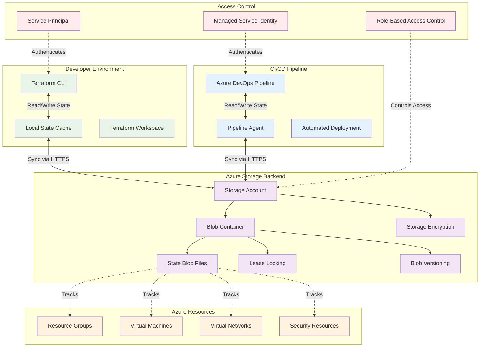
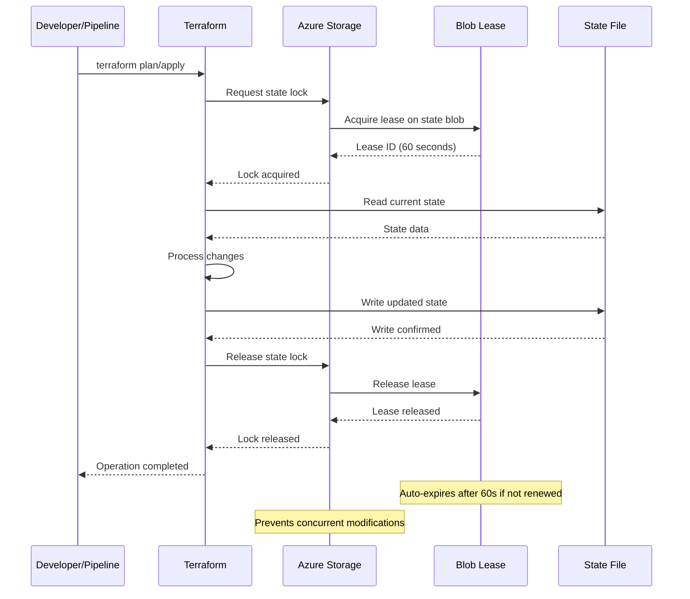
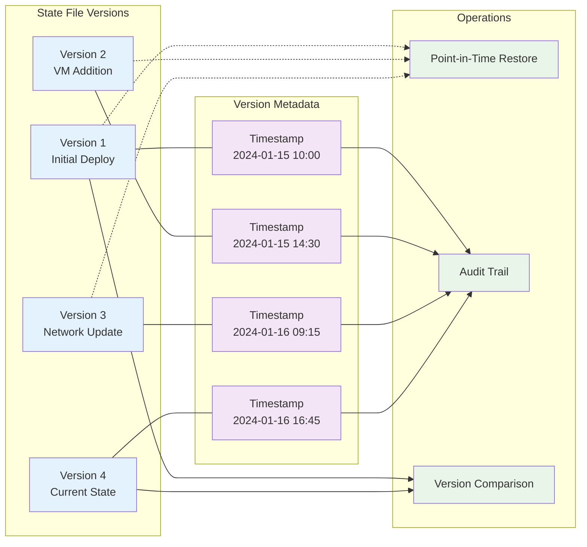

# Terraform State Management Guide

This guide provides comprehensive documentation for Terraform state management within the Azure VM Automation Accelerator, including backend configuration, state operations, and best practices.

---

## Overview

Terraform state management is critical for maintaining infrastructure consistency, enabling team collaboration, and ensuring reliable deployments. This solution implements enterprise-grade state management using Azure Storage backend with advanced features for security, locking, and versioning.

### State Management Architecture



---

## Backend Configuration

### Primary Backend Configuration

The solution uses Azure Storage as the Terraform backend with the following configuration:

```hcl
# backend.tf
terraform {
  required_version = ">= 1.5.0"
  
  backend "azurerm" {
    # Backend configuration will be provided via backend config files
    # This allows for environment-specific backend configurations
  }
  
  required_providers {
    azurerm = {
      source  = "hashicorp/azurerm"
      version = "~> 3.80"
    }
    azuread = {
      source  = "hashicorp/azuread"
      version = "~> 2.45"
    }
  }
}

# Configure the Azure Provider
provider "azurerm" {
  features {
    resource_group {
      prevent_deletion_if_contains_resources = false
    }
    
    virtual_machine {
      delete_os_disk_on_deletion     = true
      graceful_shutdown              = false
      skip_shutdown_and_force_delete = false
    }
    
    key_vault {
      purge_soft_delete_on_destroy    = true
      recover_soft_deleted_key_vaults = true
    }
  }
  
  # Use Managed Service Identity in CI/CD
  use_msi = true
  
  # Storage provider features
  storage_use_azuread = true
}
```

### Environment-Specific Backend Configurations

**Production Backend** (`backend-config/production.hcl`):
```hcl
resource_group_name  = "rg-terraform-state-prod-eastus"
storage_account_name = "sttfstateprodeastus001"
container_name       = "tfstate-production"
key                  = "vm-automation-accelerator/production/terraform.tfstate"

# Authentication
use_msi                     = true
use_azuread_auth           = true
subscription_id            = "12345678-1234-1234-1234-123456789012"
tenant_id                  = "12345678-1234-1234-1234-123456789012"

# Additional settings
snapshot                   = true
```

**Development Backend** (`backend-config/development.hcl`):
```hcl
resource_group_name  = "rg-terraform-state-dev-eastus"
storage_account_name = "sttfstatedeveastus001"
container_name       = "tfstate-development"
key                  = "vm-automation-accelerator/development/terraform.tfstate"

# Authentication
use_msi                     = true
use_azuread_auth           = true
subscription_id            = "87654321-4321-4321-4321-210987654321"
tenant_id                  = "12345678-1234-1234-1234-123456789012"

# Additional settings
snapshot                   = true
```

**User Acceptance Testing Backend** (`backend-config/uat.hcl`):
```hcl
resource_group_name  = "rg-terraform-state-uat-eastus"
storage_account_name = "sttfstateuateastus001"
container_name       = "tfstate-uat"
key                  = "vm-automation-accelerator/uat/terraform.tfstate"

# Authentication
use_msi                     = true
use_azuread_auth           = true
subscription_id            = "11111111-2222-3333-4444-555555555555"
tenant_id                  = "12345678-1234-1234-1234-123456789012"

# Additional settings
snapshot                   = true
```

---

## State Initialization and Management

### Initial State Setup

**Step 1: Create Backend Infrastructure**
```bash
# Create resource group for state storage
az group create \
  --name "rg-terraform-state-prod-eastus" \
  --location "East US" \
  --tags "Purpose=TerraformState" "Environment=Production"

# Create storage account with versioning and encryption
az storage account create \
  --name "sttfstateprodeastus001" \
  --resource-group "rg-terraform-state-prod-eastus" \
  --location "East US" \
  --sku "Standard_LRS" \
  --kind "StorageV2" \
  --enable-versioning \
  --min-tls-version "TLS1_2" \
  --allow-blob-public-access false \
  --tags "Purpose=TerraformState" "Environment=Production"

# Create blob container
az storage container create \
  --name "tfstate-production" \
  --account-name "sttfstateprodeastus001" \
  --auth-mode login

# Enable versioning on container
az storage container-rm update \
  --name "tfstate-production" \
  --storage-account "sttfstateprodeastus001" \
  --resource-group "rg-terraform-state-prod-eastus" \
  --enable-versioning
```

**Step 2: Configure Access Control**
```bash
# Assign Storage Blob Data Contributor role to service principal
az role assignment create \
  --assignee "<service-principal-object-id>" \
  --role "Storage Blob Data Contributor" \
  --scope "/subscriptions/<subscription-id>/resourceGroups/rg-terraform-state-prod-eastus/providers/Microsoft.Storage/storageAccounts/sttfstateprodeastus001"

# Assign Reader role for resource group
az role assignment create \
  --assignee "<service-principal-object-id>" \
  --role "Reader" \
  --scope "/subscriptions/<subscription-id>/resourceGroups/rg-terraform-state-prod-eastus"
```

**Step 3: Initialize Terraform**
```bash
# Initialize with specific backend configuration
terraform init -backend-config="backend-config/production.hcl"

# Verify backend configuration
terraform state list
```

### State Operations

#### Basic State Commands

```bash
# List all resources in state
terraform state list

# Show detailed information about a specific resource
terraform state show azurerm_virtual_machine.web_server

# Show current state file location and metadata
terraform show

# Refresh state from actual infrastructure
terraform refresh
```

#### Advanced State Management

**State Import Operations**:
```bash
# Import existing virtual machine
terraform import \
  azurerm_virtual_machine.existing_vm \
  /subscriptions/12345678-1234-1234-1234-123456789012/resourceGroups/rg-existing/providers/Microsoft.Compute/virtualMachines/vm-existing-001

# Import resource group
terraform import \
  azurerm_resource_group.main \
  /subscriptions/12345678-1234-1234-1234-123456789012/resourceGroups/rg-vm-automation-prod

# Import virtual network
terraform import \
  azurerm_virtual_network.main \
  /subscriptions/12345678-1234-1234-1234-123456789012/resourceGroups/rg-networking/providers/Microsoft.Network/virtualNetworks/vnet-prod-eastus
```

**State Movement Operations**:
```bash
# Move resource to a different module
terraform state mv \
  azurerm_virtual_machine.web_server \
  module.compute.azurerm_virtual_machine.web_server

# Rename resource in state
terraform state mv \
  azurerm_virtual_machine.old_name \
  azurerm_virtual_machine.new_name

# Remove resource from state (without destroying)
terraform state rm azurerm_virtual_machine.decommissioned
```

---

## State Locking

### Lease-Based Locking Mechanism

Azure Storage implements state locking using blob lease mechanism:



### Lock Management

**View Current Lock**:
```bash
# Check if state is locked
terraform force-unlock --help

# View lock information (if available)
terraform state pull | jq '.serial'
```

**Handle Lock Issues**:
```bash
# Force unlock (use with extreme caution)
terraform force-unlock <lock-id>

# Example: Emergency unlock after failed operation
terraform force-unlock "1234567890abcdef"
```

### Concurrent Access Handling

**Best Practices for Team Collaboration**:

1. **Coordinate Operations**: Communicate with team before major changes
2. **Use Short-Lived Operations**: Minimize lock duration
3. **Automated Retries**: CI/CD pipelines should implement retry logic
4. **Emergency Procedures**: Document force-unlock procedures

**Pipeline Lock Handling**:
```yaml
# Azure DevOps Pipeline example
- task: TerraformCLI@0
  displayName: 'Terraform Apply'
  inputs:
    command: apply
    workingDirectory: '$(Pipeline.Workspace)/terraform'
    commandOptions: '-auto-approve -lock-timeout=10m'
  retryCountOnTaskFailure: 3
```

---

## State Versioning and Backup

### Blob Versioning

Azure Storage blob versioning provides automatic state history:



### Version Management Commands

**List State Versions**:
```bash
# List blob versions using Azure CLI
az storage blob list \
  --container-name "tfstate-production" \
  --account-name "sttfstateprodeastus001" \
  --prefix "vm-automation-accelerator/production/" \
  --include versions \
  --auth-mode login
```

**Restore Previous Version**:
```bash
# Download specific version
az storage blob download \
  --container-name "tfstate-production" \
  --name "vm-automation-accelerator/production/terraform.tfstate" \
  --file "terraform.tfstate.backup" \
  --account-name "sttfstateprodeastus001" \
  --version-id "<version-id>" \
  --auth-mode login

# Replace current state (after validation)
az storage blob upload \
  --container-name "tfstate-production" \
  --name "vm-automation-accelerator/production/terraform.tfstate" \
  --file "terraform.tfstate.backup" \
  --account-name "sttfstateprodeastus001" \
  --auth-mode login \
  --overwrite
```

### Automated Backup Strategy

**Daily Backup Script**:
```bash
#!/bin/bash
# backup-terraform-state.sh

set -euo pipefail

# Configuration
STORAGE_ACCOUNT="sttfstateprodeastus001"
CONTAINER_NAME="tfstate-production"
STATE_KEY="vm-automation-accelerator/production/terraform.tfstate"
BACKUP_CONTAINER="tfstate-backups"
DATE=$(date +%Y%m%d-%H%M%S)

echo "Starting Terraform state backup - $DATE"

# Create backup container if it doesn't exist
az storage container create \
  --name "$BACKUP_CONTAINER" \
  --account-name "$STORAGE_ACCOUNT" \
  --auth-mode login \
  --only-show-errors

# Copy current state to backup location
az storage blob copy start \
  --source-container "$CONTAINER_NAME" \
  --source-blob "$STATE_KEY" \
  --destination-container "$BACKUP_CONTAINER" \
  --destination-blob "$STATE_KEY.$DATE" \
  --account-name "$STORAGE_ACCOUNT" \
  --auth-mode login

# Verify backup
az storage blob exists \
  --container-name "$BACKUP_CONTAINER" \
  --name "$STATE_KEY.$DATE" \
  --account-name "$STORAGE_ACCOUNT" \
  --auth-mode login

echo "Terraform state backup completed successfully"

# Cleanup old backups (keep last 30 days)
CUTOFF_DATE=$(date -d '30 days ago' +%Y%m%d)

az storage blob list \
  --container-name "$BACKUP_CONTAINER" \
  --prefix "$STATE_KEY" \
  --account-name "$STORAGE_ACCOUNT" \
  --auth-mode login \
  --query "[?properties.creationTime < '$CUTOFF_DATE-00:00:00'].name" \
  --output tsv | \
while read -r blob_name; do
  if [ -n "$blob_name" ]; then
    echo "Deleting old backup: $blob_name"
    az storage blob delete \
      --container-name "$BACKUP_CONTAINER" \
      --name "$blob_name" \
      --account-name "$STORAGE_ACCOUNT" \
      --auth-mode login
  fi
done

echo "Backup cleanup completed"
```

---

## Security and Access Control

### Role-Based Access Control (RBAC)

**Required Roles for State Management**:

| Role | Scope | Purpose | Permissions |
|------|-------|---------|-------------|
| **Storage Blob Data Contributor** | Storage Account | Read/Write state files | List, read, write, delete blobs |
| **Storage Account Contributor** | Storage Account | Manage storage settings | Manage storage account properties |
| **Reader** | Resource Group | View storage account | Read storage account metadata |
| **Storage Blob Data Reader** | Storage Account | Read-only access | List and read blobs only |

**RBAC Assignment Script**:
```bash
#!/bin/bash
# assign-state-permissions.sh

# Configuration
SUBSCRIPTION_ID="12345678-1234-1234-1234-123456789012"
RESOURCE_GROUP="rg-terraform-state-prod-eastus"
STORAGE_ACCOUNT="sttfstateprodeastus001"
SERVICE_PRINCIPAL_ID="<service-principal-object-id>"

# Assign Storage Blob Data Contributor role
az role assignment create \
  --assignee "$SERVICE_PRINCIPAL_ID" \
  --role "Storage Blob Data Contributor" \
  --scope "/subscriptions/$SUBSCRIPTION_ID/resourceGroups/$RESOURCE_GROUP/providers/Microsoft.Storage/storageAccounts/$STORAGE_ACCOUNT"

# Assign Reader role for resource group
az role assignment create \
  --assignee "$SERVICE_PRINCIPAL_ID" \
  --role "Reader" \
  --scope "/subscriptions/$SUBSCRIPTION_ID/resourceGroups/$RESOURCE_GROUP"

echo "RBAC permissions assigned successfully"
```

### Authentication Methods

**Service Principal Authentication**:
```bash
# Set environment variables for service principal
export ARM_CLIENT_ID="<client-id>"
export ARM_CLIENT_SECRET="<client-secret>"
export ARM_SUBSCRIPTION_ID="<subscription-id>"
export ARM_TENANT_ID="<tenant-id>"

# Initialize Terraform with service principal
terraform init -backend-config="backend-config/production.hcl"
```

**Managed Service Identity (MSI)**:
```hcl
# Provider configuration for MSI
provider "azurerm" {
  features {}
  use_msi = true
}
```

**Azure CLI Authentication**:
```bash
# Login with Azure CLI
az login --tenant "<tenant-id>"

# Set subscription context
az account set --subscription "<subscription-id>"

# Initialize Terraform (will use CLI credentials)
terraform init -backend-config="backend-config/production.hcl"
```

---

## Best Practices Summary

### State Security
- Use Azure Storage with encryption at rest
- Implement RBAC with principle of least privilege
- Enable blob versioning for state history
- Regular automated backups
- Monitor state file access

### Team Collaboration
- Use shared remote backend
- Implement state locking
- Coordinate major changes
- Document state operations
- Use workspace separation for environments

### Operational Excellence
- Automate state management tasks
- Implement disaster recovery procedures
- Monitor state file health
- Regular state cleanup
- Version control backend configurations

### Compliance and Governance
- Audit state file access
- Implement change approval processes
- Document state management procedures
- Regular compliance reviews
- Automated policy enforcement

---

**Enterprise-Grade State Management Foundation**
