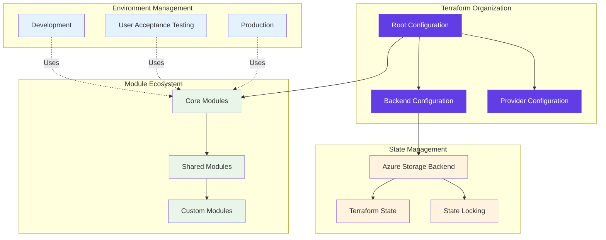
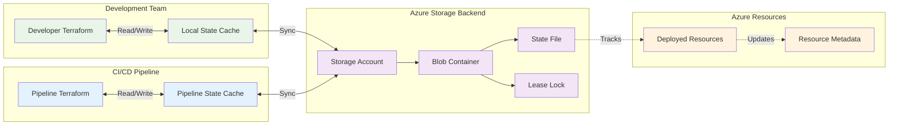
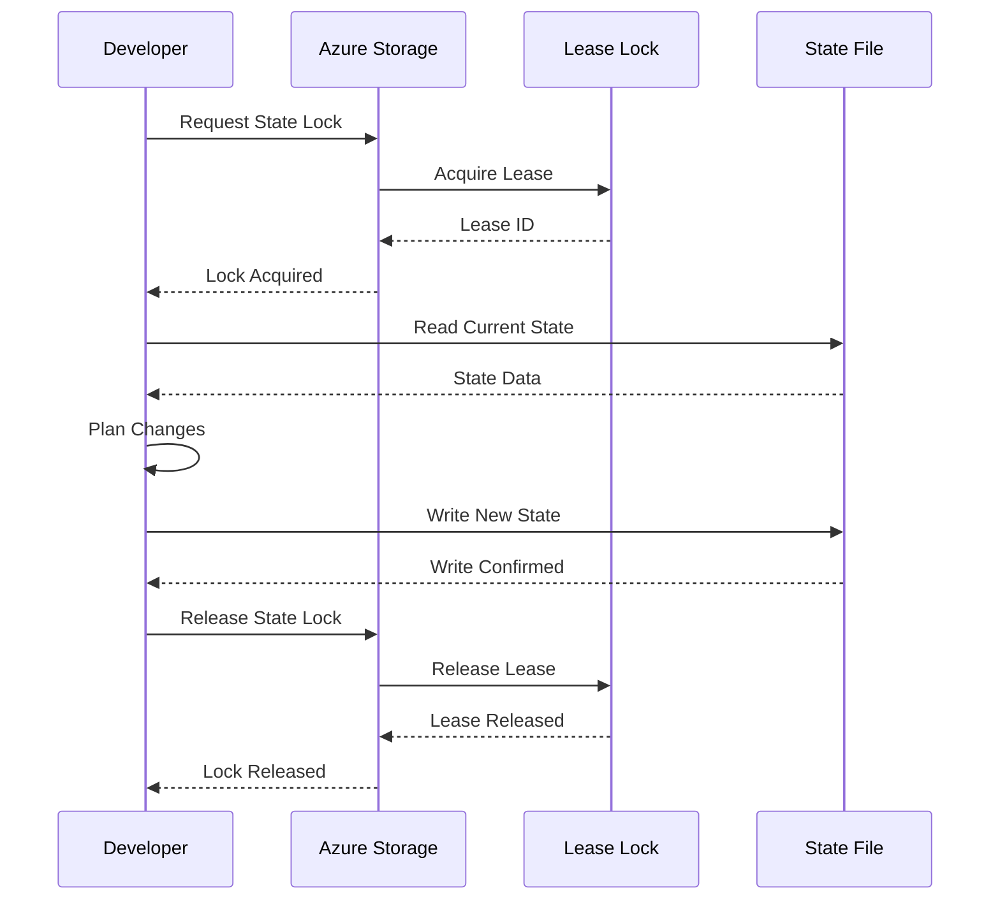
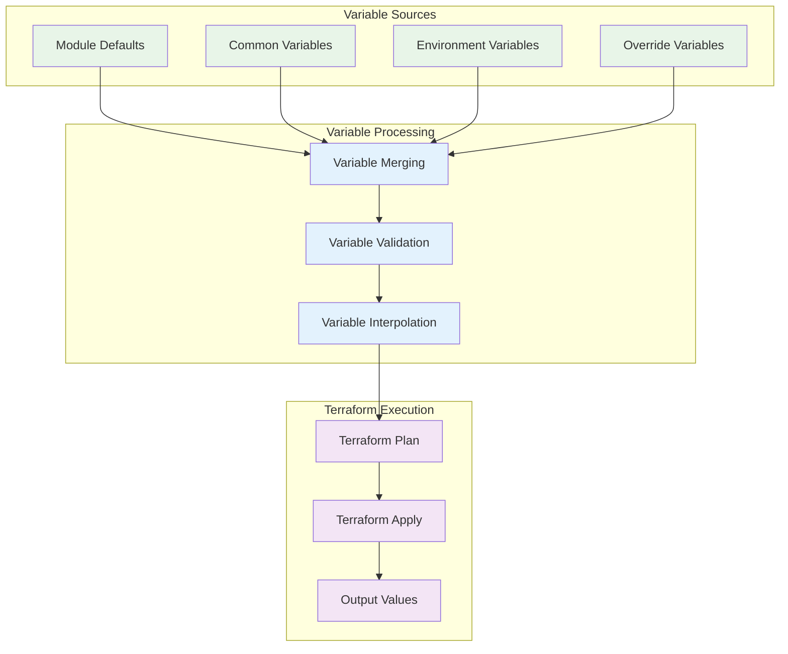
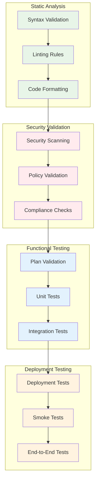

# Terraform Implementation Guide

This guide provides comprehensive documentation for the Terraform implementation used in the Azure VM Automation Accelerator, including best practices, module architecture, and operational procedures.

---

## Overview

The Azure VM Automation Accelerator leverages Terraform as the primary Infrastructure as Code (IaC) solution, implementing enterprise-grade patterns for scalable, secure, and maintainable infrastructure automation.

### Implementation Highlights

| Feature | Implementation | Benefit |
|---------|---------------|---------|
| **State Management** | Remote state with Azure Storage backend | Centralized state with team collaboration |
| **Module Architecture** | Reusable, composable modules | Standardization and maintainability |
| **Version Control** | Provider and module version constraints | Reproducible deployments |
| **Validation** | Automated validation and security scanning | Quality assurance and compliance |
| **State Locking** | Azure Blob lease mechanism | Safe concurrent operations |

---

## Architecture Overview

### Terraform Structure



### Directory Structure

```
vm-automation-accelerator/
├── deploy/terraform/
│   ├── bootstrap/                       # Bootstrap configurations
│   │   └── control-plane/
│   │       ├── main.tf                  # Control plane resources
│   │       ├── variables.tf             # Input variables
│   │       ├── outputs.tf               # Output values
│   │       └── versions.tf              # Provider versions
│   │
│   ├── run/                            # Runtime configurations
│   │   ├── workload-zone/              # Network infrastructure
│   │   │   ├── main.tf
│   │   │   ├── variables.tf
│   │   │   ├── outputs.tf
│   │   │   └── terraform.tfvars.example
│   │   │
│   │   ├── vm-deployment/              # VM deployment
│   │   │   ├── main.tf
│   │   │   ├── variables.tf
│   │   │   ├── outputs.tf
│   │   │   └── terraform.tfvars.example
│   │   │
│   │   └── governance/                 # Policy and compliance
│   │       ├── main.tf
│   │       ├── variables.tf
│   │       └── outputs.tf
│   │
│   └── terraform-units/modules/        # Reusable modules
│       ├── compute/                    # VM and compute resources
│       ├── network/                    # Networking components
│       ├── monitoring/                 # Monitoring and alerting
│       ├── backup-policy/              # Backup and recovery
│       └── naming/                     # Naming conventions
```

---

## Module Architecture

### Core Modules

#### Compute Module

**Purpose**: Provides standardized virtual machine deployments with integrated security and monitoring.

**Features**:
- Multi-OS support (Windows/Linux)
- Managed identities (system and user-assigned)
- Encryption at host with customer-managed keys
- Trusted Launch with Secure Boot and vTPM
- Automated monitoring agent deployment
- Integrated backup policy assignment

**Usage Example**:
```hcl
module "virtual_machine" {
  source = "../../terraform-units/modules/compute"
  
  # Basic configuration
  vm_name             = "vm-web-prod-001"
  resource_group_name = azurerm_resource_group.main.name
  location            = azurerm_resource_group.main.location
  vm_size             = "Standard_D4s_v5"
  
  # Operating system configuration
  os_type         = "Linux"
  os_publisher    = "Canonical"
  os_offer        = "0001-com-ubuntu-server-focal"
  os_sku          = "20_04-lts-gen2"
  os_version      = "latest"
  os_disk_size_gb = 128
  
  # Authentication configuration
  admin_username         = "azureuser"
  disable_password_auth  = true
  ssh_public_key         = var.ssh_public_key
  
  # Security configuration
  enable_encryption_at_host = true
  enable_trusted_launch     = true
  enable_secure_boot        = true
  enable_vtpm               = true
  disk_encryption_set_id    = var.disk_encryption_set_id
  
  # Network configuration
  subnet_id = module.network.subnet_ids["web"]
  
  # Monitoring configuration
  enable_monitoring          = true
  log_analytics_workspace_id = var.log_analytics_workspace_id
  
  # Backup configuration
  enable_backup      = true
  backup_policy_name = "daily-backup-30days"
  
  # Data disk configuration
  data_disks = [
    {
      name                 = "data-disk-01"
      disk_size_gb        = 512
      storage_account_type = "Premium_LRS"
      caching             = "ReadWrite"
      lun                 = 0
    }
  ]
  
  # Tagging
  tags = local.common_tags
}
```

#### Network Module

**Purpose**: Implements secure network infrastructure with proper segmentation and controls.

**Features**:
- Virtual network with multiple subnets
- Network security groups with custom rules
- Route tables and user-defined routes
- Private DNS zones for name resolution
- VNet peering for connectivity
- Service endpoints for Azure services

**Usage Example**:
```hcl
module "network" {
  source = "../../terraform-units/modules/network"
  
  # Basic configuration
  resource_group_name = azurerm_resource_group.main.name
  location            = azurerm_resource_group.main.location
  
  # Virtual network configuration
  vnet_name          = "vnet-prod-eastus"
  vnet_address_space = ["10.0.0.0/16"]
  
  # Subnet configuration
  subnets = {
    web = {
      name               = "snet-web"
      address_prefixes   = ["10.0.1.0/24"]
      service_endpoints  = ["Microsoft.Storage", "Microsoft.KeyVault"]
      
      # Network security group rules
      nsg_rules = {
        allow_https = {
          name                       = "Allow-HTTPS"
          priority                   = 100
          direction                  = "Inbound"
          access                     = "Allow"
          protocol                   = "Tcp"
          source_port_range          = "*"
          destination_port_range     = "443"
          source_address_prefix      = "*"
          destination_address_prefix = "*"
        }
        allow_ssh = {
          name                       = "Allow-SSH"
          priority                   = 110
          direction                  = "Inbound"
          access                     = "Allow"
          protocol                   = "Tcp"
          source_port_range          = "*"
          destination_port_range     = "22"
          source_address_prefix      = "10.0.0.0/8"
          destination_address_prefix = "*"
        }
      }
    }
    
    app = {
      name               = "snet-app"
      address_prefixes   = ["10.0.2.0/24"]
      service_endpoints  = ["Microsoft.Sql", "Microsoft.Storage"]
      
      nsg_rules = {
        allow_app_traffic = {
          name                       = "Allow-App-Traffic"
          priority                   = 100
          direction                  = "Inbound"
          access                     = "Allow"
          protocol                   = "Tcp"
          source_port_range          = "*"
          destination_port_range     = "8080"
          source_address_prefix      = "10.0.1.0/24"
          destination_address_prefix = "*"
        }
      }
    }
    
    data = {
      name               = "snet-data"
      address_prefixes   = ["10.0.3.0/24"]
      service_endpoints  = ["Microsoft.Sql"]
      
      nsg_rules = {
        allow_db_traffic = {
          name                       = "Allow-DB-Traffic"
          priority                   = 100
          direction                  = "Inbound"
          access                     = "Allow"
          protocol                   = "Tcp"
          source_port_range          = "*"
          destination_port_range     = "1433"
          source_address_prefix      = "10.0.2.0/24"
          destination_address_prefix = "*"
        }
      }
    }
  }
  
  # Private DNS zones
  private_dns_zones = [
    "privatelink.blob.core.windows.net",
    "privatelink.vault.azure.net",
    "privatelink.database.windows.net"
  ]
  
  # Route table configuration
  route_tables = {
    web_routes = {
      name = "rt-web"
      routes = {
        default = {
          name           = "default"
          address_prefix = "0.0.0.0/0"
          next_hop_type  = "VirtualAppliance"
          next_hop_ip    = "10.0.100.4"
        }
      }
    }
  }
  
  # Tagging
  tags = local.common_tags
}
```

#### Monitoring Module

**Purpose**: Implements comprehensive monitoring and observability for virtual machines.

**Features**:
- Azure Monitor Agent (AMA) deployment
- Data Collection Rules (DCR) configuration
- VM Insights enablement
- Custom performance counters
- Log collection and analysis
- Alerting and notification setup

**Usage Example**:
```hcl
module "monitoring" {
  source = "../../terraform-units/modules/monitoring"
  
  # Target VM configuration
  vm_id                      = module.virtual_machine.vm_id
  vm_name                    = module.virtual_machine.vm_name
  resource_group_name        = azurerm_resource_group.main.name
  location                   = azurerm_resource_group.main.location
  os_type                    = "Linux"
  
  # Log Analytics configuration
  log_analytics_workspace_id = var.log_analytics_workspace_id
  
  # Data collection configuration
  performance_counters = [
    "\\Processor(_Total)\\% Processor Time",
    "\\Memory\\Available MBytes",
    "\\PhysicalDisk(_Total)\\Disk Reads/sec",
    "\\PhysicalDisk(_Total)\\Disk Writes/sec",
    "\\Network Interface(*)\\Bytes Total/sec"
  ]
  
  # Syslog configuration (Linux)
  syslog_facilities = [
    {
      name           = "kern"
      log_levels     = ["Debug", "Critical", "Emergency"]
    },
    {
      name           = "auth"
      log_levels     = ["Alert", "Critical", "Emergency"]
    }
  ]
  
  # Alert rules configuration
  alert_rules = {
    high_cpu = {
      name        = "High CPU Usage"
      description = "CPU usage is above 80%"
      metric_name = "Percentage CPU"
      operator    = "GreaterThan"
      threshold   = 80
      severity    = 2
    }
    
    low_disk_space = {
      name        = "Low Disk Space"
      description = "Free disk space is below 10%"
      metric_name = "Disk Free Space %"
      operator    = "LessThan"
      threshold   = 10
      severity    = 1
    }
  }
  
  # Tagging
  tags = local.common_tags
}
```

---

## State Management

### Backend Configuration

The solution uses Azure Storage as the Terraform backend for centralized state management:

```hcl
terraform {
  backend "azurerm" {
    resource_group_name  = "rg-terraform-state"
    storage_account_name = "sttfstateeastus001"
    container_name       = "tfstate"
    key                  = "vm-automation/terraform.tfstate"
    
    # Enable state locking
    use_msi = true
  }
}
```

### State Management Architecture



### Environment-Specific Backends

Each environment uses separate backend configurations:

**Development Backend**:
```hcl
# backend-dev.hcl
resource_group_name  = "rg-terraform-state-dev"
storage_account_name = "sttfstatedev001"
container_name       = "tfstate-dev"
key                  = "vm-automation-dev/terraform.tfstate"
```

**Production Backend**:
```hcl
# backend-prod.hcl
resource_group_name  = "rg-terraform-state-prod"
storage_account_name = "sttfstateprod001"
container_name       = "tfstate-prod"
key                  = "vm-automation-prod/terraform.tfstate"
```

### State Locking

Azure Storage blob lease mechanism provides state locking:



---

## Variable Management

### Variable Hierarchy

The solution implements a hierarchical variable management system:



### Variable Examples

**Common Variables** (`common.tfvars`):
```hcl
# Global configuration
project_name = "vm-automation"
environment  = "production"
location     = "East US"

# Naming configuration
naming_convention = {
  resource_group = "rg-{project}-{environment}-{location}"
  vm             = "vm-{workload}-{environment}-{instance}"
  storage        = "st{project}{environment}{random}"
}

# Network configuration
network_config = {
  address_space = ["10.0.0.0/16"]
  subnets = {
    web  = "10.0.1.0/24"
    app  = "10.0.2.0/24"
    data = "10.0.3.0/24"
  }
}

# Security configuration
security_config = {
  enable_encryption_at_host = true
  enable_trusted_launch     = true
  enable_secure_boot        = true
  enable_vtpm               = true
}

# Monitoring configuration
monitoring_config = {
  enable_monitoring = true
  retention_days    = 90
  enable_alerts     = true
}

# Backup configuration
backup_config = {
  enable_backup    = true
  policy_name      = "daily-backup"
  retention_daily  = 30
  retention_weekly = 12
}

# Tagging strategy
default_tags = {
  Project     = "VM Automation Accelerator"
  Environment = "Production"
  ManagedBy   = "Terraform"
  Owner       = "Platform Team"
  CostCenter  = "IT Infrastructure"
}
```

**Environment-Specific Variables** (`production.tfvars`):
```hcl
# Override environment-specific values
vm_configurations = {
  web-server = {
    count    = 2
    vm_size  = "Standard_D4s_v5"
    os_type  = "Linux"
    
    data_disks = [
      {
        size_gb = 512
        type    = "Premium_LRS"
        caching = "ReadWrite"
      }
    ]
  }
  
  app-server = {
    count    = 3
    vm_size  = "Standard_D8s_v5"
    os_type  = "Linux"
    
    data_disks = [
      {
        size_gb = 1024
        type    = "Premium_LRS"
        caching = "ReadWrite"
      }
    ]
  }
  
  db-server = {
    count    = 2
    vm_size  = "Standard_E16s_v5"
    os_type  = "Linux"
    
    data_disks = [
      {
        size_gb = 2048
        type    = "Ultra_SSD_LRS"
        caching = "None"
      }
    ]
  }
}

# High availability configuration
availability_config = {
  enable_availability_set = true
  fault_domains          = 3
  update_domains         = 5
}

# Load balancer configuration
load_balancer_config = {
  enable_load_balancer = true
  sku                  = "Standard"
  backend_pools = [
    {
      name = "web-servers"
      vms  = ["web-server"]
    }
  ]
}
```

---

## Validation and Testing

### Terraform Validation

The solution implements multiple layers of validation:



### Validation Commands

**Basic Validation**:
```bash
# Terraform syntax validation
terraform validate

# Code formatting check
terraform fmt -check -recursive

# Security scanning with Checkov
checkov -d . --framework terraform

# Plan validation
terraform plan -detailed-exitcode
```

**Advanced Testing**:
```bash
# Terratest unit testing
cd tests/unit
go test -v -timeout 30m

# Integration testing
cd tests/integration
go test -v -timeout 60m

# End-to-end testing
cd tests/e2e
go test -v -timeout 120m
```

---

## Operational Procedures

### Deployment Workflow

```mermaid
flowchart TD
    START([Start Deployment]) --> INIT[Terraform Init]
    INIT --> WORKSPACE[Select Workspace]
    WORKSPACE --> VALIDATE[Validate Configuration]
    VALIDATE --> PLAN[Generate Plan]
    PLAN --> REVIEW{Review Plan}
    REVIEW -->|Approved| APPLY[Apply Changes]
    REVIEW -->|Rejected| ABORT([Abort])
    APPLY --> VERIFY[Verify Deployment]
    VERIFY --> SUCCESS{Deployment Success?}
    SUCCESS -->|Yes| COMPLETE([Complete])
    SUCCESS -->|No| ROLLBACK[Rollback Changes]
    ROLLBACK --> INVESTIGATE[Investigate Issues]
    INVESTIGATE --> ABORT
    
    classDef start fill:#4caf50,color:#fff
    classDef process fill:#2196f3,color:#fff
    classDef decision fill:#ff9800,color:#fff
    classDef end fill:#9c27b0,color:#fff
    classDef error fill:#f44336,color:#fff
    
    class START,COMPLETE start
    class INIT,WORKSPACE,VALIDATE,PLAN,APPLY,VERIFY process
    class REVIEW,SUCCESS decision
    class ABORT end
    class ROLLBACK,INVESTIGATE error
```

### State Management Operations

**State Inspection**:
```bash
# List resources in state
terraform state list

# Show resource details
terraform state show azurerm_virtual_machine.example

# Refresh state from Azure
terraform refresh
```

**State Maintenance**:
```bash
# Import existing resource
terraform import azurerm_virtual_machine.example /subscriptions/.../resourceGroups/.../providers/Microsoft.Compute/virtualMachines/vm-example

# Remove resource from state (without destroying)
terraform state rm azurerm_virtual_machine.example

# Move resource to different state file
terraform state mv azurerm_virtual_machine.example module.compute.azurerm_virtual_machine.example
```

### Troubleshooting

**Common Issues and Solutions**:

| Issue | Cause | Solution |
|-------|-------|----------|
| **State Lock Error** | Concurrent operations | Wait for lock release or force unlock |
| **Provider Version Conflict** | Version constraints mismatch | Update version constraints |
| **Resource Already Exists** | Resource drift | Import existing resource or resolve manually |
| **Permission Denied** | Insufficient RBAC | Verify service principal permissions |
| **Network Timeout** | Connectivity issues | Check network configuration and firewall rules |

**Diagnostic Commands**:
```bash
# Enable detailed logging
export TF_LOG=DEBUG
export TF_LOG_PATH=terraform-debug.log

# Force unlock state (use with caution)
terraform force-unlock <lock-id>

# Check provider configuration
terraform providers

# Validate remote state access
terraform state pull
```

---

## Best Practices

### Code Organization

- **Modular Design**: Use reusable modules for common patterns
- **Separation of Concerns**: Separate networking, compute, and security configurations
- **Version Control**: Tag releases and use semantic versioning
- **Documentation**: Maintain comprehensive README files for each module

### Security Practices

- **Least Privilege**: Use minimal required permissions for service principals
- **Secret Management**: Store sensitive data in Azure Key Vault
- **State Security**: Encrypt state files and restrict access
- **Network Security**: Use private endpoints and network isolation

### Operational Excellence

- **Automation**: Automate validation, testing, and deployment processes
- **Monitoring**: Implement comprehensive monitoring and alerting
- **Backup**: Regular state file backups and recovery procedures
- **Documentation**: Maintain up-to-date operational runbooks

---

**Enterprise Terraform Implementation**
│           ├── hardening/                  # Security hardening
│           ├── backup/                     # Azure Backup
│           └── site-recovery/              # Azure Site Recovery
│
├── pipelines/
│   └── azure-devops/
│       └── terraform-vm-deploy-pipeline.yml # 🆕 Terraform pipeline
│
└── scripts/
    └── powershell/
        ├── Validate-Quota.ps1
        ├── Get-CostForecast.ps1
        └── Update-ServiceNowTicket.ps1
```

---

## Key Terraform Features

### 1. Remote State Management

**Azure Storage Backend** with automatic locking:

```hcl
terraform {
  backend "azurerm" {
    resource_group_name  = "rg-terraform-state-prod"
    storage_account_name = "stuniptertfstateprod"
    container_name       = "tfstate"
    key                  = "vm-automation/prod/terraform.tfstate"
    use_azuread_auth     = true
  }
}
```

**Benefits**:
- **State Locking**: Azure Blob lease prevents concurrent modifications
- **State Versioning**: Blob versioning tracks state file history
- **Team Collaboration**: Shared state accessible by all team members
- **Encryption**: State encrypted at rest and in transit
- **RBAC Access**: Azure AD authentication for secure access

### 2. Environment Separation

Separate state files per environment:

```
tfstate container
├── vm-automation/prod/terraform.tfstate   # Production
├── vm-automation/dev/terraform.tfstate    # Development
└── vm-automation/test/terraform.tfstate   # Test
```

Initialize with environment-specific backend:

```bash
# Production
terraform init -backend-config="backend-config/prod.hcl"

# Development
terraform init -backend-config="backend-config/dev.hcl"
```

### 3. Variable Validation

Production-safe validation rules:

```hcl
variable "environment" {
  type = string
  validation {
    condition     = contains(["dev", "test", "prod"], var.environment)
    error_message = "Environment must be dev, test, or prod."
  }
}

variable "vm_size" {
  type = string
  validation {
    condition     = can(regex("^Standard_[A-Z][0-9]+[a-z]*s?_v[0-9]+$", var.vm_size))
    error_message = "VM size must match Azure SKU naming convention."
  }
}
```

### 4. Modular Architecture

Reusable, composable modules:

```hcl
module "virtual_machine" {
  source = "./modules/compute"
  
  vm_name             = var.vm_name
  resource_group_name = data.azurerm_resource_group.main.name
  # ... other parameters
}

module "monitoring" {
  source = "./modules/monitoring"
  
  vm_id = module.virtual_machine.vm_id
  # ... monitoring configuration
}
```

### 5. Comprehensive Outputs

Outputs for automation and integration:

```hcl
output "vm_id" {
  value = module.virtual_machine.vm_id
}

output "terraform_state_info" {
  value = {
    backend_type = "azurerm"
    state_key    = "vm-automation/${var.environment}/terraform.tfstate"
    workspace    = terraform.workspace
    last_updated = timestamp()
  }
}
```

---

## Terraform Workflow

### Local Development

```bash
# 1. Initialize backend
terraform init -backend-config="backend-config/dev.hcl"

# 2. Validate configuration
terraform validate

# 3. Format code
terraform fmt -recursive

# 4. Generate plan
terraform plan -out=tfplan

# 5. Review plan
terraform show -no-color tfplan > tfplan.txt
# Review tfplan.txt

# 6. Apply changes
terraform apply tfplan

# 7. View outputs
terraform output -json > outputs.json
```

### CI/CD Pipeline (Azure DevOps)

6-stage automated workflow:

```
Stage 1: Initialize Backend
   ├── Ensure storage account exists
   ├── Enable blob versioning
   └── Enable soft delete

Stage 2: Terraform Plan
   ├── terraform init
   ├── terraform validate
   ├── terraform fmt -check
   ├── Checkov security scan
   ├── Quota validation
   ├── Cost forecasting
   └── terraform plan (saved to artifact)

Stage 3: L2 Approval (prod only)
   ├── Manual validation gate
   └── Update ServiceNow ticket

Stage 4: Terraform Apply
   ├── terraform init
   ├── Fetch secrets from Key Vault
   ├── terraform apply (using saved plan)
   └── Extract outputs

Stage 5: Post-Deployment Validation
   ├── Verify VM running status
   ├── Verify monitoring agents installed
   └── Run connectivity tests

Stage 6: Notification
   ├── Update ServiceNow (success/failure)
   └── Send email notification
```

---

## State Management Best Practices

### DO

1. **Always use remote backend** for production
2. **Enable blob versioning** for state history
3. **Use separate state files** per environment
4. **Use Azure AD auth** instead of storage keys
5. **Restrict storage account access** with RBAC
6. **Enable soft delete** (30-day retention)
7. **Run `terraform plan` regularly** to detect drift
8. **Review plans before applying** in production
9. **Use state locking** (enabled by default)
10. **Document state operations** in change log

### DON'T

1. **Never commit state files** to Git (`.gitignore` includes `*.tfstate*`)
2. **Never manually edit state** (use `terraform state` commands)
3. **Never force-unlock** without verification
4. **Never share storage keys** (use Managed Identity)
5. **Never use same state** for multiple environments
6. **Never disable state locking**
7. **Never ignore drift** detected by `terraform plan`
8. **Never delete state files** manually

### State Operations

```bash
# Pull state to local file
terraform state pull > terraform.tfstate.backup

# List resources in state
terraform state list

# Show resource details
terraform state show azurerm_windows_virtual_machine.vm

# Remove resource from state (without destroying)
terraform state rm azurerm_windows_virtual_machine.vm

# Move/rename resource
terraform state mv old_address new_address

# Import existing resource
terraform import azurerm_windows_virtual_machine.vm /subscriptions/.../resourceGroups/.../providers/Microsoft.Compute/virtualMachines/vm-name
```

---

## Why Terraform for This Accelerator

### Key Advantages

- **Multi-cloud ready** - Future-proof for hybrid/multi-cloud scenarios
- **Explicit state management** - Full control and visibility
- **Advanced drift detection** - Built-in `terraform plan` comparison
- **Mature module ecosystem** - Leverage Azure Verified Modules (AVM)
- **Import existing resources** - Full support for brownfield scenarios
- **Complex variable validation** - Type checking and custom validation rules
- **Strong testing support** - Terratest, Kitchen-Terraform, and more
- **Large community** - 3000+ providers and extensive documentation

### Enterprise Benefits

| Capability | Benefit |
|------------|---------|
| **State Management** | Remote state in Azure Storage with versioning |
| **State Locking** | Azure Blob lease prevents concurrent conflicts |
| **Drift Detection** | Automatic detection of configuration changes |
| **Import Support** | Manage existing Azure resources with Terraform |
| **Variable Validation** | Enforce compliance and prevent misconfigurations |
| **Modular Design** | Reusable HCL modules for consistency |
| **Provider Ecosystem** | Integrate with 3000+ services beyond Azure |
| **IDE Support** | Multiple IDEs with Language Server Protocol |
| **Testing Framework** | Comprehensive testing with Terratest |

---

## 🛠️ Quick Start (Terraform)

### Prerequisites

```bash
# Install Terraform
choco install terraform  # Windows
brew install terraform   # macOS

# Verify installation
terraform version
# Terraform v1.5.7

# Install Azure CLI
az version
# Azure CLI 2.50.0+
```

### Initialize Project

```bash
# 1. Clone repository
git clone <repo-url>
cd vm-automation-accelerator/iac/terraform

# 2. Set up backend storage
./scripts/setup-backend.sh prod  # Creates storage account

# 3. Configure variables
cp terraform.tfvars.example terraform.tfvars
# Edit terraform.tfvars with your values

# 4. Initialize Terraform
terraform init -backend-config="backend-config/prod.hcl"

# 5. Generate plan
terraform plan -out=tfplan

# 6. Review and apply
terraform show tfplan
terraform apply tfplan
```

### First Deployment

```bash
# Validate quota
pwsh deploy/scripts/utilities/cost-management/Validate-Quota.ps1 -VMSize "Standard_D4s_v3"

# Generate plan
terraform plan -var-file="terraform.tfvars" -out=tfplan

# Review plan
terraform show -no-color tfplan > tfplan.txt
cat tfplan.txt

# Apply (after review)
terraform apply tfplan

# Verify deployment
terraform output -json > outputs.json
cat outputs.json
```

---

## Security Hardening

### State File Security

```bash
# Enable storage account firewall
az storage account update \
  --name stuniptertfstateprod \
  --default-action Deny

# Allow specific IP ranges
az storage account network-rule add \
  --account-name stuniptertfstateprod \
  --ip-address "203.0.113.0/24"

# Grant RBAC access (not storage keys)
az role assignment create \
  --role "Storage Blob Data Contributor" \
  --assignee user@Your Organization.com \
  --scope "/subscriptions/.../resourceGroups/rg-terraform-state-prod/providers/Microsoft.Storage/storageAccounts/stuniptertfstateprod"
```

### Secrets Management

```bash
# Fetch secrets from Key Vault in pipeline
$domainPassword = az keyvault secret show \
  --name "domain-join-password" \
  --vault-name "kv-Your Organization-prod" \
  --query value -o tsv

# Set Terraform variable
$env:TF_VAR_domain_join_password = $domainPassword

# Never hardcode secrets in .tfvars!
```

---

## Documentation

- **[iac/terraform/README.md](../iac/terraform/README.md)**: Terraform setup guide
- **[docs/STATE-MANAGEMENT.md](../docs/STATE-MANAGEMENT.md)**: Comprehensive state management guide
- **[ARCHITECTURE.md](../ARCHITECTURE.md)**: Architecture overview
- **[README.md](../README.md)**: Main project documentation

---

## Learning Resources

### Official Documentation
- [Terraform Azure Provider](https://registry.terraform.io/providers/hashicorp/azurerm/latest/docs)
- [Terraform Backend: azurerm](https://developer.hashicorp.com/terraform/language/settings/backends/azurerm)
- [Azure Storage for Terraform State](https://learn.microsoft.com/en-us/azure/developer/terraform/store-state-in-azure-storage)

### Best Practices
- [Terraform Best Practices](https://www.terraform-best-practices.com/)
- [Azure Naming Conventions](https://learn.microsoft.com/en-us/azure/cloud-adoption-framework/ready/azure-best-practices/resource-naming)
- [Terraform Style Guide](https://developer.hashicorp.com/terraform/language/style)

---

---

## Importing Existing Azure Resources

If you have existing Azure resources to manage with Terraform:

### Import Existing VMs

```bash
# List existing resources
az resource list --resource-group rg-app-prod --output table

# Import into Terraform state
terraform import module.virtual_machine.azurerm_windows_virtual_machine.vm[0] \
  "/subscriptions/.../resourceGroups/rg-app-prod/providers/Microsoft.Compute/virtualMachines/vm-app-prod-001"

# Verify import
terraform plan  # Should show no changes
```

### Brownfield Deployment Strategy

```bash
# Deploy new resources with Terraform
terraform apply -target=module.virtual_machine

# Verify all resources are managed
terraform state list

# Check for any drift from expected configuration
terraform plan
```

---

## Next Steps

1. **Set up Terraform backend** (state storage account)
2. **Configure variables** (`terraform.tfvars`)
3. **Initialize Terraform** (`terraform init`)
4. **Generate and review plan** (`terraform plan`)
5. **Deploy first VM** (`terraform apply`)
6. **Read STATE-MANAGEMENT.md** (understand state operations)
7. **Set up Azure DevOps pipeline**
8. **Configure ServiceNow integration**
9. **Enable monitoring dashboards**
10. **Train team on Terraform workflow**

---

## 📞 Support

For Terraform-specific questions:
- Check [iac/terraform/README.md](../iac/terraform/README.md)
- Review [docs/STATE-MANAGEMENT.md](../docs/STATE-MANAGEMENT.md)
- Contact: Azure CSA team (Pavleen Bali)

For general questions:
- Review [ARCHITECTURE.md](../ARCHITECTURE.md)
- Contact: Azure Landing Zones Team

---

**© 2025 Your Organization. All rights reserved.**
